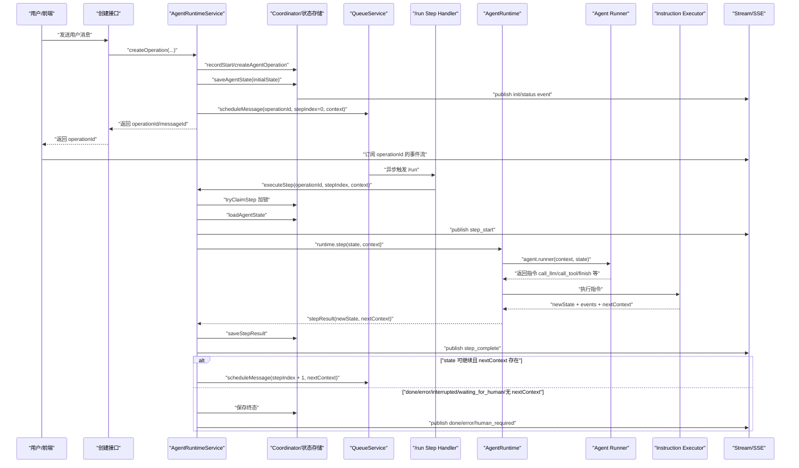

参考 LobeHub 代码，是否继续执行主要看两个条件：

1. 当前 `state.status` 不是终态
2. `runtime.step` 返回了 `nextContext`

核心代码在 [AgentRuntimeService.ts](#local-path)：

```ts
private shouldContinueExecution(state: any, context?: any): boolean {
  if (state.status === 'done') return false;
  if (state.status === 'waiting_for_human') return false;
  if (state.status === 'error') return false;
  if (state.status === 'interrupted') return false;

  if (state.costLimit && state.cost?.total >= state.costLimit.maxTotalCost) {
    return state.costLimit.onExceeded !== 'stop';
  }

  if (!context) return false;

  return true;
}
```

所以“继续”的情况就是：

> 当前任务还没有完成、没有报错、没有被中断、没有进入人工等待，并且本轮执行后还有 `nextContext` 可以交给下一轮处理。

然后才会投递下一步队列任务，在 [AgentRuntimeService.ts](#local-path)：

```ts
if (shouldContinue && stepResult.nextContext && this.queueService) {
  await this.queueService.scheduleMessage({
    context: stepResult.nextContext,
    operationId,
    stepIndex: stepIndex + 1,
  });
}
```

`nextContext` 可以理解成“下一步要处理的输入”。比如：

- `call_llm` 执行完，会返回 `llm_result`，下一步让 Agent 判断要不要调用工具。
- `call_tool` 执行完，会返回 `tool_result`，下一步让 LLM 读取工具结果继续生成。
- `call_tools_batch` 执行完，会返回 `tools_batch_result`，下一步让 LLM 汇总多个工具结果。
- 如果触发 `request_human_approve/request_human_prompt/request_human_select`，状态会变成 `waiting_for_human`，就不会继续调度。
- 如果触发 `finish`，状态变成 `done`，也不会继续调度。

面试可以这样说：

> 我们判断是否继续不是简单看有没有报错，而是看状态机和下一步上下文。每执行完一个 step，Runtime 会产出新的 state 和 nextContext。如果 state 还是 running，并且 nextContext 存在，就说明还有下一步需要处理，比如 LLM 结果要转成工具调用，或者工具结果要再喂回 LLM。反过来，如果状态已经是 done、error、interrupted、waiting_for_human，或者没有 nextContext，就停止调度。这样可以把 Agent 执行拆成多个可恢复、可重试的 step。

可以，先把它想成一句话：

> `createOperation` 只负责建任务和投递第一步；后面每一步都是 Queue 触发 `/run`，`executeStep` 推进状态机，执行完再决定要不要投递下一步。



你可以这样记这几个模块的职责：

`AgentRuntimeService` 是总控：创建 operation、执行 step、判断是否继续、调度下一步。

`Coordinator/状态存储` 是任务状态中心：保存 `operationId`、`AgentState`、step 结果、锁、终态。

`QueueService` 是异步调度器：它不理解 Agent 逻辑，只负责把 `operationId + stepIndex + context` 投递出去。

`/run` 是队列回调入口：队列触发它，它再调用 `executeStep`。

`AgentRuntime` 是状态机执行器：根据当前 `context` 让 Agent 生成指令，然后执行指令。

`Agent Runner` 是“大脑”：决定这一步要 `call_llm`、`call_tool`、`request_human_approve` 还是 `finish`。

`Instruction Executor` 是执行器：真正调用 LLM、工具、人工审批逻辑，并产出新的状态和 `nextContext`。

`SSE/Stream` 是观察通道：它不控制任务执行，只把状态变化推给前端展示。

面试时你可以浓缩成：

> 这个链路不是一次 HTTP 请求跑到底，而是 operation + step 的异步状态机。创建 operation 后先持久化初始状态，然后把第一步投递到 Queue。Queue 触发 `/run` 后，后端通过 `operationId` 加载状态、抢 step 锁、执行 Runtime、保存结果。如果本步产生了 `nextContext` 且状态仍然可继续，就继续投递下一步；如果状态变成 done、error、waiting_for_human 或 interrupted，就停止调度。前端通过 SSE 订阅 operation 的事件流，实时展示每一步状态。
