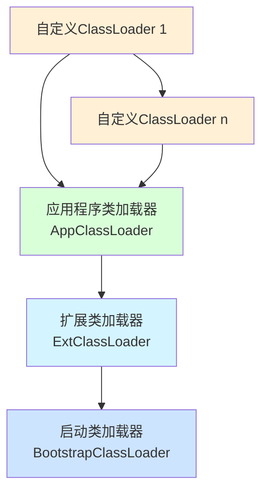

好的，我们来深入详解 Java 中的 ClassLoader（类加载器）。它是 Java 体系的核心组件，理解它对于理解 Java 的动态性、模块化和安全性至关重要。

### 一、ClassLoader 是什么？

简单来说，ClassLoader 是 JVM 的一个子系统，负责在**运行时**动态地将 Java 类加载到 JVM 内存中。它读取类的字节码（`.class` 文件），并将其转换为 JVM 内部可用的 `java.lang.Class` 对象。

**核心功能：**
1.  **加载（Loading）**：查找并导入二进制字节流。
2.  **链接（Linking）**：
    *   **验证（Verification）**：确保被加载的类的正确性，如文件格式、元数据、字节码、符号引用验证。
    *   **准备（Preparation）**：为类的**静态变量**分配内存并初始化为默认值（如 `int` 为 0，`引用` 为 `null`）。
    *   **解析（Resolution）**：将类中的符号引用转换为直接引用。
3.  **初始化（Initialization）**：执行类构造器 `<clinit>()` 方法，为静态变量赋予程序设定的初始值，并执行静态代码块。
------
### 二、Java 内置的三大 ClassLoader

Java 使用了 **"双亲委派模型（Parent Delegation Model）"**，类加载器之间存在父子层级关系。



#### 1. 启动类加载器（Bootstrap ClassLoader）
*   **C++ 实现**：是 JVM 自身的一部分，不是 `java.lang.ClassLoader` 的子类。
*   **职责**：加载 Java 的核心库（`JAVA_HOME/jre/lib/rt.jar`、`resources.jar` 等），如 `java.lang.*`、`java.util.*` 等。
*   **父加载器**：无（它是所有加载器的顶级祖先）。
*   **获取方式**：在 Java 中获取为 `null`。
    
    ```java
    "java.lang.String".getClass().getClassLoader(); // 返回 null
    ```

#### 2. 扩展类加载器（Extension ClassLoader, ExtClassLoader）
*   **Java 实现**：是 `sun.misc.Launcher$ExtClassLoader` 的实例。
*   **职责**：加载 Java 的扩展库（`JAVA_HOME/jre/lib/ext` 目录下的 jar 包）。
*   **父加载器**：Bootstrap ClassLoader。
*   **获取方式**：
    
    ```java
    ClassLoader extClassLoader = String.class.getClassLoader().getParent(); // 不一定准确，最好用下面的方式
    // 或者通过系统属性
    ClassLoader ext = ClassLoader.getSystemClassLoader().getParent();
    ```

#### 3. 应用程序类加载器（Application ClassLoader, AppClassLoader）
*   **Java 实现**：是 `sun.misc.Launcher$AppClassLoader` 的实例。
*   **职责**：加载**用户类路径（ClassPath）** 下指定的类库。这是我们自己写的类和第三方 jar 包的主要加载器。
*   **父加载器**：Extension ClassLoader。
*   **获取方式**：
    ```java
    ClassLoader appClassLoader = this.getClass().getClassLoader(); // 通常就是这个
    ClassLoader systemClassLoader = ClassLoader.getSystemClassLoader(); // 也是这个
    ```
------
### 三、双亲委派模型（Parent Delegation Model）

这是 ClassLoader 工作的核心机制。

#### 工作流程：
当一个 ClassLoader 收到类加载请求时，它不会自己去尝试加载，而是：
1.  **向上委托**：将这个请求**委托给父类加载器**去执行。
2.  **递归检查**：父类加载器又会委托给它的父类加载器，一直到顶层的 Bootstrap ClassLoader。
3.  **检查加载**：
    *   如果**父加载器可以成功加载**，则成功返回 `Class` 对象。
    *   如果**父加载器无法完成加载**（在自己的搜索范围内找不到该类），**子加载器才会尝试自己去加载**。

#### 代码体现（`ClassLoader.loadClass` 方法）：
```java
protected Class<?> loadClass(String name, boolean resolve) throws ClassNotFoundException {
    synchronized (getClassLoadingLock(name)) {
        // 首先，检查这个类是否已经被加载过了
        Class<?> c = findLoadedClass(name);
        if (c == null) {
            try {
                if (parent != null) {
                    // 如果父加载器存在，就委托给父加载器
                    c = parent.loadClass(name, false);
                } else {
                    // 如果父加载器为null，说明父加载器是Bootstrap，则尝试用Bootstrap加载
                    c = findBootstrapClassOrNull(name);
                }
            } catch (ClassNotFoundException e) {
                // 父加载器抛出异常，表示无法完成加载
            }

            if (c == null) {
                // 如果父加载器都没有加载成功，则调用自己的findClass方法
                c = findClass(name);
            }
        }
        if (resolve) {
            resolveClass(c);
        }
        return c;
    }
}
```

#### 双亲委派模型的好处：
1.  **避免重复加载**：确保一个类在 JVM 中只存在一份 `Class` 对象。
2.  **安全性和稳定性**：防止用户自定义一个核心类（如 `java.lang.String`）来替换掉 JDK 的原生实现，保证了 Java 核心 API 的纯洁性和安全。因为用户自定义的 `String` 类永远不会被 AppClassLoader 加载，而是由 Bootstrap ClassLoader 加载了官方的 `String`。
3.  **结构清晰**：明确了各个类加载器的职责。
------
### 四、自定义 ClassLoader

#### 为什么要自定义？
1.  **加载非 ClassPath 下的类**：从网络、数据库、加密文件等特定来源加载类。
2.  **热部署/热替换**：在不重启 JVM 的情况下，重新加载类以实现更新。
3.  **模块化/类隔离**：实现类似 Tomcat 的应用隔离，不同的 Web 应用使用不同的 ClassLoader，避免类冲突。
4.  **代码加密**：加载运行时解密后的类字节码。

#### 如何自定义？
通常**不直接重写 `loadClass` 方法**（因为这会破坏双亲委派模型），而是**重写 `findClass` 方法**。

```java
public class MyCustomClassLoader extends ClassLoader {

    private String classPath;

    public MyCustomClassLoader(String classPath) {
        // 指定父加载器为 AppClassLoader（默认就是它）
        super();
        this.classPath = classPath;
    }

    public MyCustomClassLoader(String classPath, ClassLoader parent) {
        // 显式指定父加载器
        super(parent);
        this.classPath = classPath;
    }

    @Override
    protected Class<?> findClass(String name) throws ClassNotFoundException {
        // 1. 根据类名，找到对应的 .class 文件，并读取为字节数组
        byte[] classData = loadClassData(name);
        if (classData == null) {
            throw new ClassNotFoundException();
        } else {
            // 2. 调用 defineClass，将字节数组转换为 Class 对象
            //    这是 ClassLoader 的核心Native方法，它完成了JVM对类的定义
            return defineClass(name, classData, 0, classData.length);
        }
    }

    private byte[] loadClassData(String className) {
        // 将包名中的 '.' 替换为文件路径分隔符 '/'
        String path = classPath + File.separatorChar + className.replace('.', File.separatorChar) + ".class";
        System.out.println("Loading class from: " + path);
        
        try (InputStream is = new FileInputStream(path);
             ByteArrayOutputStream baos = new ByteArrayOutputStream()) {
            byte[] buffer = new byte[1024];
            int len;
            while ((len = is.read(buffer)) != -1) {
                baos.write(buffer, 0, len);
            }
            return baos.toByteArray();
        } catch (IOException e) {
            e.printStackTrace();
            return null;
        }
    }
}
```

#### 使用自定义 ClassLoader：
```java
public class CustomClassLoaderTest {
    public static void main(String[] args) throws Exception {
        String classPath = "/path/to/your/classes"; // 指向一个不在ClassPath下的目录
        MyCustomClassLoader customLoader = new MyCustomClassLoader(classPath);

        // 使用自定义加载器加载指定类
        Class<?> clazz = customLoader.loadClass("com.example.Demo");
        
        // 创建实例
        Object instance = clazz.newInstance();
        
        // 注意：clazz 是由 customLoader 加载的
        System.out.println("ClassLoader: " + clazz.getClassLoader()); // 输出: MyCustomClassLoader
        System.out.println("Parent: " + clazz.getClassLoader().getParent()); // 输出: AppClassLoader
        
        // 在 JVM 看来，由不同 ClassLoader 加载的同一个类是不同的类型
        Class<?> clazz2 = Class.forName("com.example.Demo"); // 这个是由 AppClassLoader 加载的（如果在ClassPath下）
        System.out.println("clazz == clazz2 ? " + (clazz == clazz2)); // 输出: false
    }
}
```
------
### 五、重要概念：命名空间与类隔离

*   **每个 ClassLoader 都有自己的命名空间**。
*   对于同一个类，由**不同的 ClassLoader** 加载，在 JVM 看来是**两个完全不同的类**（`Class` 对象不同），会导致 `ClassCastException`。
    ```java
    // 假设 com.example.Demo 在两个不同的 ClassLoader 中都被加载了
    Object obj1 = loader1.loadClass("com.example.Demo").newInstance();
    Object obj2 = loader2.loadClass("com.example.Demo").newInstance();
    
    // 下面这行会抛出 ClassCastException
    // 因为 obj1 是 loader1's com.example.Demo, 而 obj2 是 loader2's com.example.Demo
    Demo demo = (Demo) obj2; // 假设当前类的ClassLoader是loader1
    ```
    **这就是 Tomcat 实现 Web 应用隔离的原理**：每个 WebApp 使用自己的 WebAppClassLoader，这样不同应用中的同名类（如不同版本的 `commons-lang`）不会冲突。
------
### 六、线程上下文类加载器（Thread Context ClassLoader）

双亲委派模型并非完美。在 SPI（Service Provider Interface）场景下（如 JDBC），接口在 `rt.jar` 中由 Bootstrap ClassLoader 加载，而实现类（如 `mysql-connector-java.jar`）在 ClassPath 下，应由 AppClassLoader 加载。但根据双亲委派，Bootstrap ClassLoader 无法"看见"也无法加载 AppClassLoader 下的类。

**解决方案**：打破双亲委派，使用**线程上下文类加载器（Thread Context ClassLoader）**。

*   它是一个**后备方案**，允许父级加载器请求子级加载器去完成类加载。
*   `java.lang.Thread` 类中有 `getContextClassLoader()` 和 `setContextClassLoader(ClassLoader cl)` 方法。
*   **SPI 加载流程**：
    1.  `java.sql.DriverManager`（由 Bootstrap 加载）在初始化时，会使用 `Thread.currentThread().getContextClassLoader()` 来获取上下文类加载器（通常是 AppClassLoader）。
    2.  然后用这个 ClassLoader 去加载 `META-INF/services` 下的具体驱动实现类（如 `com.mysql.cj.jdbc.Driver`）。

### 总结

| 方面         | 要点                                                         |
| :----------- | :----------------------------------------------------------- |
| **核心职责** | 动态加载类，将字节码转换为 `Class` 对象。                    |
| **三大内置** | Bootstrap (核心库) -> ExtClassLoader (扩展库) -> AppClassLoader (应用类路径)。 |
| **核心机制** | **双亲委派模型**：优先委托父加载器，保证安全、稳定、避免重复。 |
| **自定义**   | 重写 `findClass` 方法，从特定来源读取字节码，调用 `defineClass`。 |
| **关键概念** | **命名空间隔离**：不同 ClassLoader 加载的同一个类是**不同的类型**。 |
| **打破委派** | **线程上下文类加载器**：解决 SPI 等场景下父加载器需要访问子加载器类的问题。 |

理解 ClassLoader 是深入理解 JVM、Java 动态性、框架设计（如 OSGi、Tomcat）和实现高级功能（如热部署）的基石。
