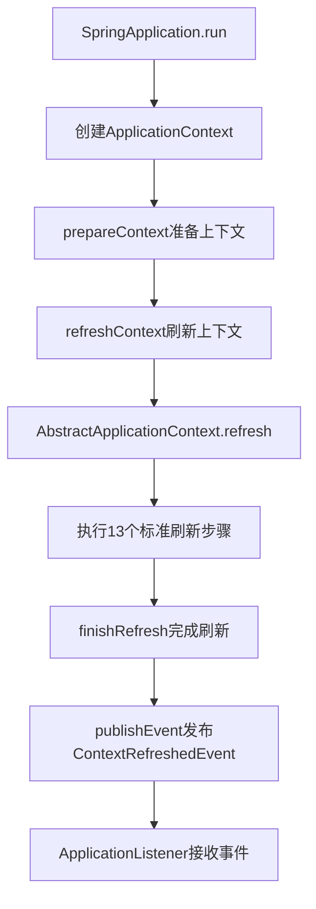
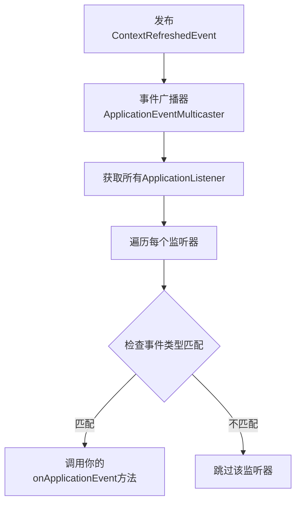

[TOC]

`ContextRefreshedEvent` 是 **Spring框架中的一个核心事件类**，表示Spring应用上下文已经完全初始化并刷新完成。

## 事件含义

`ContextRefreshedEvent` 在以下时机被触发：

- ✅ **Spring容器完成所有bean的实例化**
- ✅ **所有bean的依赖注入完成**
- ✅ **所有bean的后处理器执行完毕**
- ✅ **单例bean的初始化方法执行完成**

## 事件触发时机

```java
// 在Spring容器刷新完成后发布此事件
applicationContext.refresh(); // 内部会发布ContextRefreshedEvent
```

## 典型使用场景

### 1. 应用启动初始化（如这段代码）
```java
@Override
public void onApplicationEvent(ContextRefreshedEvent event) {
    // 确保所有bean都就绪后再执行初始化
    luceneIndexService.rebuildAllIndex();
    slotCodeService.init();
    // ...其他初始化操作
}
```

### 2. 缓存预热
```java
@Override
public void onApplicationEvent(ContextRefreshedEvent event) {
    // 预热缓存数据
    cacheService.warmUp();
}
```

### 3. 资源检查
```java
@Override  
public void onApplicationEvent(ContextRefreshedEvent event) {
    // 检查外部依赖是否可用
    databaseHealthCheck();
    redisHealthCheck();
}
```

## 与其他Spring事件的区别

| 事件类型                  | 触发时机             | 用途                         |
| ------------------------- | -------------------- | ---------------------------- |
| **ContextRefreshedEvent** | **容器完全刷新完成** | **初始化业务逻辑、预热缓存** |
| ContextStartedEvent       | 容器启动时           | 启动特定服务                 |
| ContextStoppedEvent       | 容器停止时           | 清理资源                     |
| ContextClosedEvent        | 容器关闭时           | 最终清理操作                 |

## 重要特点

1. **可能多次触发**：在有些Spring配置中（如父子容器），可能会收到多个此事件
2. **线程安全**：确保在容器完全就绪后执行
3. **依赖保证**：可以安全地调用任何bean，因为所有依赖都已注入完成

## 实际应用示例

```java
@Component
public class MyInitializer implements ApplicationListener<ContextRefreshedEvent> {
    
    @Autowired
    private MyService myService;
    
    @Override
    public void onApplicationEvent(ContextRefreshedEvent event) {
        // 这里可以安全地使用myService，因为它已经完成初始化
        myService.initializeData();
    }
}
```

在你的代码中，使用`ContextRefreshedEvent`确保了广告引擎的所有组件都已经初始化完成，然后再执行索引重建、管道配置等关键操作。

在Spring Boot中，`ContextRefreshedEvent`的触发是通过**精密的启动流程和事件发布机制**实现的。以下是详细的触发过程：

## 核心触发链路



## 具体的触发源码路径

### 1. Spring Boot启动入口
```java
// SpringApplication.java
public ConfigurableApplicationContext run(String... args) {
    // ... 前期准备
    context = createApplicationContext();
    // ... 上下文准备
    refreshContext(context); // 这里触发刷新!
    // ... 后续处理
    return context;
}
```

### 2. 刷新上下文关键方法
```java
// AbstractApplicationContext.java
public void refresh() throws BeansException, IllegalStateException {
    synchronized (this.startupShutdownMonitor) {
        // 准备工作
        prepareRefresh();
        
        // 获取刷新后的BeanFactory
        ConfigurableListableBeanFactory beanFactory = obtainFreshBeanFactory();
        
        // 准备BeanFactory
        prepareBeanFactory(beanFactory);
        
        try {
            // 后处理BeanFactory
            postProcessBeanFactory(beanFactory);
            
            // 调用BeanFactory后处理器
            invokeBeanFactoryPostProcessors(beanFactory);
            
            // 注册Bean后处理器
            registerBeanPostProcessors(beanFactory);
            
            // 初始化消息源
            initMessageSource();
            
            // 初始化事件广播器
            initApplicationEventMulticaster();
            
            // 初始化特殊Bean
            onRefresh();
            
            // 注册监听器
            registerListeners();
            
            // 完成BeanFactory初始化
            finishBeanFactoryInitialization(beanFactory);
            
            // 完成刷新 - 这里发布ContextRefreshedEvent!
            finishRefresh();
        }
        catch (BeansException ex) {
            // ... 异常处理
            throw ex;
        }
        finally {
            // 重置缓存
            resetCommonCaches();
        }
    }
}
```

### 3. 精准发布事件的核心代码
```java
// AbstractApplicationContext.java
protected void finishRefresh() {
    // 清除资源缓存
    clearResourceCaches();
    
    // 初始化生命周期处理器
    initLifecycleProcessor();
    
    // 传播刷新事件
    getLifecycleProcessor().onRefresh();
    
    // 精准发布ContextRefreshedEvent!
    publishEvent(new ContextRefreshedEvent(this));
    
    // 激活MBean注册（如果适用）
    LiveBeansView.registerApplicationContext(this);
}
```

## 为什么说是"精准"触发？

### 1. 时机精准
事件在**所有初始化步骤完成后**发布：
- ✅ 所有Bean定义加载完成
- ✅ 所有Bean实例化完成  
- ✅ 所有依赖注入完成
- ✅ 所有Bean后处理器执行完成
- ✅ 所有生命周期回调执行完成

### 2. 顺序精准
```java
// 严格的执行顺序保证
finishBeanFactoryInitialization(beanFactory); // 1. 完成所有Bean初始化
finishRefresh();                              // 2. 完成刷新
publishEvent(new ContextRefreshedEvent(this)); // 3. 发布事件
```

### 3. 线程安全
```java
synchronized (this.startupShutdownMonitor) {
    // 整个刷新过程在同步块中，确保线程安全
}
```

## 事件发布机制

### 1. 事件发布
```java
// AbstractApplicationContext.java
public void publishEvent(ApplicationEvent event) {
    publishEvent(event, null);
}

protected void publishEvent(Object event, @Nullable ResolvableType eventType) {
    // 获取事件广播器
    ApplicationEventMulticaster multicaster = getApplicationEventMulticaster();
    //  multicaster.multicastEvent(applicationEvent, eventType);
}
```

### 2. 事件广播
```java
// SimpleApplicationEventMulticaster.java
public void multicastEvent(ApplicationEvent event, @Nullable ResolvableType eventType) {
    ResolvableType type = (eventType != null ? eventType : resolveDefaultEventType(event));
    
    // 获取所有匹配的监听器
    for (ApplicationListener<?> listener : getApplicationListeners(event, type)) {
        // 异步或同步执行监听器
        invokeListener(listener, event);
    }
}
```

## Spring Boot的增强

Spring Boot在基础上增加了：

### 1. 条件化配置
```java
// 确保所有@Conditional条件满足后才继续初始化
@ConditionalOnClass(...)
@ConditionalOnProperty(...)
```

### 2. 自动配置
```java
// 自动配置完成后才发布事件
@AutoConfigureAfter(...)
@AutoConfigureBefore(...)
```

### 3. 健康检查
```java
// 确保应用健康状态就绪
HealthIndicator healthIndicator = context.getBean(HealthIndicator.class);
```

这种精密的触发机制确保了`ContextRefreshedEvent`在**最合适的时机**被发布，让你的初始化代码能够安全地执行。

你的代码能够精准收到`ContextRefreshedEvent`而不是泛化的`ApplicationEvent`，是因为Spring框架提供了**精确的事件类型匹配机制**。以下是详细的原理：

## 核心机制：事件类型过滤

Spring的事件系统会**根据监听器的泛型类型**进行精确匹配：

```java
// 你的代码 - 只接收ContextRefreshedEvent
public class AdEngineInitProcessor implements ApplicationListener<ContextRefreshedEvent> {
    @Override
    public void onApplicationEvent(ContextRefreshedEvent event) {
        // 这里只会收到ContextRefreshedEvent
    }
}

// 对比：接收所有ApplicationEvent
public class GenericListener implements ApplicationListener<ApplicationEvent> {
    @Override
    public void onApplicationEvent(ApplicationEvent event) {
        // 这里会收到所有类型的事件
    }
}
```

## Spring内部的事件分发流程



## 源码级别的类型匹配

### 1. 事件广播核心代码
```java
// SimpleApplicationEventMulticaster.java
public void multicastEvent(ApplicationEvent event, @Nullable ResolvableType eventType) {
    // 解析事件类型
    ResolvableType type = (eventType != null ? eventType : resolveDefaultEventType(event));
    
    // 获取所有匹配的监听器 - 这里进行类型过滤!
    for (ApplicationListener<?> listener : getApplicationListeners(event, type)) {
        invokeListener(listener, event);
    }
}
```

### 2. 类型匹配的关键方法
```java
// AbstractApplicationEventMulticaster.java
protected Collection<ApplicationListener<?>> getApplicationListeners(
        ApplicationEvent event, ResolvableType eventType) {
    
    // 这里会根据事件的ResolvableType进行精确匹配
    // 你的ApplicationListener<ContextRefreshedEvent>只会匹配ContextRefreshedEvent
    return retrieveApplicationListeners(eventType, event.getSource().getClass());
}
```

### 3. 泛型类型解析
Spring使用`ResolvableType`来解析泛型信息：

```java
// 你的监听器泛型信息会被解析为：
ResolvableType listenerType = ResolvableType.forClass(AdEngineInitProcessor)
    .as(ApplicationListener.class)
    .getGeneric(); // 这里得到ContextRefreshedEvent.class

// 事件类型解析：
ResolvableType eventType = ResolvableType.forInstance(event); // ContextRefreshedEvent实例
```

## 为什么是精确匹配？

### 1. 泛型类型参数决定匹配
```java
// 只会匹配ContextRefreshedEvent及其子类
ApplicationListener<ContextRefreshedEvent>

// 会匹配所有ApplicationEvent及其子类  
ApplicationListener<ApplicationEvent>

// 会匹配所有事件
ApplicationListener<?> 或 ApplicationListener
```

### 2. 继承关系不影响匹配
即使`ContextRefreshedEvent`继承自`ApplicationContextEvent`，而后者又继承自`ApplicationEvent`，Spring仍然会进行精确的类型匹配。

## 实际匹配过程示例

当发布`ContextRefreshedEvent`时：

1. **事件类型**：`ContextRefreshedEvent`
2. **你的监听器泛型**：`ContextRefreshedEvent`
3. **匹配结果**：✅ 精确匹配，触发你的代码

如果发布其他事件（如`ContextStartedEvent`）：

1. **事件类型**：`ContextStartedEvent`  
2. **你的监听器泛型**：`ContextRefreshedEvent`
3. **匹配结果**：❌ 类型不匹配，不会触发

## 调试技巧

你可以在代码中添加调试信息来验证：

```java
@Override
public void onApplicationEvent(ContextRefreshedEvent event) {
    LogUtils.info("收到事件: " + event.getClass().getName());
    LogUtils.info("事件源: " + event.getSource().getClass().getName());
    
    // 只会输出ContextRefreshedEvent相关信息
}
```

## 总结

你的代码能够精准接收`ContextRefreshedEvent`是因为：

1. **泛型类型声明**：`ApplicationListener<ContextRefreshedEvent>`明确了只接收这种事件
2. **Spring的类型匹配系统**：在事件分发时进行精确的泛型类型匹配
3. **编译时类型安全**：泛型确保了类型安全，避免错误的事件处理

这种设计使得Spring的事件系统既灵活又类型安全，不同功能的监听器可以专注于处理特定类型的事件。

这段代码是Spring框架中事件发布机制的核心部分，负责高效地获取匹配特定事件类型的应用监听器。我来详细解析其实现逻辑：

## getApplicationListeners

这是一个保护方法，用于获取匹配特定事件类型的所有`ApplicationListener`，通过缓存机制提高性能。

## 核心组件解析

### 1. 参数说明
- `ApplicationEvent event`: 要传播的事件对象
- `ResolvableType eventType`: 事件类型（支持泛型解析）
- 返回：匹配的监听器集合

### 2. 缓存键设计
```java
ListenerCacheKey cacheKey = new ListenerCacheKey(eventType, sourceType);
```
使用事件类型+事件源类型的组合作为缓存键，确保不同事件源的相同事件类型可以分别缓存。

## 核心逻辑流程

### 1. 缓存查找阶段
```java
CachedListenerRetriever existingRetriever = this.retrieverCache.get(cacheKey);
```
首先尝试从并发HashMap中获取已缓存的监听器检索器。

### 2. 缓存未命中处理
当缓存不存在时：
```java
if (this.beanClassLoader == null ||
    (ClassUtils.isCacheSafe(event.getClass(), this.beanClassLoader) &&
     (sourceType == null || ClassUtils.isCacheSafe(sourceType, this.beanClassLoader)))) {
    // 创建新的缓存条目
}
```
**缓存安全性检查**：确保事件类和源类在当前类加载器环境下是缓存安全的，避免类加载器泄漏问题。

### 3. 线程安全的缓存填充
```java
newRetriever = new CachedListenerRetriever();
existingRetriever = this.retrieverCache.putIfAbsent(cacheKey, newRetriever);
```
使用`putIfAbsent()`确保多线程环境下的原子性操作，避免重复创建缓存条目。

### 4. 缓存命中处理
```java
if (existingRetriever != null) {
    Collection<ApplicationListener<?>> result = existingRetriever.getApplicationListeners();
    if (result != null) {
        return result; // 直接返回缓存结果
    }
}
```
如果缓存存在且已填充数据，直接返回结果，极大提升性能。

### 5. 降级处理
```java
return retrieveApplicationListeners(eventType, sourceType, newRetriever);
```
当缓存未命中或正在填充时，调用实际检索方法。

## 设计亮点

### 1. 性能优化
- **缓存机制**：避免每次事件发布都重新扫描和匹配监听器
- **懒加载**：缓存条目在首次需要时创建
- **线程安全**：使用并发容器和原子操作

### 2. 内存安全
- **类加载器感知**：检查类的缓存安全性，防止内存泄漏
- **缓存键设计**：细粒度的缓存策略，避免不必要的缓存膨胀

### 3. 并发处理
- **putIfAbsent模式**：经典的线程安全缓存填充模式
- **空结果处理**：正确处理并发环境下缓存正在填充的情况

## 典型应用场景

这段代码在Spring事件发布机制中被调用：
```java
// AbstractApplicationContext.publishEvent()
protected void publishEvent(Object event, @Nullable ResolvableType eventType) {
    // ...
    getApplicationListeners(event, type); // 调用该方法
    // ...
}
```

## 总结

这是一个典型的高性能缓存实现，展示了Spring框架如何：
1. 通过缓存提升频繁操作性能
2. 处理多线程并发访问
3. 确保类加载器环境安全
4. 提供优雅的降级机制

这种设计模式在Spring内部广泛使用，是理解框架性能优化和并发处理的重要范例。

这个`retrieveApplicationListeners`方法是Spring事件监听器检索的核心实现，负责实际获取和过滤匹配特定事件类型的监听器。我来详细解析其实现逻辑：

## retrieveApplicationListeners

这是一个私有方法，负责：
1. 从所有注册的监听器中筛选支持特定事件类型的监听器
2. 处理编程方式注册和Bean方式注册的监听器
3. 为缓存目的构建过滤后的监听器集合

## 核心逻辑流程

### 1. 初始化数据结构
```java
List<ApplicationListener<?>> allListeners = new ArrayList<>();
Set<ApplicationListener<?>> filteredListeners = (retriever != null ? new LinkedHashSet<>() : null);
Set<String> filteredListenerBeans = (retriever != null ? new LinkedHashSet<>() : null);
```
- `allListeners`: 最终返回的所有匹配监听器
- `filteredListeners`: 用于缓存的编程方式注册的监听器
- `filteredListenerBeans`: 用于缓存的Bean方式注册的监听器名称

### 2. 获取所有已注册的监听器
```java
synchronized (this.defaultRetriever) {
    listeners = new LinkedHashSet<>(this.defaultRetriever.applicationListeners);
    listenerBeans = new LinkedHashSet<>(this.defaultRetriever.applicationListenerBeans);
}
```
**线程安全**：使用同步块确保在获取监听器列表时的线程安全。

### 3. 处理编程方式注册的监听器
```java
for (ApplicationListener<?> listener : listeners) {
    if (supportsEvent(listener, eventType, sourceType)) {
        if (retriever != null) {
            filteredListeners.add(listener); // 添加到缓存
        }
        allListeners.add(listener); // 添加到结果
    }
}
```
直接检查每个监听器是否支持该事件类型。

### 4. 处理Bean方式注册的监听器（核心复杂逻辑）
```java
if (!listenerBeans.isEmpty()) {
    ConfigurableBeanFactory beanFactory = getBeanFactory();
    for (String listenerBeanName : listenerBeans) {
        // 复杂处理逻辑...
    }
}
```

#### 4.1 支持事件的Bean处理
```java
if (supportsEvent(beanFactory, listenerBeanName, eventType)) {
    ApplicationListener<?> listener = beanFactory.getBean(listenerBeanName, ApplicationListener.class);
    if (!allListeners.contains(listener) && supportsEvent(listener, eventType, sourceType)) {
        // 去重检查并添加到相应集合
        if (beanFactory.isSingleton(listenerBeanName)) {
            filteredListeners.add(listener); // 单例→直接缓存实例
        } else {
            filteredListenerBeans.add(listenerBeanName); // 非单例→缓存Bean名称
        }
    }
}
```
**重要设计**：
- 单例Bean：直接缓存实例对象
- 非单例Bean：缓存Bean名称，每次从工厂获取

#### 4.2 不支持事件的Bean处理
```java
else {
    Object listener = beanFactory.getSingleton(listenerBeanName);
    if (retriever != null) {
        filteredListeners.remove(listener); // 从缓存中移除
    }
    allListeners.remove(listener); // 从结果中移除
}
```
处理原本支持但现在不支持的事件监听器（可能由于Bean定义元数据变化）。

#### 4.3 异常处理
```java
catch (NoSuchBeanDefinitionException ex) {
    // Singleton listener instance (without backing bean definition) disappeared -
    // probably in the middle of the destruction phase
}
```
优雅处理Bean在销毁阶段消失的情况。

### 5. 排序和缓存填充
```java
AnnotationAwareOrderComparator.sort(allListeners); // 按Order注解排序
if (retriever != null) {
    if (filteredListenerBeans.isEmpty()) {
        retriever.applicationListeners = new LinkedHashSet<>(allListeners);
        retriever.applicationListenerBeans = filteredListenerBeans;
    } else {
        retriever.applicationListeners = filteredListeners;
        retriever.applicationListenerBeans = filteredListenerBeans;
    }
}
```
**缓存策略**：根据是否有非单例Bean决定缓存结构。

## 设计亮点

### 1. 双重检查机制
```java
supportsEvent(beanFactory, listenerBeanName, eventType) // 基于BeanDefinition检查
&& supportsEvent(listener, eventType, sourceType)       // 基于实际实例检查
```
确保监听器确实支持该事件类型。

### 2. 缓存优化策略
- **单例Bean**：缓存实例，避免重复查找
- **非单例Bean**：缓存Bean名称，支持原型scope
- **去重处理**：防止编程方式和Bean方式注册的重复监听器

### 3. 线程安全设计
- 同步块保护默认检索器的访问
- 并发安全的集合操作

### 4. 容错处理
- Bean不存在时的优雅降级
- 销毁阶段的异常处理

### 5. 性能考虑
- 懒加载：只在需要时创建Bean实例
- 缓存友好：为后续事件发布优化性能

## 典型应用场景

这个方法在：
1. 首次发布某种类型事件时被调用
2. 缓存未命中时
3. 监听器集合发生变化时

## 总结

这是一个高度优化的监听器检索实现，展示了Spring框架如何：
1. **处理复杂性**：协调编程方式和声明式注册的监听器
2. **保证性能**：通过智能缓存策略减少Bean工厂查找
3. **确保正确性**：双重检查机制验证监听器支持性
4. **维护线程安全**：在并发环境下安全操作
5. **提供弹性**：优雅处理各种边界情况

这种设计模式体现了Spring框架在性能、安全性和功能性之间的精细平衡。
