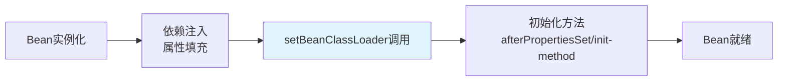

好的，我们来翻译并详细解释这个重要的 Spring 生命周期接口。

## 翻译

```java
/**
 * 回调接口，允许 Bean 感知到 bean 的 {@link ClassLoader 类加载器}；
 * 即当前 bean 工厂用于加载 bean 类的类加载器。
 *
 * <p>这主要旨在由框架类实现，这些类必须按名称获取应用类，尽管它们自身可能
 * 是从共享类加载器加载的。
 *
 * <p>有关所有 bean 生命周期方法的列表，请参阅
 * {@link BeanFactory BeanFactory 文档}。
 *
 * @author Juergen Hoeller
 * @author Chris Beams
 * @since 2.0
 * @see BeanNameAware
 * @see BeanFactoryAware
 * @see InitializingBean
 */
public interface BeanClassLoaderAware extends Aware {

	/**
	 * 向 bean 实例提供 bean {@link ClassLoader 类加载器}的回调方法。
	 * <p>在普通 bean 属性填充<i>之后</i>调用，但在初始化回调（如
	 * {@link InitializingBean InitializingBean 的}
	 * {@link InitializingBean#afterPropertiesSet()} 方法或自定义初始化方法）
	 * <i>之前</i>调用。
	 * @param classLoader 所属的类加载器
	 */
	void setBeanClassLoader(ClassLoader classLoader);
}
```
------
## 详细解释

### 1. 核心概念

`BeanClassLoaderAware` 是 Spring 框架中的一个**生命周期回调接口**，它允许 Bean 在初始化过程中**获取到加载它自己所属类的 ClassLoader**。

### 2. 调用时机

这个方法在 Bean 生命周期中的调用时机非常重要：



**具体顺序：**
1. ✅ Bean 实例化（构造函数）
2. ✅ 依赖注入（属性设置）
3. ✅ **`setBeanClassLoader()` 被调用**
4. ✅ `afterPropertiesSet()` 或自定义 init-method
5. ✅ Bean 完全初始化完成

### 3. 主要用途

#### 框架级别的类加载需求
```java
@Component
public class MyService implements BeanClassLoaderAware {
    
    private ClassLoader beanClassLoader;
    
    @Override
    public void setBeanClassLoader(ClassLoader classLoader) {
        this.beanClassLoader = classLoader;
    }
    
    public void loadClassDynamically() {
        // 使用保存的 ClassLoader 动态加载类
        try {
            Class<?> dynamicClass = this.beanClassLoader.loadClass("com.example.SomeClass");
            // ... 使用动态加载的类
        } catch (ClassNotFoundException e) {
            // 处理异常
        }
    }
}
```

#### 实际应用场景

**场景1：序列化/反序列化框架**
```java
public class JacksonConfig implements BeanClassLoaderAware {
    private ClassLoader classLoader;
    
    @Override
    public void setBeanClassLoader(ClassLoader classLoader) {
        this.classLoader = classLoader;
    }
    
    @Bean
    public ObjectMapper objectMapper() {
        ObjectMapper mapper = new ObjectMapper();
        // 配置 ObjectMapper 使用正确的 ClassLoader 来解析类型
        mapper.setTypeFactory(mapper.getTypeFactory().withClassLoader(this.classLoader));
        return mapper;
    }
}
```

**场景2：动态代理创建**
```java
public class ProxyFactoryBean implements BeanClassLoaderAware {
    private ClassLoader classLoader;
    
    @Override
    public void setBeanClassLoader(ClassLoader classLoader) {
        this.classLoader = classLoader;
    }
    
    public Object createProxy(Class<?>... interfaces) {
        // 使用正确的 ClassLoader 创建代理
        return Proxy.newProxyInstance(this.classLoader, interfaces, invocationHandler);
    }
}
```

### 4. 为什么需要这个接口？

#### 类加载器隔离环境
在复杂的应用环境中，可能存在多个 ClassLoader：

```java
// 不同的 ClassLoader 场景
ClassLoader systemClassLoader = ClassLoader.getSystemClassLoader();
ClassLoader threadContextClassLoader = Thread.currentThread().getContextClassLoader();
ClassLoader beanClassLoader = ...; // Spring 容器使用的 ClassLoader

// 这三个可能是不同的！
```

**问题：** 如果使用错误的 ClassLoader，可能导致 `ClassNotFoundException` 或类转换异常。

**解决方案：** `BeanClassLoaderAware` 确保 Bean 使用与 Spring 容器相同的 ClassLoader。

### 5. 与其他 Aware 接口的关系

Spring 提供了一系列 `Aware` 接口，用于不同的感知需求：

| Aware 接口                 | 提供的信息              | 典型用途         |
| -------------------------- | ----------------------- | ---------------- |
| `BeanNameAware`            | Bean 的 ID/名称         | 日志、监控       |
| `BeanFactoryAware`         | BeanFactory 引用        | 编程式 Bean 查找 |
| `ApplicationContextAware`  | ApplicationContext 引用 | 获取容器服务     |
| **`BeanClassLoaderAware`** | **ClassLoader 引用**    | **动态类加载**   |
| `EnvironmentAware`         | Environment 对象        | 访问配置属性     |

### 6. 实际框架中的使用示例

**Spring 内部的使用：**
```java
// Spring 的 CachingMetadataReaderFactory 实际实现
public class CachingMetadataReaderFactory implements BeanClassLoaderAware {
    private ClassLoader classLoader;
    
    @Override
    public void setBeanClassLoader(ClassLoader classLoader) {
        this.classLoader = classLoader;
    }
    
    public MetadataReader getMetadataReader(Resource resource) {
        // 使用保存的 ClassLoader 读取类元数据
        return new SimpleMetadataReader(resource, this.classLoader);
    }
}
```

### 7. 注意事项

```java
@Component
public class MyComponent implements BeanClassLoaderAware {
    
    @Override
    public void setBeanClassLoader(ClassLoader classLoader) {
        // 不要在这里执行复杂的初始化逻辑！
        // 这个方法只是用于"感知"，真正的初始化应该在 afterPropertiesSet() 中
        
        // 正确做法：保存 ClassLoader 引用供后续使用
        this.classLoader = classLoader;
    }
    
    @PostConstruct
    public void init() {
        // 在这里使用 classLoader 进行初始化
        if (this.classLoader != null) {
            // 执行需要 ClassLoader 的初始化逻辑
        }
    }
}
```

## 总结

`BeanClassLoaderAware` 是一个**框架级别的扩展接口**，主要价值在于：

1. **解决类加载器一致性**：确保 Bean 使用与 Spring 容器相同的 ClassLoader
2. **支持动态类加载**：为需要按名称加载类的框架组件提供支持
3. **生命周期集成**：在合适的时机（属性注入后，初始化前）提供 ClassLoader
4. **复杂环境适配**：在 OSGi、模块化系统等复杂类加载环境中特别有用

对于大多数业务开发来说，你可能不需要直接使用这个接口。但它对于框架开发者和需要处理动态类加载的高级场景非常重要。
