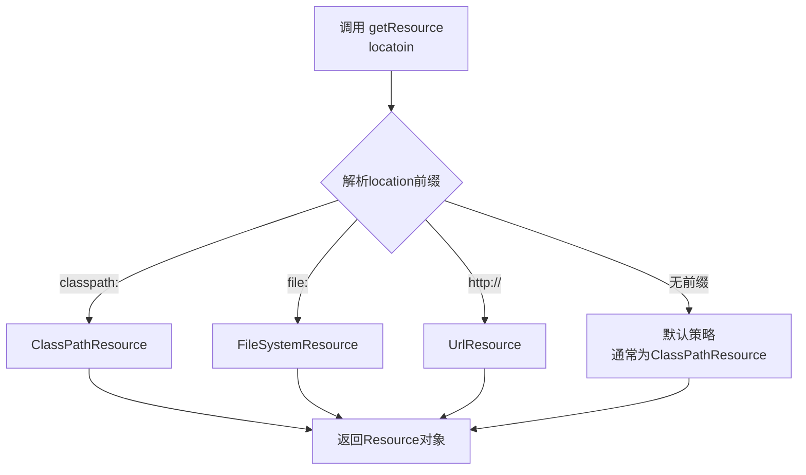

好的，我们来深入理解 Spring 的 `ResourceLoader` 机制，这是 Spring 框架中资源抽象的核心。

## 1. ResourceLoader 的核心作用

`ResourceLoader` 是 Spring 资源加载的**策略接口**，它定义了一个统一的资源访问抽象，**屏蔽了资源来源的差异**。

### 设计目标
- **统一访问**：无论资源在文件系统、类路径、网络还是其他地方，都用相同的方式访问
- **协议抽象**：通过前缀（如 `classpath:`, `file:`）来标识资源位置
- **懒加载**：获取的是资源的"句柄"（Resource对象），不是立即加载内容

## 2. Location（资源位置）详解

### Location 的本质
Location 是一个**字符串**，表示资源的"地址"。它支持多种格式：

```java
// 不同的 location 示例
"classpath:application.yml"           // 类路径资源
"file:/etc/app/config.properties"     // 文件系统绝对路径
"file:./config/app.properties"        // 文件系统相对路径
"https://config.server.com/app.yml"   // URL 网络资源
"WEB-INF/web.xml"                     // 无前缀（由具体实现解析）
"custom://my-resource"                // 自定义协议
```

### Location 的前缀协议

| 前缀                   | 示例                         | 说明                           |
| ---------------------- | ---------------------------- | ------------------------------ |
| `classpath:`           | `classpath:app.xml`          | 从类路径加载                   |
| `file:`                | `file:/home/config.xml`      | 从文件系统加载                 |
| `http://` / `https://` | `https://example.com/config` | 从网络 URL 加载                |
| (无前缀)               | `WEB-INF/web.xml`            | 由具体实现决定，通常是相对路径 |

## 3. ResourceLoader 的获取机制

### 核心方法：`getResource(String location)`

```java
Resource getResource(String location);
```

这个方法**不立即加载资源内容**，而是返回一个 `Resource` 对象（资源句柄）。

### 获取流程



## 4. 实际使用示例

### 示例1：基本使用
```java
ResourceLoader loader = new DefaultResourceLoader();

// 获取资源句柄（不加载内容）
Resource classpathResource = loader.getResource("classpath:application.yml");
Resource fileResource = loader.getResource("file:/etc/app/config.properties");
Resource urlResource = loader.getResource("https://example.com/config.json");

// 真正检查资源是否存在
boolean exists = classpathResource.exists();

// 真正获取资源内容
InputStream inputStream = classpathResource.getInputStream();
```

### 示例2：在 Spring Boot 中的应用
```java
@SpringBootApplication
public class MyApp implements ApplicationRunner {
    
    @Autowired
    private ResourceLoader resourceLoader; // Spring 会自动注入
    
    @Override
    public void run(ApplicationArguments args) throws Exception {
        // 加载配置文件
        Resource configResource = resourceLoader.getResource("classpath:application.yml");
        if (configResource.exists()) {
            // 读取配置内容
            String content = StreamUtils.copyToString(
                configResource.getInputStream(), StandardCharsets.UTF_8);
            System.out.println("Config content: " + content);
        }
        
        // 加载模板文件
        Resource templateResource = resourceLoader.getResource("file:./templates/welcome.html");
    }
}
```

## 5. Resource 接口的重要方法

获取到 `Resource` 对象后，你可以调用以下方法：

```java
public interface Resource extends InputStreamSource {
    boolean exists();        // 资源是否存在
    boolean isReadable();    // 资源是否可读
    boolean isOpen();        // 资源是否已打开
    URL getURL() throws IOException;           // 获取URL
    File getFile() throws IOException;         // 获取File对象
    long contentLength() throws IOException;   // 获取内容长度
    long lastModified() throws IOException;    // 最后修改时间
    Resource createRelative(String relativePath) throws IOException; // 创建相对资源
    String getFilename();    // 获取文件名
    String getDescription(); // 获取描述信息
}
```

## 6. Spring 环境中的高级用法

### 资源路径通配符
Spring 提供了更强大的 `ResourcePatternResolver`：

```java
ResourcePatternResolver resolver = new PathMatchingResourcePatternResolver();

// 加载所有匹配的资源
Resource[] resources = resolver.getResources("classpath*:META-INF/spring.factories");
Resource[] templates = resolver.getResources("file:./templates/*.html");
```

### 在配置中使用
```properties
# application.properties
app.config.location=classpath:config/app.properties
app.template.location=file:./templates/
```

```java
@Component
public class AppConfig {
    
    @Value("${app.config.location}")
    private Resource configResource; // 直接注入Resource
    
    @Value("classpath:default-config.yml") 
    private Resource defaultConfig;
    
    @Value("file:${user.home}/app-data/")
    private Resource dataDirectory;
}
```

## 7. 自定义 ResourceLoader

### 创建自定义实现
```java
public class DatabaseResourceLoader extends DefaultResourceLoader {
    @Override
    public Resource getResource(String location) {
        if (location.startsWith("db:")) {
            // 处理自定义的数据库资源协议
            String query = location.substring("db:".length());
            return new DatabaseResource(query);
        }
        // 其他情况使用默认处理
        return super.getResource(location);
    }
}

// 使用自定义加载器
ResourceLoader loader = new DatabaseResourceLoader();
Resource dbResource = loader.getResource("db:select * from config where app='myapp'");
```

## 8. 总结

### ResourceLoader 的核心价值

1. **抽象统一**：提供统一的资源访问接口
2. **协议支持**：通过前缀支持多种资源协议
3. **懒加载**：`getResource()` 只返回句柄，不立即加载内容
4. **扩展性强**：可以轻松添加自定义资源协议

### 关键理解点

- **Location 是字符串**：描述资源位置的地址
- **Resource 是句柄**：代表资源，但不包含内容
- **真正的内容获取**：通过 `Resource.getInputStream()` 实现
- **Spring Boot 集成**：自动配置，可通过 `@Autowired` 注入使用

这种设计使得 Spring 应用能够以一致的方式处理各种来源的资源，大大提高了代码的灵活性和可移植性。
