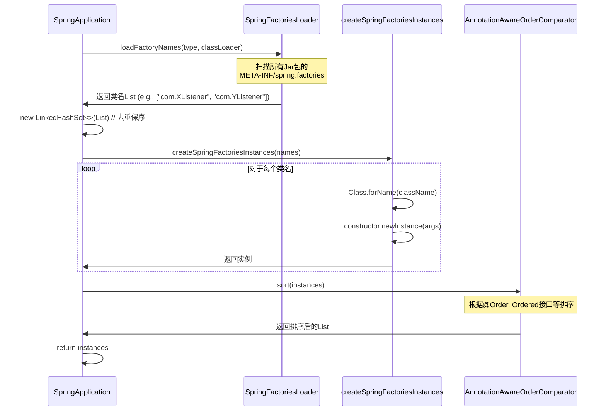

好的，我们来详细解析这段 Spring Boot 中用于加载和实例化扩展组件的核心代码。这是 Spring Boot 自动配置和扩展机制的基石。

### 方法功能

**`getSpringFactoriesInstances`** 是一个泛型方法，它的核心作用是：**从 `META-INF/spring.factories` 文件中加载指定类型的工厂实现类名，然后通过反射实例化这些类，最后进行排序并返回实例集合。**

简单来说，它就是 Spring Boot **“约定优于配置”** 的灵魂，负责自动发现和组装各种组件（如监听器、初始化器等）。
------
### 代码逐行解析

#### 1. 获取类加载器
```java
ClassLoader classLoader = getClassLoader();
```
- **目的**：获取当前应用的类加载器（ClassLoader）。这是后续进行类加载和反射实例化的基础。

#### 2. 加载工厂类名（核心步骤）
```java
Set<String> names = new LinkedHashSet<>(SpringFactoriesLoader.loadFactoryNames(type, classLoader));
```
这是整个方法中最关键的一步。

- **`SpringFactoriesLoader.loadFactoryNames(type, classLoader)`**:
    - **`type`**: 要加载的接口或抽象类的类型（如 `ApplicationContextInitializer.class`, `ApplicationListener.class`）。
    - **工作原理**：这个方法会扫描整个类路径下所有的 `META-INF/spring.factories` 文件。这个文件是一个属性文件，格式如下：
        ```properties
        # META-INF/spring.factories (位于 spring-boot.jar 或 spring-boot-autoconfigure.jar 中)
        org.springframework.context.ApplicationContextInitializer=\
        com.example.MyInitializer,\
        org.springframework.boot.context.ConfigurationWarningsApplicationContextInitializer
        
        org.springframework.boot.ApplicationRunner=\
        com.example.MyApplicationRunner
        ```
    - **返回值**：一个包含所有找到的**完整类名**的 `List<String>`。

- **`new LinkedHashSet<>(...)`**:
    - **目的**：将列表转换为 `LinkedHashSet`。这有两个重要作用：
        1.  **去重**：防止从不同的 JAR 包中加载到相同的实现类。
        2.  **保持顺序**：`LinkedHashSet` 会保留元素被添加的顺序，这对应了 `spring.factories` 文件中定义的顺序。

#### 3. 反射创建实例
```java
List<T> instances = createSpringFactoriesInstances(type, parameterTypes, classLoader, args, names);
```
这一步将上一步获取的类名字符串，变成真正的 Java 对象。

- **`createSpringFactoriesInstances` 方法内部会**：
    1.  遍历上一步得到的类名集合 `names`。
    2.  对于每个类名，使用 `ClassUtils.forName(className, classLoader)` 动态加载这个类。
    3.  通过反射 `clazz.getDeclaredConstructor(parameterTypes)` 获取类的构造函数。
    4.  使用 `constructor.newInstance(args)` 传入参数 `args` 来创建实例。
- **`parameterTypes` 和 `args`**：允许传入构造参数。例如，在创建 `SpringApplication` 时，加载 `ApplicationListener` 可能会传入 `SpringApplication` 实例本身作为参数。

#### 4. 排序实例
```java
AnnotationAwareOrderComparator.sort(instances);
```
- **目的**：对实例化好的对象列表进行排序。
- **`AnnotationAwareOrderComparator`**：是一个强大的比较器，它支持多种排序规则：
    1.  **`@Order` 注解**：检查类上的 `@Order(1)` 注解，数字越小优先级越高。
    2.  **`Ordered` 接口**：检查类是否实现了 `Ordered` 接口，并调用 `getOrder()` 方法。
    3.  **`@Priority` 注解**（JSR-250 标准）。
- **重要性**：排序确保了这些扩展组件（如监听器、初始化器）的执行顺序是确定的，这对于启动流程的正确性至关重要。例如，某些监听器必须在其他监听器之前执行。

#### 5. 返回结果
```java
return instances;
```
- 最终返回一个已经**实例化、去重、排序好**的指定类型的对象集合。
------
### 工作流程图示



### 实际应用场景

在 `SpringApplication` 的初始化过程中，这个方法被多次调用：

```java
// 设置初始化器 (ApplicationContextInitializer)
setInitializers((Collection) getSpringFactoriesInstances(ApplicationContextInitializer.class));

// 设置监听器 (ApplicationListener)
setListeners((Collection) getSpringFactoriesInstances(ApplicationListener.class));
```

### 总结

| 步骤            | 核心对象/概念                                        | 作用                               |
| :-------------- | :--------------------------------------------------- | :--------------------------------- |
| 1. 获取类加载器 | `ClassLoader`                                        | 提供类加载能力                     |
| 2. **加载类名** | `SpringFactoriesLoader`, `META-INF/spring.factories` | **发现**扩展实现（自动配置的基石） |
| 3. 创建实例     | 反射 (`Constructor.newInstance`)                     | **实例化**扩展类                   |
| 4. **排序**     | `AnnotationAwareOrderComparator`, `@Order`           | **控制**扩展类的执行顺序           |
| 5. 返回         | `Collection<T>`                                      | 返回可直接使用的组件集合           |

这个方法完美体现了 Spring Boot 的三大设计理念：
1.  **约定优于配置**：通过固定的 `spring.factories` 文件位置和格式自动发现组件。
2.  **开箱即用**：Spring Boot 内置了大量 `spring.factories` 配置，提供了默认行为。
3.  **易于扩展**：用户只需在自己的 Jar 包的 `spring.factories` 文件中添加配置，即可轻松扩展框架功能。
