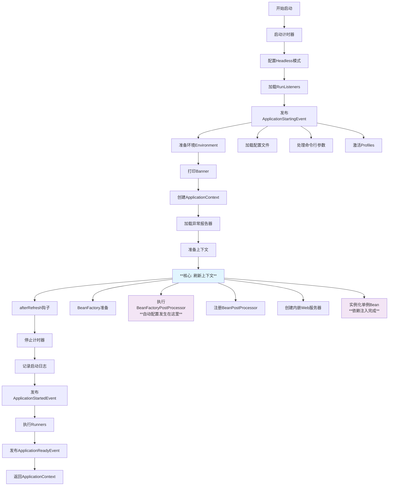

这是 **Spring Boot 应用启动的核心方法**，包含了整个应用从启动到运行的全流程。让我们逐部分详细解析这个重要的 `run` 方法。

## 方法概览

**作用**：启动整个 Spring Boot 应用，创建并刷新 ApplicationContext，返回完全初始化的应用上下文。

**返回值**：`ConfigurableApplicationContext` - 配置好的应用上下文（IoC 容器）
------
## 代码逐部分深度解析

### 1. 启动计时和初始化
```java
StopWatch stopWatch = new StopWatch();
stopWatch.start();
ConfigurableApplicationContext context = null;
Collection<SpringBootExceptionReporter> exceptionReporters = new ArrayList<>();
```

- **`StopWatch`**: Spring 的工具类，用于测量执行时间
- **`context`**: 应用上下文，初始为 null，在后续创建
- **`exceptionReporters`**: 异常报告器集合，用于启动失败时的错误处理

### 2. 基础配置
```java
configureHeadlessProperty();
SpringApplicationRunListeners listeners = getRunListeners(args);
listeners.starting();
```

- **`configureHeadlessProperty()`**: 设置 Java AWT 的 headless 模式，确保在服务器环境（无图形界面）也能正常工作
- **`getRunListeners(args)`**: 从 `spring.factories` 加载 `SpringApplicationRunListener` 实现
- **`listeners.starting()`**: 发布 `ApplicationStartingEvent` 事件，通知监听器应用开始启动

### 3. 环境准备
```java
ApplicationArguments applicationArguments = new DefaultApplicationArguments(args);
ConfigurableEnvironment environment = prepareEnvironment(listeners, applicationArguments);
configureIgnoreBeanInfo(environment);
Banner printedBanner = printBanner(environment);
```

- **`ApplicationArguments`**: 封装命令行参数，提供便捷的访问接口
- **`prepareEnvironment()`**: **关键步骤** - 创建和配置环境（Profiles、配置文件、命令行参数等）
- **`configureIgnoreBeanInfo()`**: 配置 BeanInfo 忽略，优化性能
- **`printBanner()`**: 打印 Spring Boot 启动 Banner（就是那个大大的 Spring 标志）

### 4. 创建应用上下文
```java
context = createApplicationContext();
exceptionReporters = getSpringFactoriesInstances(SpringBootExceptionReporter.class,
        new Class[] { ConfigurableApplicationContext.class }, context);
```

- **`createApplicationContext()`**: 根据应用类型（Servlet/Reactive/None）创建对应的 ApplicationContext
- **`exceptionReporters`**: 加载异常报告器，用于优雅地处理启动失败

### 5. 上下文准备和刷新（最核心的部分）
```java
prepareContext(context, environment, listeners, applicationArguments, printedBanner);
refreshContext(context);
afterRefresh(context, applicationArguments);
```

这三步是 **Spring Boot 启动的魔法所在**：

#### `prepareContext()`
- 将环境设置到上下文中
- 执行 Bean 定义后置处理
- 加载所有源（主配置类、其他配置等）
- 发布 `ApplicationPreparedEvent` 事件

#### `refreshContext()` - **最最关键的方法**
```java
// 内部调用 context.refresh()，包含：
// 1. BeanFactory 准备
// 2. 执行 BeanFactoryPostProcessor（自动配置在这里发生！）
// 3. 注册 BeanPostProcessor
// 4. 初始化消息源和事件
// 5. 创建内嵌 Web 服务器（Tomcat/Netty/Jetty）
// 6. 实例化所有非懒加载的单例 Bean（依赖注入在这里完成）
// 7. 完成刷新，发布 ContextRefreshedEvent
```

#### `afterRefresh()`
- 刷新后的钩子方法，默认空实现，可用于自定义扩展

### 6. 启动完成处理
```java
stopWatch.stop();
if (this.logStartupInfo) {
    new StartupInfoLogger(this.mainApplicationClass).logStarted(getApplicationLog(), stopWatch);
}
listeners.started(context);
callRunners(context, applicationArguments);
```

- **计时停止**：计算总启动时间
- **启动日志**：记录启动完成信息
- **`listeners.started()`**：发布 `ApplicationStartedEvent` 事件
- **`callRunners()`**：执行所有 `ApplicationRunner` 和 `CommandLineRunner` Bean

### 7. 运行状态和异常处理
```java
try {
    listeners.running(context);  // 发布 ApplicationReadyEvent
}
catch (Throwable ex) {
    handleRunFailure(context, ex, exceptionReporters, null);
    throw new IllegalStateException(ex);
}
return context;
```

- **`listeners.running()`**：发布 `ApplicationReadyEvent`，表示应用已完全就绪
- **异常处理**：如果任何步骤失败，调用 `handleRunFailure` 进行清理并发布失败事件
------
## 完整启动流程图示


------
## 事件发布序列

Spring Boot 通过事件机制提供了丰富的扩展点：

1. **`ApplicationStartingEvent`**：应用开始启动
2. **`ApplicationEnvironmentPreparedEvent`**：环境准备完成
3. **`ApplicationPreparedEvent`**：上下文准备完成，但未刷新
4. **`ContextRefreshedEvent`**：上下文刷新完成（Spring Framework 事件）
5. **`ApplicationStartedEvent`**：应用启动完成，Runners 即将执行
6. **`ApplicationReadyEvent`**：应用完全就绪，可处理请求
------
## 实际应用示例

### 自定义 Runner
```java
@Component
public class MyApplicationRunner implements ApplicationRunner {
    @Override
    public void run(ApplicationArguments args) {
        // 应用启动后执行的初始化逻辑
        System.out.println("应用启动完成，执行自定义初始化...");
    }
}
```

### 事件监听器
```java
@Component
public class MyApplicationListener {
    @EventListener
    public void handleApplicationReady(ApplicationReadyEvent event) {
        // 应用完全就绪后的处理
        System.out.println("应用已就绪，可以开始处理请求！");
    }
}
```
------
## 设计思想总结

### 1. **模板方法模式**
整个 `run` 方法定义了一个标准的启动流程，每个步骤都可以被重写或扩展。

### 2. **事件驱动架构**
通过多个事件节点，允许在启动过程的不同阶段插入自定义逻辑。

### 3. **失败恢复机制**
完善的异常处理确保启动失败时能够优雅地清理资源。

### 4. **模块化设计**
每个步骤职责单一，便于理解和维护。

### 5. **开箱即用**
默认实现提供了完整的功能，同时保留充分的扩展性。

这个 `run` 方法是 Spring Boot **"约定优于配置"** 理念的完美体现，它将复杂的启动过程封装在一个简单的方法调用中，让开发者可以专注于业务逻辑。
