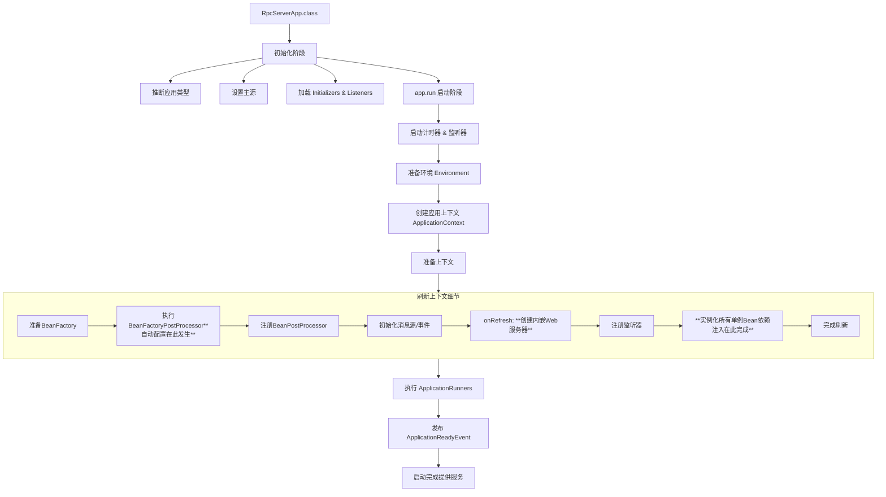

------
### 第一行：`SpringApplication app = new SpringApplication(RpcServerApp.class);`

这行代码是**实例化**一个 `SpringApplication` 对象，为后续的启动做准备。它内部进行了一系列关键的初始化工作。

#### 发生了什么？

1.  **推断应用类型**
    *   SpringApplication 会检查当前的类路径，推断出你的应用类型。主要是三种：
        *   `NONE`: 普通 Java 应用（非 Web）。
        *   `SERVLET`: 基于 Servlet 的 Web 应用（如使用 Spring MVC）。
        *   `REACTIVE`: 响应式 Web 应用（如使用 Spring WebFlux）。
    *   对于你的 `RpcServerApp`，如果类路径下有 Servlet 相关的包（比如 `spring-boot-starter-web`），它会被推断为 `SERVLET` 类型。

2.  **设置主源**
    *   将你传入的 `RpcServerApp.class`（主配置类）保存起来。这个类非常重要，它是：
        *   **组件扫描的起点**：Spring 会从这个类所在的包及其子包下扫描 `@Component`, `@Service`, `@Controller` 等注解的 Bean。
        *   **Java 配置的入口**：它本身通常带有 `@SpringBootApplication` 注解。

3.  **初始化器和监听器**
    *   **关键步骤！** SpringApplication 会从 `spring.factories` 文件中加载一大批 `ApplicationContextInitializer` 和 `ApplicationListener`。
    *   **`ApplicationContextInitializer`**: 在 ApplicationContext 被刷新（refresh）之前，对其进行一些自定义的初始化工作（比如设置环境变量、注册 Bean 等）。
    *   **`ApplicationListener`**: 监听应用启动过程中发布的各种事件（如 `ApplicationStartedEvent`, `ApplicationFailedEvent` 等），实现事件驱动的扩展。这是 Spring Boot 强大的扩展机制之一。

4.  **推断主类**
    *   通过分析调用栈，自动推断出包含 `main` 方法的类（即你的 `RpcServerApp`）。

**此阶段小结：**
此时，`SpringApplication` 对象已经创建完毕，它内部已经知道了应用类型、主配置类、以及需要哪些初始化器和监听器。但 **Spring IoC 容器还没有被创建**，任何 Bean 都还没有被实例化。
------
### 第二行：`app.run(args);`

这行代码是真正的**启动命令**，它触发了整个 Spring 容器的启动流程。这个方法返回一个 `ConfigurableApplicationContext` 对象，代表已经启动好的应用上下文（容器）。其内部流程非常经典和复杂，可以概括为以下几个核心步骤：

#### 发生了什么？

1.  **创建并启动计时器**
    *   启动一个 `StopWatch` 来记录应用的启动时间，方便调试和监控。

2.  **配置 Headless 模式**
    *   设置 Java AWT 的 headless 模式，确保在没有显示设备、键盘或鼠标的环境下（如服务器）也能正常工作。

3.  **获取并运行监听器 - `SpringApplicationRunListeners`**
    *   从 `spring.factories` 加载并启动 `SpringApplicationRunListener`（注意和 `ApplicationListener` 的区别）。
    *   这些监听器会在启动过程的关键节点发布事件（如 `ApplicationStartingEvent`），之前加载的 `ApplicationListener` 就会监听到这些事件并做出响应。

4.  **准备环境 - `ConfigurableEnvironment`**
    *   这是非常重要的一步。创建和配置应用运行环境。
    *   **处理配置文件**：加载 `application.properties` 或 `application.yml` 文件。
    *   **处理命令行参数**：解析 `main` 方法的 `args` 参数，比如 `--server.port=8081`。
    *   **激活 Profiles**：根据配置激活不同的环境（如 `dev`, `test`, `prod`）。
    *   最终，所有配置源（默认属性、配置文件、系统属性、命令行参数等）会被合并，形成一个统一的 `Environment` 对象。

5.  **创建应用上下文 - `ApplicationContext`**
    *   **根据第一步推断的应用类型，实例化对应的 ApplicationContext。**
        *   对于 `SERVLET` 类型，会创建 `AnnotationConfigServletWebServerApplicationContext`。
    *   这个上下文对象就是未来的 Spring IoC 容器。

6.  **准备上下文**
    *   这是一个预处理阶段。
    *   将准备好的 `Environment` 设置到上下文中。
    *   执行 **Bean 定义后置处理**，注册一些特殊的 Bean（如 `BeanNameGenerator`, `BeanPostProcessor`）。
    *   最关键的是，**调用之前加载的所有 `ApplicationContextInitializer` 的 `initialize` 方法**，对上下文进行自定义初始化。

7.  **刷新上下文 - `context.refresh()`**
    *   **这是整个 Spring Boot 启动过程中最最核心的一步！** 它来源于 Spring Framework，是启动 IoC 容器的标准入口。
    *   这个过程极其复杂，主要包括：
        *   **准备 BeanFactory**：创建 `BeanFactory`（真正的 Bean 工厂）。
        *   **执行 `BeanFactoryPostProcessor`**：允许在 Bean 实例化之前修改 Bean 的定义。**这是 Spring Boot 自动配置的魔法所在！** `ConfigurationClassPostProcessor` 会在这个阶段扫描你的 `RpcServerApp.class`（因为有 `@SpringBootApplication`），找到所有需要被管理的 Bean 的定义。
        *   **注册 `BeanPostProcessor`**：这些处理器会在 Bean 的初始化前后插入自定义逻辑（如依赖注入、AOP 代理等）。
        *   **初始化消息源**（国际化）。
        *   **初始化事件广播器**。
        *   **`onRefresh()` 钩子方法**：**Spring Boot 在这里创建了内嵌的 Web 服务器（如 Tomcat）！** 这是 Spring Boot 的独特之处。
        *   **注册监听器**。
        *   **完成 BeanFactory 初始化** - **实例化所有非懒加载的单例 Bean**：这一步会创建所有你定义的 Bean（如你的 RPC 服务实现类、控制器等），并解决它们之间的依赖关系（依赖注入）。
        *   **完成刷新**：发布 `ContextRefreshedEvent` 事件，标志容器已就绪。

8.  ** afterRefresh 钩子和调用 `Runners`**
    *   容器刷新完成后，Spring Boot 提供了一个 `afterRefresh` 钩子方法。
    *   然后，它会寻找并执行 `ApplicationRunner` 和 `CommandLineRunner` 接口的实现类。**这是你可以在应用完全启动后，执行一些自定义初始化逻辑（比如启动 RPC 服务端）的理想位置。**

9.  **发布应用启动完成事件**
    *   发布 `ApplicationReadyEvent` 或 `ApplicationFailedEvent`，告知监听器应用已成功启动或启动失败。

10. **返回 ApplicationContext**
    *   最终，`run` 方法返回已经完全启动好的 `ApplicationContext` 对象。

### 总结与流程图

简单来说，这两行代码从读取配置开始，到创建内嵌服务器，再到实例化所有 Bean 并解决它们的依赖关系，最终启动了一个完整的、可直接运行的 Java 应用程序。你的 RPC 服务端也在这个过程中被初始化并准备好接收请求了。
