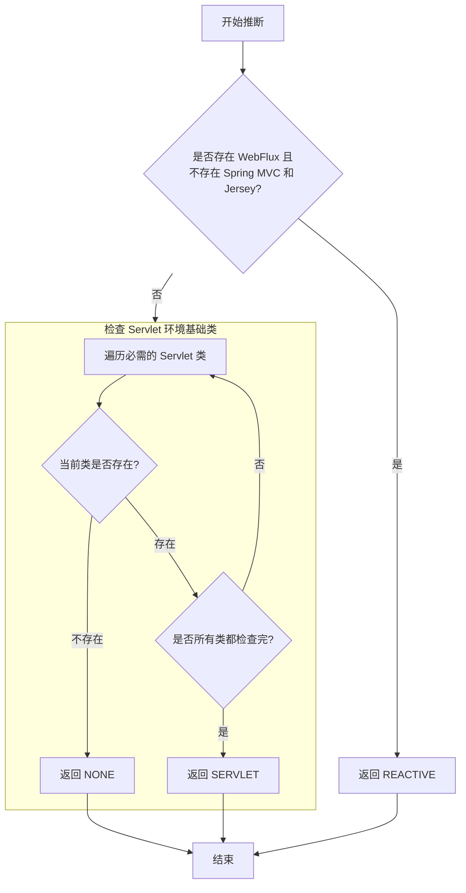

### 方法功能

**`deduceFromClasspath()`** 是一个静态方法，它的唯一目的是：**通过检查当前项目的类路径（Classpath）中是否存在特定的关键类，来推断出 Spring Boot 应用的类型**。

它返回一个 `WebApplicationType` 枚举，共有三个值：
- `REACTIVE`: 响应式 Web 应用
- `SERVLET`: 基于 Servlet 的传统 Web 应用
- `NONE`: 非 Web 应用（如后台任务、批处理应用）
------
### 代码逐行解析

#### 第一部分：判断是否为响应式（REACTIVE）应用

```java
if (ClassUtils.isPresent(WEBFLUX_INDICATOR_CLASS, null) && 
    !ClassUtils.isPresent(WEBMVC_INDICATOR_CLASS, null) &&
    !ClassUtils.isPresent(JERSEY_INDICATOR_CLASS, null)) {
    return WebApplicationType.REACTIVE;
}
```

- **`ClassUtils.isPresent(String className, ClassLoader classLoader)`**: 这是一个 Spring 工具方法，用于判断指定的类能否在当前的类路径下被成功加载。如果能，返回 `true`，表示该类存在。
- **`WEBFLUX_INDICATOR_CLASS`**: 通常是 `"org.springframework.web.reactive.DispatcherHandler"`。这是 Spring WebFlux（响应式 Web 框架）的核心控制器。
- **`WEBMVC_INDICATOR_CLASS`**: 通常是 `"org.springframework.web.servlet.DispatcherServlet"`。这是 Spring MVC（传统 Servlet Web 框架）的核心控制器。
- **`JERSEY_INDICATOR_CLASS`**: 通常是 `"org.glassfish.jersey.servlet.ServletContainer"`。这是 JAX-RS 规范的一种实现（Jersey），也是一种创建 Web 服务的方式。

**逻辑解释：**
只有当**同时满足**以下所有条件时，应用才被推断为 `REACTIVE`：

1.  **存在** WebFlux 的 `DispatcherHandler` → 意味着项目引入了 Spring WebFlux 依赖（如 `spring-boot-starter-webflux`）。
2.  **不存在** Spring MVC 的 `DispatcherServlet` → 意味着项目**没有**引入传统的 Spring MVC 依赖。
3.  **不存在** Jersey 的 `ServletContainer` → 意味着项目**没有**使用 Jersey 来构建 REST 服务。

**设计意图：** 这种判断确保了只有当应用**明确地只使用了 WebFlux** 时，才会被判定为响应式应用。如果类路径中同时存在 WebFlux 和 MVC（有时可能意外引入），Spring Boot 会优先将其视为更常见的 SERVLET 应用，以避免冲突。
------
#### 第二部分：判断是否为非 Web（NONE）应用

如果上一步不满足（即不是纯响应式应用），代码会继续执行：

```java
for (String className : SERVLET_INDICATOR_CLASSES) {
    if (!ClassUtils.isPresent(className, null)) {
        return WebApplicationType.NONE;
    }
}
```

- **`SERVLET_INDICATOR_CLASSES`**: 这是一个包含多个类名的集合，通常包括：
    - `"javax.servlet.Servlet"`
    - `"org.springframework.web.context.ConfigurableWebApplicationContext"`
    - 等等。这些是 Servlet 环境和 Spring Web 支持的基础类。

**逻辑解释：**
这是一个“只要有一个不存在，就返回 NONE”的逻辑。
- 循环遍历所有代表 Servlet Web 应用所**必需**的类。
- 如果发现其中**任何一个类不存在于类路径中**，就意味着当前环境连最基本的 Servlet API 或 Spring Web 支持都不具备，那么它肯定不是一个 Web 应用。
- 因此，直接返回 `WebApplicationType.NONE`。
------
#### 第三部分：默认判断为 Servlet（SERVLET）应用

如果代码能执行到最后的 `return` 语句，说明：
1.  它不是纯响应式应用（第一步的条件不满足）。
2.  它具备了所有 Servlet Web 应用所需的基础类（第二步的循环没有提前返回）。

```java
return WebApplicationType.SERVLET;
```

因此，应用被推断为最常用的 `WebApplicationType.SERVLET` 类型。这涵盖了绝大多数使用 Spring MVC、Jersey 或者同时引入了 WebFlux 和 MVC 的情况。
------
### 逻辑流程图



### 总结

这个方法体现了 Spring Boot 的“约定优于配置”原则和强大的自动配置能力。它通过简单的类路径扫描，智能地决定了应用的运行模式：

- **优先级从高到低**：`REACTIVE` > `NONE` > `SERVLET`。
- **严谨的判断**：确保响应式应用的纯粹性，避免因依赖冲突导致意外行为。
- **默认通用**：将最常见的情况（SERVLET）作为默认选择。

这个推断结果直接影响了后续流程，特别是 `ApplicationContext` 的类型和内嵌 Web 服务器的创建（例如，`REACTIVE` 类型会创建 `Netty` 服务器，而 `SERVLET` 类型会创建 `Tomcat` 服务器）。
