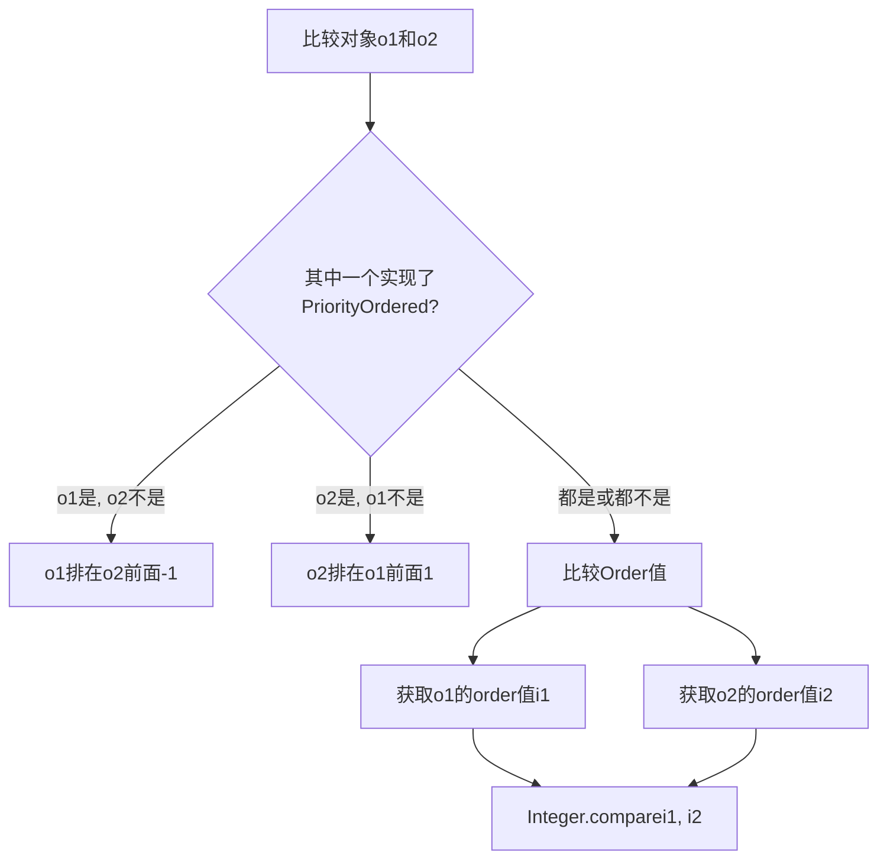

非常好的问题！这行代码的魔法不在于"保证"所有实例都有 order 属性，而在于它**用统一的方式处理各种不同的排序规则**。让我们来深入解析。

## 核心理解

`AnnotationAwareOrderComparator.sort(instances)` **不要求**所有实例都必须有 order 属性，而是**智能地识别和处理多种排序机制**。

## 排序规则优先级

Spring 支持多种排序方式，按优先级从高到低：

### 1. **@Order 注解**（最高优先级）
```java
@Order(1)
public class HighPriorityInitializer implements ApplicationContextInitializer {
    // 这个类会排在前面
}

@Order(100)  
public class LowPriorityInitializer implements ApplicationContextInitializer {
    // 这个类会排在后面
}
```

### 2. **@Priority 注解**（JSR-250 标准）
```java
@Priority(1000)
public class Jsr250Service implements ApplicationContextInitializer {
    // 支持 JSR-250 标准
}
```

### 3. **Ordered 接口**
```java
public class OrderedService implements ApplicationContextInitializer, Ordered {
    @Override
    public int getOrder() {
        return 50; // 实现 getOrder() 方法
    }
}
```

### 4. **默认值**（最低优先级）
```java
public class DefaultService implements ApplicationContextInitializer {
    // 没有实现任何排序机制，使用默认值 Ordered.LOWEST_PRECEDENCE
}
```

## AnnotationAwareOrderComparator 的工作原理

让我们看看源码中的关键逻辑：

### findOrder() 方法（简化版）
```java
protected Integer findOrder(Object obj) {
    // 1. 首先检查 @Order 注解
    Integer order = OrderUtils.getOrder(obj.getClass());
    if (order != null) {
        return order;
    }
    
    // 2. 检查 @Priority 注解（JSR-250）
    order = Jsr250OrderUtils.getPriority(obj.getClass());
    if (order != null) {
        return order;
    }
    
    // 3. 检查 Ordered 接口
    if (obj instanceof Ordered) {
        return ((Ordered) obj).getOrder();
    }
    
    // 4. 返回默认值
    return null;
}
```

### 实际的比较逻辑
```java
public int compare(Object o1, Object o2) {
    Integer order1 = getOrder(o1);  // 智能获取 o1 的 order 值
    Integer order2 = getOrder(o2);  // 智能获取 o2 的 order 值
    
    // 处理 null 值（没有定义排序的实例）
    if (order1 == null) {
        order1 = Ordered.LOWEST_PRECEDENCE; // 默认值：Integer.MAX_VALUE
    }
    if (order2 == null) {
        order2 = Ordered.LOWEST_PRECEDENCE; // 默认值：Integer.MAX_VALUE
    }
    
    return Integer.compare(order1, order2);
}
```

## 实际示例演示

```java
// 定义几个测试类
@Order(10)
class A implements ApplicationContextInitializer {}

@Priority(20)  
class B implements ApplicationContextInitializer {}

class C implements ApplicationContextInitializer, Ordered {
    public int getOrder() { return 30; }
}

class D implements ApplicationContextInitializer {} // 无排序定义

// 实例化并排序
List<Object> instances = Arrays.asList(new D(), new B(), new C(), new A());
AnnotationAwareOrderComparator.sort(instances);

// 排序结果：[A, B, C, D]
// A(@Order(10)) → B(@Priority(20)) → C(Ordered.getOrder()=30) → D(默认值Integer.MAX_VALUE)
```

## 默认值的处理策略

对于没有定义任何排序机制的实例：

```java
// 在 AnnotationAwareOrderComparator 中
public static final int LOWEST_PRECEDENCE = Integer.MAX_VALUE;
public static final int HIGHEST_PRECEDENCE = Integer.MIN_VALUE;

// 没有定义排序的实例会被赋予 Ordered.LOWEST_PRECEDENCE
// 也就是 Integer.MAX_VALUE（2147483647）
```

这意味着：
- **有排序定义的实例**：按定义的值排序（值越小优先级越高）
- **无排序定义的实例**：都使用 `Integer.MAX_VALUE`，它们之间的相对顺序**不确定**

## 在 Spring Boot 中的实际应用

### SpringApplication 中的使用
```java
private <T> Collection<T> getSpringFactoriesInstances(Class<T> type, Object... args) {
    Set<String> names = new LinkedHashSet<>(SpringFactoriesLoader.loadFactoryNames(type, classLoader));
    List<T> instances = createSpringFactoriesInstances(type, parameterTypes, classLoader, args, names);
    
    // 关键行：对所有实例进行智能排序
    AnnotationAwareOrderComparator.sort(instances);
    
    return instances;
}
```

### 自动配置中的排序
```properties
# 在 META-INF/spring.factories 中，排序很重要
org.springframework.boot.autoconfigure.EnableAutoConfiguration=\
com.example.LowPriorityAutoConfiguration,\
com.example.HighPriorityAutoConfiguration

# 但也可以通过 @Order 覆盖文件中的顺序
@Order(100)
public class LowPriorityAutoConfiguration { /* 即使写在前面，也会在后面 */ }
```

## 总结

`AnnotationAwareOrderComparator.sort(instances)` 的智能之处在于：

1. **多策略支持**：统一处理 `@Order`、`@Priority`、`Ordered` 接口三种排序机制
2. **优先级明确**：`@Order` > `@Priority` > `Ordered` 接口
3. **默认值保障**：未定义排序的实例使用 `Integer.MAX_VALUE`，确保排在最后
4. **向后兼容**：支持传统的 `Ordered` 接口和新的注解方式
5. **灵活性强**：允许混合使用不同的排序机制

正是这种**智能的、多策略的排序机制**，使得 Spring 能够"保证"所有实例都有可比较的 order 值，而不需要强制每个实例都实现特定的接口或添加注解。

非常好！这是一个 Spring 框架中用于**增强排序能力**的高级扩展接口。让我们来深入理解 `OrderSourceProvider` 的设计思想和应用场景。

## 核心概念

`OrderSourceProvider` 是一个**函数式接口**，它的目的是：**为给定的对象提供一个"排序源"，从而允许间接地确定该对象的排序值。**

简单来说，它解决了这个问题：**"当对象本身没有定义排序规则时，应该去哪里查找它的排序值？"**
------
## 接口定义解析

### 1. 函数式接口标记
```java
@FunctionalInterface
```
意味着它只有一个抽象方法，可以用 lambda 表达式实现。

### 2. 核心方法
```java
@Nullable
Object getOrderSource(Object obj);
```
- **输入**：需要排序的对象 (`obj`)
- **输出**：该对象的"排序源"对象，或者 `null`（如果找不到）
------
## 理解"排序源"的概念

### 什么是排序源？
排序源是**另一个对象**，这个对象上定义了排序信息（有 `@Order` 注解、`@Priority` 注解或实现了 `Ordered` 接口）。

### 为什么需要排序源？
有时候，我们无法或不想在需要排序的对象本身上定义排序规则，而是希望**通过关联的其他对象来确定排序**。

## 实际应用场景

### 场景1：代理对象的排序
```java
// 被代理的原始类 - 有排序信息
@Order(10)
public class RealService {
    public void doWork() { ... }
}

// 代理类 - 本身没有排序信息
public class ServiceProxy {
    private RealService target;
    
    public ServiceProxy(RealService target) {
        this.target = target;
    }
    
    // 代理方法...
}

// OrderSourceProvider：告诉比较器应该检查被代理对象
OrderSourceProvider provider = obj -> {
    if (obj instanceof ServiceProxy) {
        return ((ServiceProxy) obj).getTarget(); // 返回被代理的 RealService
    }
    return null; // 其他对象按默认规则处理
};
```

### 场景2：注解元数据的排序
```java
// 配置类上的排序注解
@Order(100)
@Configuration
public class DatabaseConfig { ... }

// 对应的 Bean 定义本身没有排序信息
BeanDefinition dbConfigDefinition = ...;

// OrderSourceProvider：告诉比较器应该检查配置类上的注解
OrderSourceProvider provider = obj -> {
    if (obj instanceof BeanDefinition) {
        // 返回 BeanDefinition 对应的配置类
        return ((BeanDefinition) obj).getBeanClass();
    }
    return null;
};
```

### 场景3：工厂方法创建的对象
```java
public class ServiceFactory {
    @Order(50)
    public MyService createService() {
        return new MyService();
    }
}

// 创建的对象本身没有排序信息
MyService service = factory.createService();

// OrderSourceProvider：告诉比较器应该检查工厂方法
OrderSourceProvider provider = obj -> {
    if (obj instanceof MyService) {
        // 返回创建该对象的工厂方法
        return findFactoryMethodFor((MyService) obj);
    }
    return null;
};
```
------
## 在 AnnotationAwareOrderComparator 中的使用

`OrderSourceProvider` 是 `AnnotationAwareOrderComparator` 的一个可选属性：

```java
public class AnnotationAwareOrderComparator extends OrderComparator {
    
    @Nullable
    private OrderSourceProvider orderSourceProvider;
    
    public void setOrderSourceProvider(@Nullable OrderSourceProvider orderSourceProvider) {
        this.orderSourceProvider = orderSourceProvider;
    }
    
    @Override
    protected Integer findOrder(Object obj) {
        // 1. 首先尝试使用 OrderSourceProvider
        Integer order = findOrderFromSourceProvider(obj);
        if (order != null) {
            return order;
        }
        
        // 2. 如果没有 OrderSourceProvider 或返回 null，使用默认查找逻辑
        return super.findOrder(obj);
    }
    
    private Integer findOrderFromSourceProvider(Object obj) {
        if (this.orderSourceProvider != null) {
            // 获取排序源
            Object source = this.orderSourceProvider.getOrderSource(obj);
            if (source != null) {
                // 递归查找排序源的排序值（支持数组）
                return findOrder(source);
            }
        }
        return null;
    }
}
```

## 完整工作流程

```mermaid
graph TD
    A[需要排序的对象obj] --> B{OrderSourceProvider是否存在?}
    B -- 是 --> C[调用orderSourceProvider.getOrderSource(obj)]
    C --> D{返回排序源source?}
    D -- 非null --> E[递归调用findOrder(source)]
    D -- null --> F[直接在obj上查找排序信息]
    B -- 否 --> F
    E --> G[返回排序值]
    F --> G
```

## 实际使用示例

### 示例1：Spring Framework 内部使用
```java
// 创建比较器并设置 OrderSourceProvider
AnnotationAwareOrderComparator comparator = new AnnotationAwareOrderComparator();

// 设置自定义的 OrderSourceProvider
comparator.setOrderSourceProvider(obj -> {
    if (obj instanceof Method) {
        // 对于方法对象，检查方法上的@Order注解
        return obj;
    }
    if (obj instanceof Advised) {
        // 对于AOP代理对象，检查目标对象
        return ((Advised) obj).getTargetSource().getTarget();
    }
    return null;
});

// 使用增强的比较器进行排序
List<Object> components = ...;
comparator.sort(components);
```

### 示例2：支持数组排序源
```java
// OrderSourceProvider 可以返回数组，检查多个可能的排序源
OrderSourceProvider arrayProvider = obj -> {
    if (obj instanceof ComplexComponent) {
        ComplexComponent comp = (ComplexComponent) obj;
        // 返回多个可能的排序源，按顺序检查
        return new Object[] {
            comp.getPrimaryConfig(),  // 首先检查主配置
            comp.getSecondaryConfig(), // 然后检查备用配置
            comp.getClass()           // 最后检查类本身
        };
    }
    return null;
};
```

## 设计思想总结

1. **关注点分离**：排序规则可以与业务对象分离，定义在相关的元数据上
2. **扩展性强**：通过简单的接口支持各种复杂的排序场景
3. **递归查找**：支持在排序源上继续查找排序信息，形成查找链
4. **优雅降级**：如果找不到排序源，回退到默认的排序查找逻辑
5. **函数式设计**：简单的接口设计，易于实现和组合

## 什么时候需要使用 OrderSourceProvider？

当你遇到以下情况时，可以考虑使用 `OrderSourceProvider`：

- **代理模式**：被代理对象有排序信息，但代理对象本身没有
- **工厂模式**：创建过程与排序定义分离
- **元数据驱动**：排序信息定义在注解、配置类等元数据上
- **动态排序**：需要根据运行时条件确定排序值

这个接口体现了 Spring 框架一贯的设计哲学：**提供扩展点，让复杂的需求可以通过简单的接口来实现**。

非常好！这是 Spring 排序机制中**最核心的比较逻辑**。这个方法体现了 Spring 排序的**优先级策略**。让我们逐行解析这个精妙的设计。

## 方法概览

**作用**：比较两个对象的排序优先级，确定它们的相对顺序。

**核心策略**：**`PriorityOrdered` 接口具有最高优先级**，高于任何排序值。
------
## 代码逐行深度解析

### 1. 判断 PriorityOrdered 接口
```java
boolean p1 = (o1 instanceof PriorityOrdered);
boolean p2 = (o2 instanceof PriorityOrdered);
```

**`PriorityOrdered` 是什么？**
```java
public interface PriorityOrdered extends Ordered {
    // 只是一个标记接口，没有额外方法
    // 但具有特殊的排序语义
}
```

### 2. PriorityOrdered 的绝对优先级规则
```java
if (p1 && !p2) {
    return -1;  // o1 是 PriorityOrdered，o2 不是 → o1 排在前面
}
else if (p2 && !p1) {
    return 1;   // o2 是 PriorityOrdered，o1 不是 → o2 排在前面
}
```

**这是最关键的部分！** 规则很简单：
- 如果只有一个对象实现了 `PriorityOrdered`，它**总是**排在前面
- 这个规则**优先于**任何 `@Order` 注解或 `Ordered.getOrder()` 返回值

### 3. 获取实际的排序值
```java
int i1 = getOrder(o1, sourceProvider);
int i2 = getOrder(o2, sourceProvider);
```

**`getOrder()` 方法会：**
1. 使用 `OrderSourceProvider`（如果提供）查找排序源
2. 检查 `@Order`、`@Priority` 注解
3. 检查 `Ordered` 接口
4. 返回排序值（如果没有定义，返回 `Ordered.LOWEST_PRECEDENCE`）

### 4. 比较排序值
```java
return Integer.compare(i1, i2);
```

**排序值比较规则：**
- 值**越小**，优先级**越高**（排在前面）
- 值**越大**，优先级**越低**（排在后面）
------
## 完整排序优先级规则



## 实际示例演示

### 示例1：PriorityOrdered 的绝对优先级
```java
class A implements PriorityOrdered { 
    // 隐含的order值 = Ordered.LOWEST_PRECEDENCE 
}

@Order(1)  // 高优先级
class B { 
    // 普通对象
}

// 比较结果：A 排在 B 前面，尽管 A 的order值更大
// 因为 A 实现了 PriorityOrdered
```

### 示例2：多种情况对比
```java
@Order(100)
class HighOrder implements PriorityOrdered { }

@Order(1)  
class LowOrderNormal { }

@Order(50)
class MediumOrder implements PriorityOrdered { }

class NoOrderNormal { }  // 默认order = Integer.MAX_VALUE
```

**排序结果：**
1. `HighOrder` (PriorityOrdered + order=100)
2. `MediumOrder` (PriorityOrdered + order=50)  
3. `LowOrderNormal` (Normal + order=1)
4. `NoOrderNormal` (Normal + order=Integer.MAX_VALUE)

**注意：** 在 PriorityOrdered 组内，仍然按 order 值排序！

## 源码中的 getOrder 方法

让我们看看 `getOrder` 的简化逻辑：

```java
protected int getOrder(@Nullable Object obj, @Nullable OrderSourceProvider sourceProvider) {
    Integer order = null;
    
    // 1. 使用 OrderSourceProvider 查找排序源
    if (sourceProvider != null) {
        Object source = sourceProvider.getOrderSource(obj);
        if (source != null) {
            order = findOrder(source); // 递归查找
        }
    }
    
    // 2. 直接在对象上查找
    if (order == null) {
        order = findOrder(obj);
    }
    
    // 3. 返回默认值如果没找到
    return (order != null ? order : Ordered.LOWEST_PRECEDENCE);
}
```

## 设计思想分析

### 1. **两阶段比较策略**
```java
// 第一阶段：类型优先级
if (p1 && !p2) return -1;
if (p2 && !p1) return 1;

// 第二阶段：数值优先级  
int i1 = getOrder(...);
int i2 = getOrder(...);
return Integer.compare(i1, i2);
```

这种设计确保了 **"类别优先级"高于"数值优先级"**。

### 2. **为什么需要 PriorityOrdered？**

**应用场景：** 框架级别的组件需要确保在用户组件之前初始化。

```java
// Spring 内部的 PriorityOrdered 实现
class ConfigurationClassPostProcessor implements PriorityOrdered {
    public int getOrder() {
        return Ordered.HIGHEST_PRECEDENCE;  // 最高优先级
    }
}

// 用户自定义的组件
@Order(1)  // 即使值很小，也会排在框架组件之后
class MyCustomBeanPostProcessor implements BeanPostProcessor {
}
```

### 3. **null 值处理**
方法参数标记为 `@Nullable`，但实际比较时：
- 如果两个都是 `null`，返回 0（相等）
- 如果一个是 `null`，非 null 的排在前面

## 在 Spring Boot 中的实际应用

### 启动流程中的排序
```java
// 加载 ApplicationContextInitializer
List<ApplicationContextInitializer> initializers = getSpringFactoriesInstances(
    ApplicationContextInitializer.class);

// 内部会调用 doCompare 进行排序
AnnotationAwareOrderComparator.sort(initializers);
```

### 自动配置排序
```properties
# 框架内部的配置类通常实现 PriorityOrdered
# 用户配置类使用 @Order
```

## 总结

`doCompare` 方法体现了 Spring 排序的**层次化优先级策略**：

### 优先级从高到低：
1. **`PriorityOrdered` 接口**：框架级别绝对优先级
2. **排序数值比较**：数值越小优先级越高
3. **默认值处理**：未定义排序的使用 `Integer.MAX_VALUE`

### 核心比较规则表：
| 情况 | o1                | o2                | 比较结果      | 原因         |
| ---- | ----------------- | ----------------- | ------------- | ------------ |
| 1    | `PriorityOrdered` | 普通对象          | o1 < o2       | 类型优先级   |
| 2    | 普通对象          | `PriorityOrdered` | o1 > o2       | 类型优先级   |
| 3    | `PriorityOrdered` | `PriorityOrdered` | 比较 order 值 | 同类型按数值 |
| 4    | 普通对象          | 普通对象          | 比较 order 值 | 同类型按数值 |

这种设计确保了框架组件的**可靠初始化顺序**，同时为应用组件提供了灵活的排序机制。
