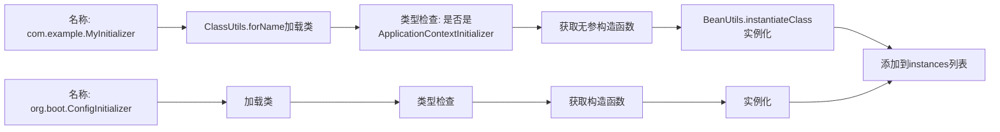

好的，这是 Spring Boot 自动配置流程中**将类名转换为实际对象实例**的关键方法。我们来详细解析这个实例化过程。

## 方法概览

**作用**：将一组类名字符串通过反射机制实例化为具体的对象。

**输入**：
- `type`：目标类型（接口/抽象类）
- `parameterTypes`：构造函数的参数类型
- `classLoader`：用于加载类的类加载器
- `args`：构造函数的实际参数
- `names`：类名字符串集合（来自 `spring.factories`）

**输出**：`List<T>` - 实例化后的对象列表
------
## 代码逐行深度解析

### 1. 初始化结果列表
```java
List<T> instances = new ArrayList<>(names.size());
```
- 预先分配足够容量的 ArrayList，避免扩容开销

### 2. 遍历所有类名
```java
for (String name : names) {
    // 对每个类名进行实例化
}
```
- `names` 来自 `loadSpringFactories` 方法的结果
- 例如：`["com.example.MyInitializer", "org.springframework.boot.ContextInitializer"]`

### 3. 加载类定义
```java
Class<?> instanceClass = ClassUtils.forName(name, classLoader);
```
**`ClassUtils.forName()` 是关键方法**，它与普通的 `Class.forName()` 相比：

| 特性     | `Class.forName()`             | `ClassUtils.forName()`                  |
| -------- | ----------------------------- | --------------------------------------- |
| 异常处理 | 抛出 `ClassNotFoundException` | 统一转换为 `IllegalStateException`      |
| 类加载器 | 使用调用者的类加载器          | 可指定自定义 `ClassLoader`              |
| 原始类型 | 不支持                        | 支持（如 `int.class`, `boolean.class`） |
| 数组类型 | 特殊语法                      | 支持普通类名格式                        |

**示例**：
```java
// 加载类
Class<?> clazz = ClassUtils.forName("com.example.MyApplicationRunner", classLoader);
```

### 4. 类型安全检查
```java
Assert.isAssignable(type, instanceClass);
```
**确保加载的类确实是目标类型的实现**：

```java
// 示例：type = ApplicationContextInitializer.class
// instanceClass = MyInitializer.class
Assert.isAssignable(ApplicationContextInitializer.class, MyInitializer.class);
```

如果 `MyInitializer` 没有实现 `ApplicationContextInitializer`，这里会抛出异常。

### 5. 获取构造函数
```java
Constructor<?> constructor = instanceClass.getDeclaredConstructor(parameterTypes);
```
- **`getDeclaredConstructor`**：获取声明的构造函数（包括 `private` 构造函数）
- **`parameterTypes`**：指定需要的构造函数参数类型

**常见场景**：
```java
// 场景1：无参构造函数
parameterTypes = new Class<?>[]{}; // 空数组
args = new Object[]{}; // 空数组

// 场景2：需要 SpringApplication 参数的构造函数
parameterTypes = new Class<?>[]{SpringApplication.class};
args = new Object[]{springApplicationInstance};
```

### 6. 实例化对象
```java
T instance = (T) BeanUtils.instantiateClass(constructor, args);
```
**`BeanUtils.instantiateClass()` 是 Spring 的工具方法**，比直接调用 `constructor.newInstance()` 更强大：

```java
// 底层大致实现
public static <T> T instantiateClass(Constructor<T> ctor, Object... args) {
    try {
        // 设置可访问（即使构造函数是 private 的）
        ReflectionUtils.makeAccessible(ctor);
        // 创建实例
        return ctor.newInstance(args);
    }
    catch (Exception ex) {
        // 统一的异常处理
        throw new BeanInstantiationException(ctor, "Failed to instantiate", ex);
    }
}
```

### 7. 添加到结果列表
```java
instances.add(instance);
```
- 将成功创建的对象添加到返回列表中
------
## 完整工作流程示例

假设我们要创建 `ApplicationContextInitializer` 实例：

### 输入数据
```java
type = ApplicationContextInitializer.class
parameterTypes = new Class<?>[]{} // 无参构造
args = new Object[]{} // 无参数
names = ["com.example.MyInitializer", "org.boot.ConfigInitializer"]
```

### 执行过程


### 结果
```java
List<ApplicationContextInitializer> instances = [
    new com.example.MyInitializer(),      // 实例化后的对象
    new org.boot.ConfigInitializer()      // 实例化后的对象
];
```
------
## 异常处理机制

```java
catch (Throwable ex) {
    throw new IllegalArgumentException("Cannot instantiate " + type + " : " + name, ex);
}
```

**捕获 `Throwable` 而不是 `Exception`**，因为可能遇到：
- `Error`：如 `NoClassDefFoundError`、`OutOfMemoryError`
- `Exception`：如 `ClassNotFoundException`、`InstantiationException`

**设计思想**：单个类实例化失败不应该影响其他类的实例化，但会立即抛出异常终止整个流程。
------
## 在 Spring Boot 启动流程中的位置

这个方法在 `getSpringFactoriesInstances` 中被调用：

```java
private <T> Collection<T> getSpringFactoriesInstances(Class<T> type, Object... args) {
    // 1. 加载类名
    Set<String> names = loadSpringFactories(type);
    
    // 2. 实例化对象（就是这个方法）
    List<T> instances = createSpringFactoriesInstances(type, parameterTypes, classLoader, args, names);
    
    // 3. 排序
    AnnotationAwareOrderComparator.sort(instances);
    
    return instances;
}
```

## 设计模式分析

### 1. **工厂方法模式**
- 根据类名创建对象实例
- 隐藏具体的实例化细节

### 2. **依赖注入的底层实现**
- 这是 Spring IoC 容器中 Bean 实例化的简化版本
- 展示了如何从配置到运行时对象的转换

### 3. **模板方法模式**
- 定义了实例化的标准流程（加载→检查→构造→实例化）
- 具体的类名和参数可以变化

## 总结

这个方法是 Spring Boot 自动配置的**桥梁**，它将：

**配置文件中的字符串** → **具体的 Java 对象**

| 步骤          | 输入                    | 输出               | 关键技术                       |
| ------------- | ----------------------- | ------------------ | ------------------------------ |
| 1. 加载类     | `"com.example.MyClass"` | `Class<?>` 对象    | `ClassUtils.forName()`         |
| 2. 类型检查   | `Class<?>` 对象         | 验证通过           | `Assert.isAssignable()`        |
| 3. 获取构造器 | 参数类型数组            | `Constructor` 对象 | 反射 API                       |
| 4. 实例化     | `Constructor` + 参数    | 对象实例           | `BeanUtils.instantiateClass()` |

正是通过这个机制，Spring Boot 才能实现"约定优于配置"的魔法——从简单的配置文件自动创建出复杂的对象图。
