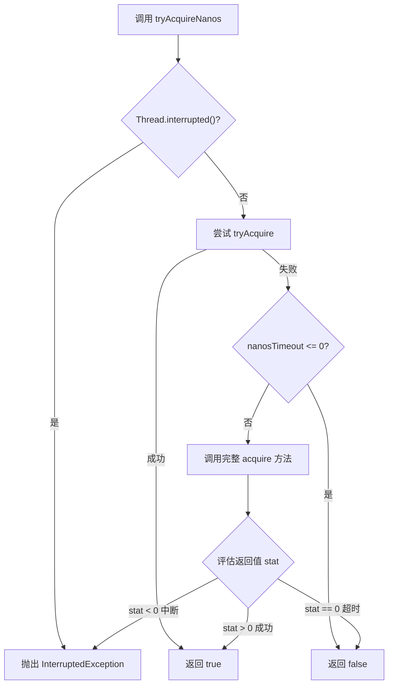

# 							AQS同步器源码1.9+版本解析

## 一、AQS 概述：同步器的骨架引擎

**核心定义：**
AQS 是 `java.util.concurrent.locks` 包下的一个抽象类。它提供了一个**框架**，用于实现依赖于**先进先出 (FIFO) 等待队列**的阻塞锁和相关的同步器（如信号量、事件等）。

**设计目标：**
AQS 解决了在构建同步器时，与**状态管理、线程排队、阻塞与唤醒**相关的复杂且易错的底层细节。它采用了**模板方法模式 (Template Method Pattern)**，将这些通用逻辑封装起来，让开发者可以专注于实现特定的同步语义。

#### 1.核心思想：三位一体

AQS 的核心可以概括为三个部分的协作：

1.  **一个 volatile 的整数状态 (state)**
    *   这是一个 `volatile int` 变量，代表了同步器的状态。
    *   对于不同的实现，它有不同的含义：
        *   **ReentrantLock**: `state` 表示锁的重入次数。0 表示未被占用，>0 表示被占用，并且值代表同一线程重入的次数。
        *   **Semaphore**: `state` 表示当前可用的许可数量。
        *   **CountDownLatch**: `state` 表示计数器当前的值。
    *   所有对状态的原子操作（如 `getState()`, `setState()`, `compareAndSetState()`）都由 AQS 提供，这是实现同步的基础。

2.  **一个 FIFO 线程等待队列 (CLH 变体)**
    *   这是一个双向链表，用于管理所有等待获取资源的线程。
    *   当线程请求资源（如锁）失败时，AQS 会将其包装成一个节点（Node）并加入到队列尾部。每个节点保存了线程引用、等待状态（如是否已取消）以及前驱和后继指针。
    *   这个队列是“公平”的保障，它确保了等待时间最长的线程（队列头部的节点）会优先被唤醒。

3.  **一套模板方法**
    *   AQS 将需要子类实现的逻辑定义为protected方法，主要是**尝试获取 (acquire)** 和**尝试释放 (release)** 资源。
    *   **需要子类重写的方法**：
        *   `tryAcquire(int arg)`: 尝试以独占模式获取资源。
        *   `tryRelease(int arg)`: 尝试以独占模式释放资源。
        *   `tryAcquireShared(int arg)`: 尝试以共享模式获取资源。
        *   `tryReleaseShared(int arg)`: 尝试以共享模式释放资源。
        *   `isHeldExclusively()`: 判断当前线程是否独占着资源。
    *   **AQS 提供的核心模板方法（供使用者调用）**：
        *   `acquire(int arg)`: 以独占模式获取资源，如果失败则进入队列等待。此方法会调用子类的 `tryAcquire`。
        *   `release(int arg)`: 以独占模式释放资源，成功后唤醒队列中的后继节点。此方法会调用子类的 `tryRelease`。
        *   `acquireShared(int arg)`, `releaseShared(int arg)`: 共享模式版本。

**工作流程简述（以独占模式为例）：**
1.  线程调用 `acquire(arg)`。
2.  `acquire` 内部先调用子类实现的 `tryAcquire(arg)` 尝试获取资源。
3.  如果成功，直接返回。
4.  如果失败，AQS 将线程构建为节点并加入等待队列尾部，然后调用 `LockSupport.park()` 阻塞该线程。
5.  当持有资源的线程调用 `release(arg)` 时，它会调用子类的 `tryRelease(arg)` 释放资源。
6.  释放成功后，AQS 会找到队列中合适的节点（通常是头节点的后继），调用 `LockSupport.unpark(node.thread)` 唤醒其线程。
7.  被唤醒的线程再次尝试 `tryAcquire`，如果成功，则将自己设为新的头节点并继续执行。
------
#### 2.前世今生：从混沌到秩序

前世：JDK 1.5 之前

在 AQS 出现之前（即 JDK 1.5 之前的 `synchronized` 时代），实现自定义同步器的唯一方式是使用 `Object` 的 `wait()` 和 `notify()`/`notifyAll()` 方法。

*   **痛点**：
    1.  **复杂性高**：开发者需要手动管理状态变量、等待队列和阻塞/唤醒逻辑，代码极其复杂且容易出错（比如错过 `notify` 或错误地使用 `notifyAll` 导致性能问题）。
    2.  **功能单一**：难以实现复杂的同步器，如读写锁、信号量等。`synchronized` 关键字本身功能有限（例如，无法实现超时、不可中断的获取）。
    3.  **性能一般**：早期 `synchronized` 的性能在竞争激烈时表现不佳（尽管后来的版本进行了大量优化，已不再是问题）。

诞生：JDK 1.5 (JSR 166)

Java 并发大师 **Doug Lea** 在构建 `java.util.concurrent` 这个强大的并发包时，发现几乎所有同步器（`ReentrantLock`, `Semaphore`, `CountDownLatch` 等）都可以抽象出相同的底层行为。

*   **解决方案**：他将这些公共的、复杂的线程排队、阻塞、唤醒机制抽取出来，凝聚成了 AQS 这个核心抽象类。
*   **意义**：AQS 成为了 JUC 包的**心脏**。它一次性解决了底层同步的难题，让构建新的同步器变得前所未有的简单和可靠。只需几行代码，通过组合 AQS 并实现少数几个方法，就能创建一个功能完整、性能卓越的同步器。
*   **代表作**：`ReentrantLock`, `ReentrantReadWriteLock`, `Semaphore`, `CountDownLatch`, `FutureTask` 等核心类都是基于 AQS 构建的。

今生：优化与演进

自诞生以来，AQS 本身也在不断进行优化：

1.  **性能优化**：对 CLH 队列的细节进行了多次优化，例如引入“自旋”等待以减少在竞争不激烈时的上下文切换开销，优化入队和出队的逻辑。
2.  **内存布局优化**：对内部节点类的字段进行重新排列，以改善缓存局部性（Cache Line），减少伪共享（False Sharing）。
3.  **与 `synchronized` 的竞争**：HotSpot JVM 团队对 **`synchronized`** 关键字进行了极致的优化（如偏向锁、轻量级锁、自旋锁、锁消除等），使得其在很多常见场景下性能与 AQS 实现的锁相差无几甚至更优。这使得 AQS 的优势更多地体现在其**丰富的功能**（可中断、可超时、非块结构、公平/非公平选择）上，而不仅仅是性能。

​		尽管今天 `synchronized` 的性能已被大幅优化，新的并发抽象也不断出现，但 AQS 所代表的**设计思想**——**分离变与不变、模板方法、队列管理**——依然是并发系统设计的典范。理解 AQS，不仅是理解一套 API，更是理解一种解决并发问题的架构思想。

## 二、源码解析

## 类属性

```java
// Node status bits, also used as argument and return values
static final int WAITING   = 1;          // must be 1
static final int CANCELLED = 0x80000000; // must be negative
static final int COND      = 2;          // in a condition wait
/**
* Head of the wait queue, lazily initialized.
*/
private transient volatile Node head;
/**
* Tail of the wait queue. After initialization, modified only via casTail.
*/
private transient volatile Node tail;
/**
* The synchronization state.
*/
private volatile int state;
```

核心概念：位掩码 (BitMask)

这些常量被定义为 `int` 类型的不同位（第0位、第1位、第31位），这样它们就可以通过**位运算**（如 `|` (OR), `&` (AND), `~` (NOT)）来组合和检查状态，而互不干扰。

一个 `int` 有32位，我们可以将其视为32个独立的布尔标志开关。

逐项讲解

### 1. `static final int WAITING = 1; // must be 1`


*   **二进制表示**: `00000000 00000000 00000000 00000001`
*   **含义**: 表示节点正处于**等待状态**。这意味着该节点所代表的线程正在等待获取锁或某个条件被满足。它是线程需要被唤醒（`unpark`）的主要信号。
*   **为何必须是1**: 这是最简单、最基础的位掩码，它只设置了最低位（第0位）。在代码中，很可能通过 `status == 0` 来判断节点是否处于初始或活跃状态。任何非零值都可能表示一种等待或取消状态，而 `1` 是其中最基础的一个。将其设为1可以方便地进行 `status > 0` 的判断来表示“正在等待但未被取消”。

### 2. `static final int CANCELLED = 0x80000000; // must be negative`

*   **十六进制**: `0x80000000`
*   **二进制表示**: `10000000 00000000 00000000 00000000`
*   **含义**: 表示节点已被**取消**。通常是因为等待超时（`awaitNanos`）或被中断（`interrupt`）。处于该状态的节点应该被跳过，不再参与同步竞争，并会被从队列中移除。
*   **为何必须是负数**: 这是最关键的一点。在Java中，`0x80000000` 是 `int` 类型的最小值，即 **-2³¹**。这是一个非常重要的特性，它使得：
    1.  **快速判断**: 检查一个节点是否被取消变得非常简单且高效，只需要判断 `status < 0` 即可。因为所有其他状态（WAITING, COND, 0）都是大于等于0的。这是一个非常快速的条件判断。
    2.  **唯一性**: 它占据了符号位，确保了不会与其他任何正数状态标志位冲突。

### 3. `static final int COND = 2; // in a condition wait`

*   **二进制表示**: `00000000 00000000 00000000 00000010`
*   **含义**: 表示该节点正处于一个**条件队列**中（例如 `ConditionObject` 的队列），而不是在主要的同步队列中。当一个线程调用 `Condition.await()` 时，它会被包装成一个节点并转移到条件队列中，同时状态会被标记为 `COND`。
*   **与 `WAITING` 的关系**: `COND` 是一种特定类型的等待。一个节点可以同时具有 `WAITING` 和 `COND` 状态。它们不是互斥的。

组合使用示例

这些状态可以通过**按位或（OR）** 操作进行组合。

例子1：在条件队列中正常等待

例如，一个在条件队列中等待的节点，其状态值可能是：
`WAITING | COND`

让我们计算一下：
*   `WAITING` 的二进制: `...0001`
*   `COND` 的二进制: `...0010`
*   按位或 (`|`) 操作: `...0011` (十进制是 3)

所以这个节点的 `status` 值等于 **3**。

例子2：在条件队列中等待时被中断

假设一个线程在条件队列中等待（状态已是 `WAITING | COND`），此时它被其他线程中断了。

- **状态值**: `WAITING | COND | CANCELLED`
- **计算**:
  - `WAITING | COND`: `...0011`
  - `CANCELLED`: `1000...`
  - `|` (按位或) 结果: `1000...0011`
- **十进制值**: `-2147483645` (一个很大的负数)
- **含义解释**:
  - 这是最关键的一点：`status < 0` **为真**，因为最高位是1。这意味着任何检查 `if (node.status < 0)` 的代码会立即知道这个节点**已被取消**，应该被丢弃或清理。
  - 同时，我们仍然可以通过位与操作知道它*曾经*在条件队列中 `(status & COND != 0)`。

**代码中的逻辑**：中断处理代码会尝试将节点状态**原子地**从 `WAITING | COND` 更新为 `WAITING | COND | CANCELLED`。成功后，该节点就会被视为已取消。之后清理队列的代码会将它从条件队列中移除，并可能处理中断异常。

好的，这三个 `volatile` 字段是 **AQS (AbstractQueuedSynchronizer)** 类的核心骨架，构成了其实现阻塞锁和相关同步器（如 Semaphore, CountDownLatch 等）的基础。我们来逐一分解它们的含义和作用。

### 4. `private transient volatile Node tail;`

*   **含义**：指向等待队列的**尾节点**。
*   **作用**：
    1.  **入队操作**：当一个线程无法获取资源（锁）时，它需要将自己加入到等待队列的**末尾**进行排队。`tail` 指针用于快速定位队列的尾部，以便高效地执行入队操作（通过 CAS 操作 `compareAndSetTail`）。
    2.  **维护队列结构**：作为队列的尾端锚点，它与 `head` 共同定义了整个队列的范围。
*   **修饰词解析**：
    *   `volatile`：保证多线程环境下对 `tail` 的修改立即可见。入队和出队操作通常由不同的线程完成（一个线程入队，另一个线程释放锁后修改 `tail`），必须保证可见性。
    *   `transient`：序列化时不被包含。因为锁的状态是暂时的，与具体的 JVM 线程调度相关，序列化一个锁对象没有意义。
*   **注释解析 - `After initialization, modified only via casTail`**：
    *   这指出了其线程安全的修改方式。不会直接 `tail = newNode`，而是通过一个原子操作 **`compareAndSetTail(Node expect, Node update)`** 来更新。这保证了即使多个线程同时尝试入队，也只有其中一个能成功更新 `tail`，确保队列构建的正确性。
------
### 5. `private transient volatile Node head;`

*   **含义**：指向等待队列的**头节点**。
*   **作用**：
    1.  **出队操作**：当持有资源的线程释放资源时，它需要唤醒队列中的下一个等待线程。这个“下一个线程”就是 `head` 节点的**后继节点**（`head.next`）。`head` 指针用于快速定位这个需要被唤醒的节点。
    2.  **虚拟节点**：头节点通常不包含实际的线程信息（`thread=null`），它是一个**虚拟节点（dummy node）**。它的存在是为了简化算法的边界条件处理（如队列刚初始化时）。真正第一个等待的线程是 `head.next`。
*   **修饰词解析**：
    *   `volatile`：同样为了保证可见性。释放资源的线程需要看到最新的 `head` 来确定要唤醒谁。
    *   `transient`：同上，不序列化。
*   **注释解析 - `lazily initialized`**：
    *   队列不会在构造 AQS 时就初始化。而是等到**第一个线程需要排队**时才会构建队列（即初始化 `head` 和 `tail`）。这是一种优化，避免了不必要的对象创建（如果锁从无竞争）。
------
### 6. `private volatile int state;`

*   **含义**：**同步状态**。这是整个 AQS 的灵魂，其具体语义完全由子类决定。
*   **作用**：
    *   对于**独占锁**（如 `ReentrantLock`），`state` 通常表示：
        *   `0`：锁未被任何线程持有。
        *   `1`：锁被某个线程持有。
        *   `>1`：锁被同一个线程**重入**了多次。
    *   对于**共享锁**（如 `Semaphore`, `CountDownLatch`），`state` 表示：
        *   `Semaphore`：当前可用的**许可证数量**。
        *   `CountDownLatch`：还需要等待的**事件数量**。
*   **修饰词解析**：
    *   `volatile`：这是最重要的。所有对资源的获取和释放操作都依赖于对 `state` 的原子读写。必须保证一个线程修改了 `state`（如释放锁将其从1改为0），其他线程能立即看到这个变化，从而有机会去竞争资源。
    *   （没有 `transient`）：`state` 通常需要被序列化，因为它代表了同步器的核心状态。例如，一个 `CountDownLatch` 被序列化时，剩余的计数（`state`）是需要被保存下来的。

三者如何协同工作：以一个锁为例

1.  **线程A尝试获取锁**：
    *   调用 `tryAcquire(arg)`（由子类实现）尝试通过 **CAS** 操作将 `state` 从 `0` 改为 `1`。
    *   成功，则线程A获取锁。`head` 和 `tail` 仍然是 `null`，因为无需排队。

2.  **线程B尝试获取锁（此时锁已被A持有）**：
    *   `tryAcquire` 失败（因为 `state == 1`）。
    *   线程B将自己包装成一个 `Node`。
    *   初始化队列（`head = new Node()`），然后通过 `casTail` 操作将线程B的节点添加到队列尾部。
    *   线程B可能进入阻塞状态（`LockSupport.park()`）。

3.  **线程A释放锁**：
    *   调用 `tryRelease(arg)` 将 `state` 从 `1` 改回 `0`。
    *   释放成功后，线程A看到队列不为空（`head != tail`），于是找到 `head.next`（即线程B的节点）。
    *   尝试唤醒 (`unpark`) 线程B。

4.  **线程B被唤醒后**：
    *   再次尝试 `tryAcquire`，这次成功地将 `state` 从 `0` 改为 `1`。
    *   线程B的节点晋升为新的 **`head`**（原头节点出队），并开始运行。

简而言之：
*   **`state`** 回答“**资源能不能拿**”的问题。
*   **`head`** 和 **`tail`** 维护了一个队列，回答“**如果资源不能拿，该去哪排队等**”以及“**资源释放后该唤醒谁**”的问题。

## 子类

### `abstract static class Node`

类定义与用途

```java
abstract static class Node {
```
这是一个 `abstract` 类，意味着它不会被直接实例化。它作为基础，会有具体的子类来实现不同模式的同步（例如，独占模式或共享模式）。它的唯一作用就是**构成 AQS 内部的双向链表（CLH队列），用于管理所有等待获取锁的线程**。

核心字段解析

每个字段都被精心设计，以满足特定的并发语义：

1.  **`volatile Node prev;`**
    *   **作用**：指向队列中当前节点的**前驱节点**。
    *   **volatile**：保证多线程下的可见性。
    *   **设计意图**：如我们之前讨论的，`prev` 指针是**稳定的**。一旦在入队时通过 `casTail` 设置成功，就几乎不会再被修改（除了在 `cleanQueue` 中移除已取消的节点时）。它构成了从尾到头遍历的可靠基础链路。

2.  **`volatile Node next;`**
    *   **作用**：指向队列中当前节点的**后继节点**。
    *   **volatile**：保证多线程下的可见性。
    *   **设计意图**：`next` 指针是**不稳定的**。它主要用于优化，在无竞争的情况下实现快速遍历。但当节点被取消时，它可能会被修改（甚至指向自己），因此不能完全依赖。注释 `visibly nonnull when signallable` 意为“当节点可以被通知（唤醒）时，它的 next 字段是非空的且对其他线程可见”。

3.  **`Thread waiter;`**
    *   **作用**：**保存正在等待的线程对象**。这是节点的核心数据。
    *   **非 volatile**：这个字段不需要 `volatile`，因为它只在节点入队时被设置一次（此时对其它线程可见），并且在节点被取消时会被原子操作清空（设为 `null`）。注释 `visibly nonnull when enqueued` 意为“当节点入队后，它的 waiter 字段是非空的且对其他线程可见”。

4.  **`volatile int status;`**
    *   **作用**：表示节点的**状态**。这是AQS实现中的关键创新，用单个整型字段替代了旧版本中繁琐的 `waitStatus`。
    *   **volatile**：保证多线程下的可见性。
    *   **状态值**：其数值代表不同的状态，例如：
        *   `0`：初始状态，或者节点已被取消（`CANCELLED` 在旧版中为 `1`，新版可能通过位运算表示）。
        *   `SIGNAL`（例如 `-1`）：表示该节点的后继节点需要被唤醒。
        *   `CONDITION`（例如 `-2`）：表示该节点当前在条件队列中。
        *   `PROPAGATE`（例如 `-3`）：在共享模式下使用，表示后续的获取操作可能成功，需要传播。
    *   通过**位操作**来原子性地读写不同的状态位，非常高效。

原子操作方法解析

这些方法是安全操作 `prev`, `next`, `status` 字段的工具：

1.  **`casPrev(Node c, Node v)` 和 `casNext(Node c, Node v)`**
    *   **作用**：使用 **CAS（Compare-And-Swap）** 操作来原子性地比较并设置 `prev` 和 `next` 指针。
    *   **`weakCompareAndSetReference`**：这是比普通CAS更弱一点的内存语义，但在当前场景下完全足够，并且可能具有更好的性能。
    *   **用途**：主要用于 `cleanQueue` 方法，在并发安全地移除已取消的节点时，修复队列的链接关系。

2.  **`getAndUnsetStatus(int v)`**
    *   **作用**：**原子性地**获取当前 `status` 的值，然后**清除**（按位与）掉指定的位 `v`。
    *   **实现**：`U.getAndBitwiseAndInt(this, STATUS, ~v)`。这是一个非常底层的原子操作。
    *   **用途**：主要用于**信号传递**（signalling）。当一个节点要唤醒它的后继节点时，它需要原子性地改变自身状态，同时知道之前的状态是什么。

3.  **`setPrevRelaxed(Node p)` 和 `setStatusRelaxed(int s)`**
    *   **作用**：**“宽松地”设置** `prev` 指针和 `status` 状态。
    *   **“Relaxed”（宽松）的含义**：这些操作不保证立即可见性，也不提供任何内存屏障（如 `volatile` 写那样的保证）。它们只是最终会将对值的更新写入主内存。
    *   **用途**：用于**非并发**或**线程封闭**的场景。例如，在构造一个新节点时，可以先宽松地设置它的 `prev` 指针，然后再通过一个 `volatile` 写或 CAS 操作“发布”这个节点，此时所有之前的宽松写入都会变得可见。这是一种性能优化。

4.  **`clearStatus()`**
    *   **作用**：将状态 `status` 清零。
    *   **`putIntOpaque`**：这是一种介于普通写和 `volatile` 写之间的内存语义。它保证写入的原子性和最终可见性，但不立即强加一个全面的内存屏障。
    *   **用途**：**减少不必要的信号**。当一个操作不需要复杂的状态变更，只需要将状态重置为0时，使用这个更高效的方法。

内存偏移量

```java
private static final long STATUS = U.objectFieldOffset(Node.class, "status");
private static final long NEXT = U.objectFieldOffset(Node.class, "next");
private static final long PREV = U.objectFieldOffset(Node.class, "prev");
```
*   **作用**：这些是字段的**内存偏移量**。`Unsafe (U)` 类需要这些偏移量来直接操作对象在内存中的特定字段，从而实现上面那些原子方法（如 `weakCompareAndSetReference`）。
*   它们是在类加载时初始化一次的静态常量，避免了每次调用原子方法时重新计算的开销。

“宽松地”设置 prev 指针和 status 状态

好的，“宽松地”设置（Relaxed Set）是理解现代并发编程内存模型的一个关键概念。我们可以用一个比喻和具体例子来深入理解。

核心比喻：办公室公告板

想象一下多线程环境就像一个大办公室，每个线程是一个员工。共享变量（如 `prev`, `status`）是办公室里的一个公告板。

*   **`volatile` 写（强顺序）**：就像你不仅把新通知贴到公告板上，还拿起大喇叭对整个办公室喊：“大家注意！公告板有更新！”。这确保了**所有员工（线程）都能立即、同时地看到最新通知**，并且你贴通知的顺序和喇叭喊的顺序一致。
*   **“宽松地”写（Relaxed Write）**：就像你**悄悄地、默默地把新通知贴到公告板上**，没有喊话，没有提醒。其他员工可能**不会立即看到**这个更新。他们可能过一会儿溜达的时候才偶然看到，或者直到有人（通过一个“强顺序”操作）大喊一声“大家看公告板！”，他们才会去刷新自己的视野，从而看到你之前悄悄贴的所有通知。

技术解析：内存排序（Memory Ordering）

CPU和编译器为了提升性能，会进行**指令重排序（Reordering）**。这意味着代码的编写顺序（Program Order）和最终的执行顺序（Execution Order）可能并不一致。

“宽松地”设置涉及到一个叫做**内存排序**或**内存屏障**的概念。

1.  **普通写入（无屏障）**：
    *   编译器和CPU可以自由地重排序指令。
    *   写入的值可能先停留在当前CPU核心的缓存中，不会立即刷回主内存，因此对其他线程不可见。
    *   **可见性**和**顺序性**都没有保证。

2.  **`volatile` 写入（强屏障）**：
    *   在写入 `volatile` 变量时，会插入一个**写屏障**。
    *   **保证**：所有在这个写操作**之前**的任何读写操作（无论是不是volatile），都必须在这个写操作**之前**完成并对其他线程可见。同时，这个写操作本身会立即刷入主内存。
    *   它严格限制了重排序，保证了强 visibility（可见性）和 ordering（顺序性）。

3.  **“宽松地”写入（Relaxed / Opaque / Release 等）**：
    *   这是介于以上两者之间的一种折衷。
    *   它通常**只保证原子性和最终可见性**，但**不立即插入强内存屏障**。
    *   它**不禁止所有重排序**，只禁止一部分。
    *   它不强制要求立即将数据刷入主内存，但保证最终会刷入。

在 `Node` 类中的具体应用

现在回头看这两个方法：

```java
final void setPrevRelaxed(Node p) {      // for off-queue assignment
    U.putReference(this, PREV, p);
}
final void setStatusRelaxed(int s) {     // for off-queue assignment
    U.putInt(this, STATUS, s);
}
```

**为什么可以在这里使用“宽松地”设置？**

注释给出了答案：`for off-queue assignment`（用于非队列内的赋值）。

**典型场景：初始化一个新节点。**

1.  **构造节点**：当前线程正在创建一个新的 `Node` 对象，准备将其加入等待队列。
2.  **设置字段**：在加入队列**之前**，当前线程需要先设置好这个节点的一些初始状态，比如 `prev` 和 `status`。**此时，这个新节点是完全私有的，没有其他任何线程可以引用到它！** 这是一个**线程封闭**的场景。
3.  **发布节点**：通过一个 **CAS 操作**（如 `compareAndSetTail`）或一个 **`volatile` 写**（如 `head = node`）将这个新节点“发布”到共享的队列中。**这个CAS或`volatile`写操作本身就是一个强大的释放屏障（Release Barrier）**。
4.  **屏障效应**：这个释放屏障**保证了在这个屏障之前的所有写入操作（包括我们刚才“宽松地”设置的 `prev` 和 `status`），在屏障完成后，对其他获取到该节点的线程来说，都是可见的**。

**简单来说：**

> 我先悄悄地（宽松地）把准备工作做好，然后通过一个大动作（CAS/volatile写）正式宣布：“东西做好了，大家来看吧！”。这个大动作会确保我之前所有悄悄的准备工作都被大家看到。

| 特性         | “宽松地”设置 (Relaxed Write)                                 | `volatile` 写 (Strong Write)                                 |
| :----------- | :----------------------------------------------------------- | :----------------------------------------------------------- |
| **性能**     | **高**。几乎无性能损耗，因为它几乎没有内存屏障的开销。       | **低**。有性能损耗，因为需要插入内存屏障。                   |
| **可见性**   | **最终可见性**。值最终会写入，但不保证何时对其他线程可见。   | **立即可见性**。值写入后立即强制刷新的主内存，对其他线程立即可见。 |
| **顺序性**   | **弱保证**。不防止与其前后的普通读写操作发生重排序。         | **强保证**。防止与其前后的操作发生重排序（内存屏障效应）。   |
| **适用场景** | **线程封闭**场景。在对象被“发布”到其他线程**之前**，由单个线程进行初始化操作。 | **强并发**场景。需要立即让其他线程感知到变化，并需要严格的顺序保证。 |

### 具体的节点子类（Concrete classes tagged by type）

AQS 通过继承来区分节点在不同同步模式下的行为。

```java
// Concrete classes tagged by type
static final class ExclusiveNode extends Node { }
static final class SharedNode extends Node { }
```

*   **`ExclusiveNode` (独占模式节点)**:
    *   用于实现**互斥锁**，如 `ReentrantLock`。
    *   一个时刻只能有一个线程（即一个 `ExclusiveNode`）成功获取资源。
    *   它直接继承 `Node`，没有添加任何新字段或方法。**它的类型信息本身就足以标识其模式**。AQS 通过检查节点的类型来决定如何执行同步操作（例如，共享模式的节点可以多个同时成功，而独占模式则不行）。

*   **`SharedNode` (共享模式节点)**:
    *   用于实现**共享锁/信号量**，如 `CountDownLatch`, `Semaphore`, `ReentrantReadWriteLock` 的读锁。
    *   多个线程（即多个 `SharedNode`）可以同时成功获取资源。
    *   同样，它也只通过类型来标识自己，没有新增成员。

**设计意图**：使用空的子类是一种轻量级且清晰的“标记”方式。在入队时，AQS 会创建特定类型的节点（`ExclusiveNode` 或 `SharedNode`），后续的逻辑（如 `tryAcquire`, `tryRelease`）就可以根据 `instanceof` 来检查节点类型并做出相应的行为。

2. 条件队列节点 (ConditionNode)

```java
static final class ConditionNode extends Node
    implements ForkJoinPool.ManagedBlocker {
    ConditionNode nextWaiter;            // link to next waiting node
    ...
}
```

这个类更为特殊，它用于实现 **`Condition`** 接口（例如 `ReentrantLock.newCondition()`）。

*   **`nextWaiter`**:
    *   **作用**：这是一个指向**下一个等待节点的指针**，但它**不是用于主同步队列**，而是用于构建一个单独的、**单向的**条件等待队列。
    *   **与主队列的区别**：主同步队列是一个双向链表（通过 `prev` 和 `next` 连接），用于所有竞争资源的线程。而每个 `Condition` 对象都维护着自己的一个单向链表（仅通过 `nextWaiter` 连接），用于等待该特定条件的线程。

*   **实现 `ForkJoinPool.ManagedBlocker`**:
    *   这是一个高级优化，是为了让基于 AQS 的锁能在 `ForkJoinPool` 这个特殊的线程池中更高效地工作。
    *   `ForkJoinPool` 的特性是线程数量有限，如果一个工作线程被阻塞，可能会浪费宝贵的计算资源甚至导致死锁。
*   **`isReleasable()`**:
    *   方法告诉 `ForkJoinPool`：“我是否可以结束阻塞状态？”。
    *   `status <= 1`：通常，`status` 为 `0` 或 `1`（`CANCELLED`）意味着节点不再需要等待（已被信号唤醒或已取消）。
    *   `Thread.currentThread().isInterrupted()`：或者当前线程被中断了，也应该结束阻塞。
*   **`block()`**:
    *   方法定义了如何阻塞当前线程。
    *   它在一个循环中调用 `LockSupport.park()` 来阻塞线程，直到 `isReleasable()` 返回 `true`。
    *   这种自旋循环检查比单纯挂起更安全，能及时响应中断和信号。


好的，这段代码是 AQS 提供的一组**核心工具方法**，用于安全地操作其关键内部状态（`state`, `head`, `tail`）。它们是构建所有高级同步操作（如 `acquire`, `release`）的基础积木。
------
### 1. 同步状态（State）的操作方法

这三个方法是子类（如 `ReentrantLock`, `Semaphore`）用来实现其特定同步逻辑的基础。

#### `protected final int getState()`

```java
/**
 * Returns the current value of synchronization state.
 * This operation has memory semantics of a {@code volatile} read.
 * @return current state value
 */
protected final int getState() {
    return state;
}
```

*   **作用**：读取当前同步状态 `state` 的值。
*   **内存语义**：具有 **`volatile` 读**的内存语义。这意味着：
    1.  **可见性保证**：它总能读到其他线程通过 `volatile` 写（如 `setState` 或 `compareAndSetState`）所写入的最新值。
    2.  **禁止重排序**：编译器/CPU 不能将这条读指令与其后面的任何内存操作进行重排序。
*   **为何重要**：在判断资源是否可用时（例如，检查锁是否空闲、信号量是否有许可），必须读取到最新的状态，否则会导致错误的决策。

#### `protected final void setState(int newState)`

```java
/**
 * Sets the value of synchronization state.
 * This operation has memory semantics of a {@code volatile} write.
 * @param newState the new state value
 */
protected final void setState(int newState) {
    state = newState;
}
```

*   **作用**：无条件地设置同步状态 `state` 为一个新值。
*   **内存语义**：具有 **`volatile` 写**的内存语义。这意味着：
    1.  **可见性保证**：这个写入会立即刷新到主内存，对其他线程立即可见。
    2.  **禁止重排序**：编译器/CPU 不能将这条写指令与其前面的任何内存操作进行重排序。
*   **使用场景**：通常用于**非竞争性的状态更新**。例如，当持有独占锁的线程释放锁时，它知道没有其他线程能干扰，所以可以简单地使用 `setState(0)`，而不需要昂贵的 CAS 操作。

#### `protected final boolean compareAndSetState(int expect, int update)`

```java
/**
 * Atomically sets synchronization state to the given updated
 * value if the current state value equals the expected value.
 * This operation has memory semantics of a {@code volatile} read
 * and write.
 *
 * @param expect the expected value
 * @param update the new value
 * @return {@code true} if successful. False return indicates that the actual
 *         value was not equal to the expected value.
 */
protected final boolean compareAndSetState(int expect, int update) {
    return U.compareAndSetInt(this, STATE, expect, update);
}
```

*   **作用**：**原子性地**比较并设置状态值。只有当前状态值等于预期值 `expect` 时，才会将其更新为新值 `update`。
*   **实现**：使用 `Unsafe` 类的 `compareAndSetInt` 方法，这是一个本地方法，依靠 CPU 的 CAS 指令实现其原子性。
*   **内存语义**：具有 **`volatile` 读和写**的内存语义。它同时具有读和写的屏障效果。
*   **使用场景**：这是最重要的方法，用于**竞争性的状态更新**。例如，多个线程同时尝试获取锁：
    
    ```java
    // 在 tryAcquire 方法中：
    if (getState() == 0) { // 锁是空闲的
        // 使用 CAS 尝试获取锁。如果成功，当前线程获得锁；如果失败，说明其他线程抢占了。
        if (compareAndSetState(0, 1)) {
            setExclusiveOwnerThread(Thread.currentThread());
            return true;
        }
    }
    ```
------
### 2. 队列工具方法 (Queuing utilities)

这些是 AQS 内部用于管理 CLH 队列的私有方法。

#### `private boolean casTail(Node c, Node v)`

```java
private boolean casTail(Node c, Node v) {
    return U.compareAndSetReference(this, TAIL, c, v);
}
```

*   **作用**：原子性地比较并设置尾节点 `tail`。
*   **为什么需要 CAS**：**入队操作可能是并发的**。多个线程可能同时尝试将自己添加到队列尾部。`casTail` 确保了只有一个线程能成功地将 `tail` 指针指向自己的新节点，其他失败的线程会观察到新的尾节点，然后重试在其后添加。
*   **注释呼应**：这与之前字段声明时的注释 `modified only via casTail` 完全对应，是实现该约束的具体方法。

#### `private void tryInitializeHead()`

```java
/** tries once to CAS a new dummy node for head */
private void tryInitializeHead() {
    Node h = new ExclusiveNode();
    if (U.compareAndSetReference(this, HEAD, null, h))
        tail = h;
}
```

*   **作用**：**惰性初始化队列**。它尝试一次 CAS 操作，将一个新建的“哑元”节点设置为头节点。
*   **惰性初始化**：队列一开始是空的（`head = tail = null`）。只有在第一个线程需要排队时，才创建头节点。
*   **哑元节点（Dummy Node）**：头节点本身不代表任何等待线程（它的 `waiter` 为 `null`）。它的存在极大地简化了队列的管理算法，因为头节点永远存在，避免了处理 `head` 为 `null` 的各种边界情况。
*   **逻辑**：尝试将 `head` 从 `null` CAS 为新的哑元节点 `h`。如果成功，说明当前线程完成了初始化，那么尾节点 `tail` 自然也应该是这个唯一的节点，所以直接设置 `tail = h`。

### 为什么 tail = h 不用cas操作来设置

这是一个非常 insightful 的问题！它触及了 AQS 实现中并发控制的精妙之处。

**核心答案：在 `tryInitializeHead()` 这个特定场景下，`tail = h` 这个赋值操作是线程安全的，不需要 CAS，因为成功执行到这里的线程已经赢得了初始化队列的“竞赛”，此时它是唯一一个知道这个新队列存在的线程。**

让我们一步步分析为什么：

### 1. 上下文：这是一个“初始化”操作

`tryInitializeHead()` 的目标是初始化一个**空队列**。它的前置条件是：
`head == null` （队列尚未初始化）

### 2. 成功的 CAS 操作赢得了“竞赛”

```java
if (U.compareAndSetReference(this, HEAD, null, h))
```
这一行代码是**关键**。它是一个 CAS 操作，尝试将 `head` 从 `null` 设置为新节点 `h`。

*   **只有一个线程能成功**：由于 `head` 初始为 `null`，多个并发线程可能同时调用 `tryInitializeHead()`。但 **CAS 的原子性保证了只有一个线程的 `compareAndSetReference` 调用会返回 `true`**。这个线程就是“获胜者”。
*   **失败的线程会如何**：其他所有失败的线程，它们的 `CAS` 操作会返回 `false`。这些线程会**跳过 `if` 语句块**，不会执行里面的 `tail = h`。对于它们来说，`tryInitializeHead()` 方法调用就结束了。

### 3. 获胜线程的“单线程”环境

对于那个唯一的获胜线程，在执行 `tail = h` 时，程序的状态是：
*   **它刚刚成功地将 `head` 指向了新节点 `h`。**
*   **此时，其他所有线程看到的 `head` 仍然是 `null`**，或者刚刚变成 `h`（由于 `volatile` 写的可见性，但存在延迟）。
*   **最关键的是：其他线程即使看到了 `head` 不再是 `null`，它们也绝对不会来修改 `tail`**。所有修改 `tail` 的代码路径（主要是 `enqueue` 操作）都有一个前提：它们会先读取当前的 `tail`，然后尝试 `casTail`。而在初始化完成的极短时间内，其他线程看到的 `tail` 仍然是 `null`，它们会认为自己才是第一个需要初始化队列的线程，从而进入 `tryInitializeHead()` 或者其他类似逻辑，而不是直接操作 `tail`。

**因此，在执行 `tail = h` 的那一刻，获胜线程实际上是处于一个“事实上的单线程环境”**。没有其他线程会与它竞争修改 `tail` 变量。一个简单的赋值足以保证正确性。

### 4. 为什么可以不用 `volatile` 写语义？

你可能会注意到 `tail` 本身是 `volatile` 的，但这里的赋值 `tail = h` 就是一个普通的写操作。为什么可以？

*   **`volatile` 写的重要性在于其“发布”效应**（即写后对其他线程立即可见）和**禁止重排序**。
*   在这个初始化场景中，**`head` 的 CAS 操作已经是一个强大的 `volatile` 写**。它充当了**释放屏障（Release Barrier）**。
*   **Java 内存模型（JMM）保证**：在 `volatile` 写（`head = h` via CAS）**之前**的所有普通写操作，在 `volatile` 写**完成后**，对其他线程来说都是可见的。
*   所以，即使 `tail = h` 是一个普通写，只要它发生在 `head` 的 `volatile` 写**之前**，那么当其他线程看到 `head` 不为 `null` 时，它们也**一定能**看到 `tail` 被赋值为 `h` 的这个结果。`head` 的 `volatile` 写“捎带”着发布了 `tail` 的新值。

### 类比：建造一个公共设施

想象一下多个施工队（线程）发现一个城市没有图书馆（`head == null`），都决定去建一个。

1.  **CAS 竞赛**：市政府（CPU）规定，只颁发一张建设许可证（成功的 CAS）。只有一个施工队（获胜线程）能拿到。
2.  **建造**：获胜的施工队先盖好图书馆的主楼（`new ExclusiveNode()`），然后去市政府注册（`CAS(set HEAD)`）。注册成功后，它顺手在图书馆门口立了一块牌子，写上“图书馆的后门在XX街”（`tail = h`）。
3.  **其他施工队**：其他施工队也去申请许可证，但被告知图书馆已经注册了（CAS 失败）。它们就不会再去立那个“后门”的牌子了，而是直接离开或者根据新图书馆的地址进行后续操作。

立牌子（`tail = h`）这个动作，只有在拿到许可证的施工队完成注册后才会发生，并且没有其他队会来干扰，所以直接立牌子就可以了，不需要再为此举行一场拍卖（CAS）。

这种设计是**极致的性能优化**：在保证绝对正确性的前提下，避免了一个不必要的、开销更大的 CAS 操作，而是用一个简单的存储（store）来代替。这体现了 AQS 作者对并发场景的深刻理解：精确识别哪些地方存在真竞争，哪些地方不存在。

## `enqueue` 方法

### 方法功能概述

**`enqueue(Node node)`** 的作用是：将一个节点（`node`）安全地添加到同步队列（CLH队列）的尾部。这个方法主要用于入队 **`ConditionNode`**（条件队列中的节点需要转移到同步队列），而对于普通的获取操作（`acquire`），入队逻辑是交织在其中的。
------
### 代码逐行解析

```java
final void enqueue(Node node) {
    if (node != null) { // 1. 空检查
        for (;;) {      // 2. 自旋循环（CAS重试循环）
            Node t = tail; // 3. 获取当前尾节点快照
            node.setPrevRelaxed(t); // 4. 预先设置前驱指针
            if (t == null)          // 5. 情况一：队列未初始化
                tryInitializeHead();
            else if (casTail(t, node)) { // 6. 情况二：尝试CAS入队
                t.next = node;      // 7. 设置后继指针
                if (t.status < 0)   // 8. 额外检查：是否需要唤醒
                    LockSupport.unpark(node.waiter);
                break;              // 9. 入队成功，退出循环
            }
            // 10. CAS失败：循环重试
        }
    }
}
```

#### 1. 空检查 `if (node != null)`
*   简单的防御性编程，避免空指针异常。

#### 2. 无限循环 `for (;;)`
*   这是一个典型的 **CAS自旋循环**。在并发入队时，多个线程可能竞争修改 `tail`。失败的线程会循环重试，直到成功为止。

#### 3. 获取当前尾节点 `Node t = tail;`
*   在循环开始时，先获取当前尾节点的**快照**（`t`）。这个快照可能很快会过时，但它是我们进行后续决策和CAS操作的基础。

#### 4. 宽松设置前驱指针 `node.setPrevRelaxed(t);`
*   **这是算法的第一个精妙之处**。
*   **目的**：在尝试CAS之前，先“预连接”新节点和当前尾节点。即使这个操作被其他线程看到，也因为 `prev` 指针的稳定性而不会造成问题。
*   **性能**：使用 `setPrevRelaxed`（普通写）而不是 `volatile` 写，避免了不必要的内存屏障开销。因为如果后续CAS失败，这个值会被覆盖；如果成功，这个值的可见性会由后续对 `tail` 或 `next` 的 `volatile` 写来保证。

#### 5. 处理未初始化队列 `if (t == null)`
*   **情况**：如果当前尾节点 `t` 为 `null`，说明整个队列都还未初始化（`head` 和 `tail` 都是 `null`）。
*   **操作**：调用 `tryInitializeHead()` 来惰性初始化队列，创建一个哑元节点作为 `head` 和 `tail`。
*   **后续**：初始化完成后，循环会继续（`for(;;)`），下一次循环就能获取到非空的 `tail`，从而进入分支6。

#### 6. 核心：尝试CAS入队 `else if (casTail(t, node))`
*   **这是算法的核心和安全性的保障**。
*   **目的**：尝试原子性地将尾指针从刚才快照的 `t` 指向我们的新节点 `node`。
*   **并发控制**：
    *   **成功**：如果CAS成功，说明在当前线程获取 `t` 之后到执行CAS之前，没有其他线程修改过 `tail`。我们成功地将新节点添加到了队列尾部。程序继续执行后续步骤。
    *   **失败**：如果CAS失败，说明在此期间 `tail` 已经被其他线程修改（有其他节点成功入队）。当前线程只需**循环重试**（回到步骤3），获取新的 `tail` 快照，然后再次尝试。

#### 7. 设置后继指针 `t.next = node;`
*   **这是算法的第二个精妙之处**。
*   **目的**：在CAS成功将新节点设为 `tail` 后，回来完善双向链表，将**原尾节点** `t` 的 `next` 指针指向新节点 `node`。
*   **为什么是安全的？**：
    1.  此时，当前线程已经成功修改了 `tail`，意味着它已经“宣称”了自己在队列中的位置。
    2.  其他线程看到新的 `tail` 后，会在它后面添加新节点，而不会来修改**原尾节点 `t`** 的 `next` 指针。
    3.  因此，当前线程是**唯一一个会修改 `t.next` 的线程**，这个操作不存在竞争，所以一个简单的赋值即可，不需要CAS。
*   **可见性**：`tail` 是 `volatile` 的，对 `tail` 的CAS写操作作为一个释放屏障，能确保这次普通的 `t.next = node` 写操作对其他线程可见。

#### 8. 额外检查与唤醒 `if (t.status < 0)`
*   **检查条件**：检查原尾节点 `t` 的状态是否小于0。状态 `< 0` 通常表示节点处于某种信号状态（如 `SIGNAL`），意味着它需要唤醒它的后继者。
*   **操作**：如果条件为真，则直接唤醒新节点 `node` 中的线程（`LockSupport.unpark(node.waiter)`）。
*   **目的**：这是一种**优化**。原尾节点可能已经完成或即将完成释放资源的操作，并期望唤醒后继者。如果此时正好有新节点入队成为它的后继者，那么直接唤醒这个新线程可以**减少不必要的等待延迟**，让它尽快重试获取资源。

#### 9. 退出循环 `break;`
*   所有操作完成，成功入队，退出自旋循环。
------
这个方法完美体现了并发编程的设计原则：**在保证安全性的前提下，尽可能提升性能**。它将高强度（昂贵）的原子操作（CAS）控制在最小范围，而将无竞争的操作用低强度（廉价）的普通操作来完成。

## 为什么要尝试提前唤醒新线程

这是一个非常高级的优化策略，目的是**减少线程不必要的挂起等待时间，提升系统的响应速度和吞吐量**。

为了理解这一点，我们需要先看一个没有这种优化的、简单的入队流程是怎样的。

### 标准的、无优化的流程

1.  **线程A**：持有锁。
2.  **线程B**：尝试获取锁失败，被加入同步队列尾部（成为节点 `NodeB`），然后调用 `LockSupport.park()` **挂起自己**，等待被唤醒。
3.  **线程A**：释放锁。在释放过程中，它会检查队列，发现它的后继节点是 `NodeB`，于是调用 `LockSupport.unpark(NodeB.waiter)` **唤醒线程B**。
4.  **线程B**：被唤醒后，再次尝试获取锁。

在这个流程中，线程B经历了 **“获取失败 -> 入队 -> 挂起 -> (一段时间后) -> 被唤醒 -> 再次尝试”** 的过程。这里的“一段时间”就是**不必要的等待延迟**。
------
### 带有“提前唤醒”优化的流程

现在，我们考虑 `enqueue` 方法中第8步的优化场景。这是一种**非常特殊但有利**的时机：

1.  **线程A**：正在释放锁。它已经完成了核心工作（比如将 `state` 从1改为0），并将自己的节点状态设置为 `SIGNAL`（即 `status < 0`），表示“我需要唤醒我的后继者”。**但是，它还没有执行到实际唤醒那一步**。
2.  **线程B**：恰好在**这个极短的窗口期内**尝试获取锁失败，并执行入队操作 (`enqueue`)。它成功地将自己设置为新的尾节点，而它的前驱节点正好是即将释放锁的线程A的节点。
3.  **此时，线程B（在入队方法中）发现前驱节点的 `status < 0`**。这意味着：
    *   前驱节点（线程A）所代表的线程**几乎已经完成了释放操作**。
    *   资源**马上**或者说**已经**可用了（`state` 很可能已经是0了）。
4.  **于是，线程B果断地调用 `LockSupport.unpark(node.waiter)` 来唤醒自己！**

这个流程变成了：**“获取失败 -> 入队 -> (发现前驱即将释放) -> 主动唤醒自己 -> 立即尝试获取”**。

线程B**完全避免了一次正式的挂起操作**（`park`）。它可能刚从 `park()` 调用中返回，或者更幸运的是，在它还没来得及调用 `park()` 之前，`unpark()` 的调用已经先发生了（`LockSupport` 的 `unpark` 可以先于 `park` 发生，这种情况下后续的 `park()` 调用会立即返回）。

### 为什么这是安全的？

你可能会担心：如果线程A其实并没有成功释放呢？

这种担心是多余的，因为这种优化是**保守且安全**的：

1.  **条件苛刻**：它只在看到前驱节点 `status < 0` 时才会触发。这个状态是由即将释放资源的线程**可靠地设置**的，是一个强烈的信号，表明资源很可能立刻可用。
2.  **幂等操作**：`LockSupport.unpark(thread)` 是一个**幂等**操作。即使提前唤醒发生了多次，或者资源实际上还没有完全释放，也完全没有问题。被唤醒的线程B会再次尝试获取锁（`tryAcquire`）。
    *   **如果资源确已可用**：线程B成功获取，皆大欢喜。
    *   **如果资源尚未可用**（比如有极端的竞争）：线程B的 `tryAcquire` 会失败，它会再次检查状态，如果确实需要等待，它会乖乖地再次调用 `park()` 挂起自己。**整个逻辑依然是正确的，没有任何副作用**。

### 类比：等出租车

*   **无优化**：你走到出租车排队点，发现没车。你就在长椅上坐下（`park`）开始睡觉。等车来了，调度员再把你叫醒（`unpark`）。
*   **有优化**：你正往排队点走，看到前面一个人（你的前驱节点）已经付完钱下车了（`status < 0`）。你根本不用坐下睡觉，直接就对调度员喊：“别叫了，我来了！”（`unpark` yourself），然后直接上车。


| 方面       | 解释                                                         |
| :--------- | :----------------------------------------------------------- |
| **目的**   | **减少线程调度延迟**，提升系统响应速度和吞吐量。             |
| **时机**   | 在入队时，发现**前驱节点几乎已经释放完资源**的极短窗口期内。 |
| **机制**   | 新入队的线程**主动唤醒自己**，避免了一次昂贵的、不必要的线程挂起操作。 |
| **安全性** | **绝对安全**。条件是可靠的（检查 `status`），操作是幂等的（`unpark`），失败后逻辑会回退到正常的挂起流程。 |
| **本质**   | 这是一种 **“乐观”的优化**。它赌资源马上可用，如果赌赢了，性能大幅提升；如果赌输了，也毫无损失。 |

这种优化是AQS作者对并发场景深刻理解的又一体现，它抓住了多线程执行流程中一个微妙的、转瞬即逝的机会窗口，从而实现了性能的进一步提升。

## isEnqueued方法

### 方法功能概述

**`isEnqueued(Node node)`** 的作用是：**判断给定的节点 `node` 是否当前正处于同步队列中**。

*   返回 `true`：表示该节点是队列中的一员。
*   返回 `false`：表示从当前队列的尾部向前遍历，没有找到该节点。
------
### 代码逐行解析

```java
final boolean isEnqueued(Node node) {
    // 1. 从尾节点开始遍历
    for (Node t = tail; t != null; t = t.prev)
        // 2. 检查当前遍历到的节点是否是目标节点
        if (t == node)
            return true;
    // 3. 遍历完成未找到，返回false
    return false;
}
```

#### 1. 遍历起点：`for (Node t = tail; t != null; t = t.prev)`
*   **从 `tail` 开始**：这是关键。如我们之前所讨论，`prev` 指针是**稳定的**，构成了一个从尾到头的可靠链表。即使队列正在被并发修改（例如有节点被取消），从后向前的遍历也能找到所有有效的节点，而不会因为 `next` 指针断裂而丢失节点。
*   **终止条件 `t != null`**：循环会一直进行，直到遍历到队列最前面的哑元头节点之后（头节点的 `prev` 是 `null`）。
*   **迭代 `t = t.prev`**：通过前驱指针，一步步向队列头部移动。

#### 2. 检查条件：`if (t == node)`
*   这是一个**身份比较（reference equality）**，检查当前遍历到的节点 `t` 是不是我们要找的节点 `node`。
*   找到则立即返回 `true`。

#### 3. 默认返回：`return false`
*   如果循环完整地从 `tail` 遍历到了 `head`（直到 `t` 变为 `null`）都没有找到目标节点，则断定它不在队列中，返回 `false`。
------
### 为什么这个方法的设计是正确且可靠的？

#### 1. 可靠性源于稳定的 `prev` 链
这个方法的核心依赖是 `prev` 指针的稳定性。无论队列如何并发修改：
*   节点被取消时，只会修改 `next` 指针和 `waiter`，不会修改 `prev`。
*   新节点入队时，其 `prev` 指针在CAS成功后就永不改变。
因此，从 `tail` 开始，通过 `prev` 指针总能遍历到队列中所有曾经存在过的节点（直到头节点），形成一个“快照”。这个快照可能是过时的（它可能包含已取消的节点），但它是**完整**的。

#### 2. 它检查的是“存在过”，而不仅仅是“正在”
这是一个非常重要的细微差别。方法的注释是 `Returns true if node is found in traversal`（如果在遍历中找到就返回true），而不是 `Returns true if node is currently enqueued`。

*   **它可能会为已取消的节点返回 `true`**：如果一个节点已经成功入队，但随后又被取消了，它仍然会在 `prev` 链中。遍历时依然能找到它，所以该方法会返回 `true`。
*   **这是一个符合预期的行为**：在很多调用上下文中，关心的是“这个节点是否曾经被成功添加到队列中”，而不是它当前是否有效。例如，在判断一个条件等待线程是否已经被转移到同步队列时，只要它被添加过，就满足条件。

#### 3. 它的“快照”语义
该方法提供的是一种“弱一致性”的视图。它返回的是**在遍历发生的那个瞬间**所观察到的结果。在它返回之后，队列可能已经发生了改变。调用者不能假设返回值在返回后仍然成立。
------
### 典型使用场景

这个方法通常用于**检查状态**，而不是用于控制核心逻辑。例如：

1.  **条件等待 (`ConditionObject`)**：
    在调用 `Condition.await()` 时，当前线程会创建一个 `ConditionNode` 并加入条件队列。当它被信号唤醒时，需要转移到同步队列。`isEnqueued(node)` 可能被用来确认转移是否已经成功完成。`while (!isOnSyncQueue(node))` 是一种常见的等待模式，等待节点被成功转移到同步队列。

2.  **监控和调试**：
    外部工具或代码可能需要检查一个线程（及其对应的节点）是否正在等待锁。

### 总结

| 特性           | 说明                                                         |
| :------------- | :----------------------------------------------------------- |
| **功能**       | 判断一个节点是否存在于同步队列的 `prev` 链中。               |
| **遍历方向**   | **从尾到头**。这是为了依赖稳定的 `prev` 指针，保证遍历的可靠性。 |
| **返回值语义** | **“弱一致性”快照**。返回的是调用发生时遍历到的状态，结果可能立即过时。 |
| **可靠性**     | **高**。因为依赖于稳定的 `prev` 链，遍历不会丢失节点。       |
| **精度**       | **可能包含已取消的节点**。它检查的是节点引用是否在链中，而不关心其状态。 |
| **用途**       | 主要用于状态检查（如条件等待机制），而非核心的同步控制流程。 |

这个简短的方法再次证明了AQS的设计哲学：**通过选择正确的底层不变性（稳定的 `prev` 链）来构建简单而可靠的高级操作**。

好的，我们来解析这个 `signalNext` 方法。这是一个非常关键的方法，负责在释放资源时唤醒后继者，是实现锁传递机制的核心。

### 方法功能概述

**`signalNext(Node h)`** 的作用是：**唤醒给定节点 `h` 的后继节点（如果存在的话）**。通常，这个 `h` 是当前持有资源的节点（对于锁来说，就是持有锁的线程对应的节点），它在释放资源后，需要唤醒下一个等待的线程来接手。
------
### 代码逐行解析

```java
private static void signalNext(Node h) {
    Node s;
    // 1. 条件检查：节点h非空，且有后继节点s，且后继节点状态不为0
    if (h != null && (s = h.next) != null && s.status != 0) {
        // 2. 原子性地清除后继节点的WAITING状态位
        s.getAndUnsetStatus(WAITING);
        // 3. 唤醒后继节点中的线程
        LockSupport.unpark(s.waiter);
    }
}
```

#### 1. 条件检查 `if (h != null && (s = h.next) != null && s.status != 0)`

这是一个三重条件检查，确保只有在安全且有必要的情况下才执行唤醒操作。

*   **`h != null`**：空值检查，防御性编程。
*   **`(s = h.next) != null`**：检查节点 `h` 是否有一个有效的后继节点 `s`。如果没有后继者，自然不需要唤醒。
*   **`s.status != 0`**：这是**最关键**的检查。它检查后继节点 `s` 的状态是否**不是**初始状态 `0`。
    *   `status == 0`：通常意味着该节点是**新加入的**，还没有被安排等待（即还没有设置 `SIGNAL` 状态）。唤醒它可能是不必要的，因为它可能还在执行 `acquire` 循环中的逻辑，尚未调用 `park()`。
    *   `status != 0`：通常意味着该节点已经被设置为需要等待（例如，状态可能是 `SIGNAL`），或者已经被**取消**（`CANCELLED`）。对于需要等待的节点，我们应该唤醒它；对于已取消的节点，唤醒操作是无害的（但后续逻辑会处理它）。

#### 2. 原子性状态修改 `s.getAndUnsetStatus(WAITING);`

*   **作用**：**原子性地**获取节点 `s` 的当前状态值，并**清除**其中的 `WAITING` 状态位（注释中的 `WAITING` 可能是一个占位符，实际代码中可能是 `SIGNAL` 对应的位）。
*   **为什么需要原子性？**：因为节点的状态可能被多个线程并发修改（例如，当前线程正在唤醒它，同时它自己可能因为超时或中断而尝试取消）。
*   **`getAndUnsetStatus` 的内存语义**：这个操作同时具有**读和写的内存屏障**，保证了唤醒线程能看到 `s.waiter` 的最新值，也保证了后续的 `unpark` 操作能被正确看到。

#### 3. 唤醒线程 `LockSupport.unpark(s.waiter);`

*   这是执行实际唤醒操作的地方。它让在后继节点 `s` 中等待的线程恢复运行。
------
### 深入理解注释和设计意图

方法的注释非常重要，解释了一些微妙的设计选择：

> “Wakes up the successor of given node, if one exists, and unsets its WAITING status to avoid park race.”

**“to avoid park race” (避免park竞争)** 是这里的精髓。

**什么是 park race？**
想象一个场景：
1.  后继线程 `S` 判断它需要等待，于是它设置自己的状态为 `SIGNAL`（表示需要被唤醒）。
2.  就在它即将调用 `LockSupport.park()` **挂起自己**的前一刻，CPU被切换走了。
3.  前驱线程 `H` 此时释放了资源，执行到了 `signalNext`。它看到 `S.status != 0`，于是调用 `LockSupport.unpark(S.waiter)`。**但此时线程S还没有park！**
4.  随后，线程 `S` 恢复执行，调用了 `LockSupport.park()`。

如果没有额外措施，线程 `S` 将会**错误地挂起**，因为它错过了之前的 `unpark` 调用。这就是一种“竞争条件”。

**如何解决？—— `getAndUnsetStatus` 的作用**
`signalNext` 在调用 `unpark` **之前**，先原子性地清除了 `S` 节点的等待状态位。现在，我们再看这个竞争场景：

1.  线程 `S` 设置状态为 `SIGNAL`。
2.  线程 `H` 清除了 `S` 的状态位（设为0），并调用了 `unpark`。
3.  线程 `S` 在park之前，**会再次检查状态**（这是AQS循环中的标准做法）。它发现状态不再是 `SIGNAL`（而是0），它就**不会调用 `park()`**，从而避免了挂起。

因此，`getAndUnsetStatus` 操作相当于**留下了一个标记**，告诉后继线程：“你已经被人唤醒过了，不用再park了”。这巧妙地解决了竞争问题。

> “This may fail to wake up an eligible thread when one or more have been cancelled, but cancelAcquire ensures liveness.”

**“可能无法唤醒一个符合条件的线程”**
这是因为 `next` 指针是不稳定的。有可能节点 `h` 的后继节点 `s` 已经取消了，而 `h.next` 还没有被正确修复（指向下一个有效的节点）。因此，这次 `signalNext` 调用可能唤醒了一个已取消的节点（`unpark` 是幂等的，无害），或者干脆因为 `h.next` 为null而什么都没做。

**“但cancelAcquire保证了活性”**
这是AQS设计的另一个精妙之处。虽然 `signalNext` 可能失败，但**取消操作自身有责任确保唤醒传递能够继续**。在 `cancelAcquire` 方法中，当一个节点取消自己时，它会**主动去修复队列的链接**，并**尝试去唤醒它的后继者**（或者通过前驱节点来唤醒）。这样，即使某次 `signalNext` 失败了，锁的传递性也不会被破坏，最终总会有一个线程被成功唤醒，从而保证了系统的**活性（Liveness）**——不会所有人都永远等待。

### 总结

`signalNext` 方法是一个精心设计的、处理了各种边界和竞争条件的唤醒机制：

| 方面       | 说明                                                         |
| :--------- | :----------------------------------------------------------- |
| **目的**   | 唤醒指定节点的后继者，完成锁或资源的传递。                   |
| **安全性** | 通过检查 `status != 0` 来避免不必要的唤醒（如对新节点）。    |
| **正确性** | 通过原子性的 `getAndUnsetStatus` 操作**解决park竞争**，确保唤醒信号不会丢失。 |
| **健壮性** | 承认在并发取消的情况下可能失败，但依赖 `cancelAcquire` 的逻辑作为备份来**保证活性**。 |
| **性能**   | 操作非常轻量，只涉及一次原子状态更新和一次 `unpark` 调用。   |

这个方法体现了并发编程中的一个重要原则：**单个操作可以不完美，但整个系统必须通过协作来保证最终的正确性**。`signalNext` 与 `cancelAcquire` 相互配合，共同确保了等待队列的可靠运行。

## signalNextIfShared方法

### 方法功能概述

**`signalNextIfShared(Node h)`** 的作用是：**唤醒给定节点 `h` 的后继节点，但仅当该后继节点处于共享模式时**。这是为了实现**共享锁的传播机制**，与独占模式的唤醒有重要区别。
------
### 代码逐行解析

```java
private static void signalNextIfShared(Node h) {
    Node s;
    // 1. 条件检查：节点h非空，且有后继节点s，且后继节点是SharedNode，且状态不为0
    if (h != null && (s = h.next) != null &&
        (s instanceof SharedNode) && s.status != 0) {
        // 2. 原子性地清除后继节点的WAITING状态位
        s.getAndUnsetStatus(WAITING);
        // 3. 唤醒后继节点中的线程
        LockSupport.unpark(s.waiter);
    }
}
```

这个方法与 `signalNext` 几乎 identical，**唯一的区别**就是增加了一个关键的条件检查：
**`(s instanceof SharedNode)`**
------
### 为什么需要这个专门的方法？

要理解这个方法，必须理解**共享模式**与**独占模式**在资源释放和传播上的根本区别：

#### 独占模式 (Exclusive Mode) - 如 `ReentrantLock`
*   **资源特性**：资源是互斥的，一次只能被一个线程持有。
*   **释放逻辑**：当持有者释放资源时，它只需要唤醒**一个**后继者（通过 `signalNext`）来接替自己即可。因为只有一个线程能成功获取资源。

#### 共享模式 (Shared Mode) - 如 `Semaphore`, `CountDownLatch`
*   **资源特性**：资源可以被多个线程同时持有（如多个许可）。
*   **释放逻辑**：当持有者释放资源时，它可能会**释放多个单位**的资源。这意味着**可能有多个等待的线程可以同时被满足**。
*   **传播需求**：因此，释放操作不应该只唤醒一个后继者，而应该**唤醒一连串的后继者**，直到释放的资源被分配完毕。这被称为**传播性**。

然而，`signalNextIfShared` 看起来也只是唤醒了一个后继者。这里的精妙之处在于它的**调用时机和上下文**。

### 典型使用场景

这个方法通常不是在释放资源的开始时调用，而是在释放资源的**过程中**或**结束后**，由**刚刚被唤醒的线程**来调用。

让我们看一个典型的共享模式获取/释放流程：

1.  **线程A**：持有共享资源（例如，持有信号量的一个许可）。
2.  **线程B, C, D**：都在队列中等待获取共享资源。
3.  **线程A**：释放资源（例如，调用 `Semaphore.release()`）。
    *   释放操作会将 state 增加1（表示可用许可+1）。
    *   然后它会调用 `doReleaseShared()` 之类的逻辑来尝试唤醒后继者。
4.  **唤醒传播**：
    *   线程A首先会唤醒它的第一个后继者（线程B）。
    *   **线程B被唤醒后**，成功获取了资源（将state减1）。
    *   此时，线程B发现**还有剩余资源**（state仍然大于0）！于是，线程B有责任**继续唤醒它的后继者**（线程C）。
    *   线程B就会调用 `signalNextIfShared(h)`（这里的 `h` 可能是线程B自己的节点）。
    *   线程C被唤醒，获取资源，如果发现还有剩余资源，它也会继续唤醒线程D。
    *   如此循环，直到资源被分配完毕，或者遇到一个独占模式的节点（唤醒停止）。

**这就是 `signalNextIfShared` 的核心作用：它实现了共享模式下唤醒操作的“连锁反应”或“传播”。**

### 关键条件 `(s instanceof SharedNode)`

这个条件检查确保了**传播只在共享模式节点之间进行**。

*   **如果后继节点是共享模式**：唤醒它，让它继续参与资源的获取和传播。
*   **如果后继节点是独占模式**：**停止传播**。因为独占模式会消费掉所有资源（即使它只需要一个单位），所以不需要也不应该再唤醒后面的节点。唤醒应该由那个独占节点在释放时自己负责。

### 总结

| 方面         | `signalNext`                                   | `signalNextIfShared`                                         |
| :----------- | :--------------------------------------------- | :----------------------------------------------------------- |
| **目的**     | **传递性唤醒**。完成独占锁的交接，one-to-one。 | **传播性唤醒**。触发共享资源的连锁分配，one-to-many。        |
| **调用者**   | 通常是**释放资源的原持有者**。                 | 通常是**刚被唤醒并成功获得资源的新持有者**。                 |
| **模式检查** | 无。唤醒任何符合条件的后继者。                 | 有。**只唤醒共享模式的后继者** (`instanceof SharedNode`)。   |
| **设计思想** | 简单的交接班。                                 | **协作式传播**。每个成功获取资源的线程都承担起“通知下一个”的责任，直到资源被分配完。 |

**一句话总结：** `signalNextIfShared` 是共享同步器（如信号量、闭锁）的“心跳”机制。它确保了释放的资源能够高效地、自动化地传递给一连串正在等待的线程，而不是仅仅传递给第一个。这是实现共享模式语义的关键所在。

## acquire方法

### **前驱节点有效性检查与维护**

非常精妙。它处理的是线程**已经入队但还不是第一个等待者**时，如何确保其前驱节点是稳定和有效的。

我们来逐层拆解它的逻辑和处理的场景。

代码逻辑分解

```java
if (!first && // 条件1: 当前节点已知不是第一个
    (pred = (node == null) ? null : node.prev) != null && // 条件2: 能找到一个前驱节点
    !(first = (head == pred))) { // 条件3: 并且这个前驱节点不是头节点
    // 如果三个条件都满足，进入内部检查
    if (pred.status < 0) {
        cleanQueue();           // 场景1: 前驱节点已取消
        continue;
    } else if (pred.prev == null) {
        Thread.onSpinWait();    // 场景2: 前驱节点正在成为头节点
        continue;
    }
}
```

条件解析

1.  **`!first`**：
    *   这是一个性能优化。如果已经知道当前节点是第一个等待者 (`first = true`)，就完全不需要执行这段检查逻辑，因为第一个节点的前驱就是头节点，它肯定是稳定的。只有非第一个节点才需要关心前驱的健康状况。

2.  **`(pred = (node == null) ? null : node.prev) != null`**：
    *   获取当前节点的前驱节点 `pred`。如果节点 `node` 还没创建，自然没有 `prev`，条件不成立。
    *   `pred != null` 确保前驱节点存在。一个存在的前驱节点是后续检查的基础。

3.  **`!(first = (head == pred))`**：
    *   这是一个**巧妙的一次性赋值和检查**。它做两件事：
        a) **检查**：判断前驱节点 `pred` 是不是当前的头节点 `head`。
        b) **赋值**：将检查结果 (`head == pred`) 赋值给变量 `first`。
    *   如果 `pred` 是头节点，说明当前节点**已经变成了第一个等待者**！那么 `first` 被设为 `true`，条件 `!(first = ...)` 就不成立，跳过内部块。下一次循环就会进入 `if (first || pred == null)` 分支去尝试获取资源。
    *   只有当前驱节点存在且**不是**头节点时，才会进入内部的详细检查。

内部检查处理的两种场景

一旦进入内部块，说明当前节点在队列中，它有一个前驱节点，但这个前驱节点不是头节点。此时需要检查这个前驱节点的状态是否可靠。

场景1: 前驱节点已取消 — `if (pred.status < 0)`

*   **发生了什么**：前驱节点 `pred` 的 `status` 小于0（通常是 `CANCELLED`），意味着该节点中的线程已经因为超时或中断而放弃了等待。
*   **为什么是问题**：一个已取消的节点**不能**作为可靠的前驱节点。它可能已经被标记为从队列中移除，或者其 `next` 指针可能已经失效。如果放任不管，当前线程的后续操作（比如挂起后等待它来唤醒）都会失败。
*   **如何处理**：调用 `cleanQueue()` 方法。
    *   `cleanQueue()` 的作用是**遍历队列，移除所有已取消的节点，并修复 `prev` 和 `next` 指针**，使队列恢复到一个一致的状态。
    *   `continue`：清理完成后，立即**继续下一次循环**。在下次循环中，当前节点的 `prev` 指针可能已经被 `cleanQueue` 修复，指向了一个新的有效的前驱节点，或者它自己可能变成了第一个节点。

场景2: 前驱节点正在成为头节点 — `else if (pred.prev == null)`

*   **发生了什么**：前驱节点 `pred` 的 `prev` 指针为 `null`。在AQS的CLH队列中，**只有头节点 (`head`) 的 `prev` 指针为 `null`**。
*   **这意味着什么**：这意味着前驱节点 `pred` **正在被提升为新的头节点**！当前线程看到 `pred.prev == null` 的瞬间，正好发生在另一个线程完成资源获取，正在执行 `head = pred` 操作的过程中。这是一个**队列状态瞬时不一致**的瞬间。
*   **为什么是问题**：当前线程试图依赖一个“正在消失”的节点。这个节点马上就要变成头节点（哑元节点），不再代表一个等待线程。如果基于它做决策，可能会出错。
*   **如何处理**：调用 `Thread.onSpinWait();`
    *   `onSpinWait()` 是给CPU的一个提示，表示线程正在**自旋等待**一个条件的变化。它通常会提升自旋等待的性能（如在x86架构上可能发出`pause`指令）。
    *   `continue`：**立即继续下一次循环**。期望在下次循环时，前驱节点 `pred` 的转变已经完成：它已经正式成为头节点。这样，当前线程就会满足条件 `head == pred`，从而发现自己已经成为新的第一个等待者，然后跳出这个检查块去尝试获取资源。

总结与类比

**这部分代码是AQS队列的“健康检查员”和“状态同步器”。**

*   **它的职责**：确保当前线程在队列中的位置是可靠的，它的前驱节点是一个有效的、活跃的等待者。
*   **它处理两种异常**：
    1.  **结构性异常**：前驱节点失效（取消）。解决方法是**主动修复** (`cleanQueue`)。
    2.  **状态性异常**：前驱节点状态瞬时不一致（正在变为头节点）。解决方法是**短暂等待** (`onSpinWait`) 并重试。

**一个简单的类比：**
想象你在超市排队（CLH队列）。

- **场景1**：你前面的人突然不排了，走了（节点取消）。`cleanQueue` 就像保安过来，让后面的人（你）往前挪，并告诉新来的人排在你后面（修复链接）。
- **场景2**：你前面的人正在被柜台接待，一只脚已经迈出了队伍（正在变为头节点）。你只需要稍微等一下(`onSpinWait`)，等他完全离开，你就成了排头，可以直接上前了。

这段代码确保了即使在高度并发、节点状态瞬息万变的情况下，AQS队列也能维持一致性和活性，每个线程都能正确地找到自己的位置并依赖它的前驱。

### 核心获取逻辑

也是 AQS 作为模板方法模式的关键体现。它处理的是线程**有资格尝试获取资源**时的场景。

我们来详细解析：

代码逻辑分解

```java
// 条件检查：是否有资格尝试获取？
if (first || pred == null) {
    boolean acquired;
    try {
        // 模板方法调用：由子类实现具体的获取逻辑
        if (shared)
            acquired = (tryAcquireShared(arg) >= 0);
        else
            acquired = tryAcquire(arg);
    } catch (Throwable ex) {
        // 异常处理：如果子类实现抛出异常，则取消获取操作
        cancelAcquire(node, interrupted, false);
        throw ex;
    }
    // ... [后续成功处理逻辑]
}
```

条件解析：`if (first || pred == null)`

这个条件判断**当前线程是否有资格尝试获取资源**。它涵盖了两种有资格的情况：

1.  **`first` (是第一个等待者)**：
    *   `first` 为 `true` 表示当前线程对应的节点是同步队列中**第一个有效的等待者**（即 `head.next`）。
    *   **为什么有资格？** 在公平策略下，锁或资源应该释放给等待时间最长的线程。第一个等待者就是下一个理所应当的候选者。即使是非公平策略，在排队之后，也得按顺序来。

2.  **`pred == null` (尚未入队)**：
    *   `pred == null` 表示当前线程**还没有被正式加入同步队列**。
    *   **为什么有资格？** 这通常发生在线程**第一次尝试获取**时，或者在**非公平锁**的场景下。线程在真正排队之前，有权“插队”尝试获取一次资源。这提升了性能，但牺牲了公平性。
    *   这是一种**优化**：如果资源刚好可用，直接获取成功，避免了昂贵的入队、挂起、唤醒操作。

**总结**：这个条件意味着：“只要你还没排队，或者已经排到队首了，就有资格去尝试获取资源。”

获取尝试：`tryAcquire` / `tryAcquireShared`

这是**模板方法模式**的经典应用。AQS 将“如何获取资源”这个可变的部分抽象出来，交给子类去实现。

```java
try {
    if (shared)
        acquired = (tryAcquireShared(arg) >= 0);
    else
        acquired = tryAcquire(arg);
}
```

*   **`tryAcquire(int arg)`**：
    *   用于**独占模式**（如 `ReentrantLock`）。
    *   **约定**：成功获取返回 `true`，失败返回 `false`。
    *   **典型实现**（以 `ReentrantLock` 为例）：
        ```java
        protected boolean tryAcquire(int acquires) {
            Thread current = Thread.currentThread();
            int c = getState(); // 获取当前状态
            if (c == 0) { // 锁空闲
                if (!hasQueuedPredecessors() && // 公平性检查
                    compareAndSetState(0, acquires)) { // CAS抢锁
                    setExclusiveOwnerThread(current); // 成功，设置持有者
                    return true;
                }
            }
            else if (current == getExclusiveOwnerThread()) { // 重入
                int nextc = c + acquires;
                setState(nextc); // 无需CAS，因为当前线程已是持有者
                return true;
            }
            return false; // 获取失败
        }
        ```

*   **`tryAcquireShared(int arg)`**：
    *   用于**共享模式**（如 `Semaphore`, `CountDownLatch`）。
    *   **约定**：返回值是一个整数。
        *   返回值 **>= 0**：表示获取成功，并且返回值表示**剩余的资源数量**（或其他共享状态）。**这是判断 `acquired` 为 `true` 的依据**。
        *   返回值 **< 0**：表示获取失败。
    *   **典型实现**（以 `Semaphore` 为例）：
        ```java
        protected int tryAcquireShared(int acquires) {
            for (;;) { // 自旋循环
                int available = getState();
                int remaining = available - acquires; // 计算剩余许可
                if (remaining < 0 ||
                    compareAndSetState(available, remaining)) // CAS获取
                    return remaining; // 成功返回剩余值，失败返回负数
            }
        }
        ```

异常处理：`catch (Throwable ex)`

```java
catch (Throwable ex) {
    cancelAcquire(node, interrupted, false);
    throw ex;
}
```

这段代码处理了子类实现 (`tryAcquire`) 可能出现的**异常情况**。

*   **为什么需要？**：子类的 `tryAcquire` 方法可能包含复杂的、可能失败的逻辑（如CAS、业务判断等），这些逻辑有可能抛出异常（如 `Error`）。AQS 必须确保即使在这种情况下，整个同步队列的状态依然是**一致的**。
*   **如何处理**：
    1.  **`cancelAcquire(node, interrupted, false);`**：
        *   这是**清理现场**的关键步骤。它会：
            *   将传入的 `node` 的状态标记为 `CANCELLED`。
            *   如果节点已经入队，会将其从队列中安全地移除，并修复队列的链接。
            *   确保唤醒传递，不会因为当前节点的异常而阻塞整个队列。
        *   参数 `false` 可能表示一种紧急取消，不需要进行额外的状态检查。
    2.  **`throw ex;`**：
        *   重新抛出异常。获取操作失败，异常将传递给调用 `acquire` 的上层方法（如 `lock()`）。

**这样做的好处**：它将资源获取的异常控制权交给了子类，但AQS框架自身保持了健壮性。无论子类实现得多么复杂或脆弱，AQS都能在发生错误时回滚状态，避免破坏整个同步器。

总结

这段代码是 AQS 的核心调度逻辑：

1.  **资格检查** (`first || pred == null`)：判断当前线程是否轮到自己尝试获取资源。
2.  **模板方法调用** (`tryAcquire`/`tryAcquireShared`)：**委派**给子类实现特定资源的获取逻辑。这是AQS扩展性的源泉。
3.  **异常安全** (`catch`)：确保即使在子类实现出现错误时，AQS框架的内部状态（同步队列）也能保持**一致性**，并通过 `cancelAcquire` 进行优雅的失败处理。

它完美体现了“**好莱坞原则**”（“不要调用我们，我们会调用你”）。子类只需关心如何操作 `state` 来实现 `tryAcquire`，而复杂的排队、阻塞、唤醒、异常处理等通用策略则由AQS框架负责。

### **成功处理逻辑**

它处理了线程成功获取资源后，需要进行的队列维护和状态清理工作。

我们来详细解析每一行的作用：

代码逻辑分解

```java
if (acquired) { // 如果获取成功
    if (first) { // 并且当前节点是第一个等待者（即是从队列中获取成功的）
        node.prev = null;
        head = node;
        pred.next = null;
        node.waiter = null;
        if (shared)
            signalNextIfShared(node);
        if (interrupted)
            current.interrupt();
    }
    return 1; // 返回成功
}
```

整体逻辑

这段代码只在 `acquired` 为 `true` 时执行，意味着子类的 `tryAcquire` 或 `tryAcquireShared` 方法返回了成功。接下来分为两种情况：
1.  **从队列中成功获取** (`first == true`)：需要执行复杂的队列维护操作。
2.  **未入队直接成功获取** (`first == false`, 但 `pred == null`)：直接返回成功即可，无需操作队列。

我们重点看第一种情况，即 `if (first) { ... }` 块内的代码。

成功获取后的队列维护操作

当线程是作为队列的第一个等待者成功获取资源时，它需要“即位”，成为新的队列领导者。这涉及到对CLH队列的修改。

1. `node.prev = null;`

*   **作用**：**断开新头节点与前驱节点的链接**。
*   **为什么？** 在AQS的CLH队列中，**头节点 (`head`) 是一个哑元节点（dummy node）**，它的 `prev` 指针必须为 `null`。这是队列的一个不变式（invariant）。
*   当前节点 `node` 即将成为新的头节点，所以必须将其 `prev` 设置为 `null`，以符合头节点的规范。

​			2. `head = node;`

*   **作用**：**正式将当前节点设置为新的头节点**。
*   **细节**：`head` 字段是 `volatile` 的，这个赋值操作是一个 volatile 写，具有释放屏障（Release Barrier）的语义。这确保了之前的所有写操作（如 `node.prev = null`）对其他线程可见。

3. `pred.next = null;`

*   **作用**：**断开原头节点与后继节点的链接**。
*   **为什么？** 
    *   `pred` 在这里是原头节点（即当前节点的前驱）。
    *   `next` 指针是不稳定的，主要用于优化。将原头节点的 `next` 指向 `null`，可以**打破其与队列的联系**，使其成为一个孤立的节点。
    *   这有助于垃圾回收器（GC）更快地回收原头节点，因为现在没有任何来自队列的引用指向它了（除了可能还有 `prev` 指针，但GC是可达性分析，不影响）。
    *   这是一种**积极的内存管理优化**。

4. `node.waiter = null;`

*   **作用**：**清空新头节点中保存的线程引用**。
*   **为什么？** 
    *   `waiter` 字段用于保存等待线程的引用。现在线程已经成功获取资源，**不再处于等待状态**，因此这个引用不再需要。
    *   清空它同样是为了**帮助垃圾回收**。否则，即使线程已经结束了对锁的使用，队列中的节点仍然持有对其的引用，可能导致线程对象无法被回收。

5. `if (shared) signalNextIfShared(node);`

*   **作用**：**如果是共享模式，触发传播唤醒**。
*   **为什么？** 这是共享模式和独占模式的**关键区别**。
    *   **独占模式**：资源是互斥的。唤醒一个后继者就够了，因为它会消费掉所有资源。
    *   **共享模式**：资源是可共享的（如信号量的许可）。当前线程成功获取后，可能还**剩余有资源**（`state > 0`）。因此，它有责任**通知并唤醒下一个等待的共享节点**，让它也来尝试获取剩余的资源。这被称为“**传播**”。
    *   `signalNextIfShared(node)` 方法会检查并唤醒当前节点（新头节点）的后继者（如果它是共享模式的话）。

6. `if (interrupted) current.interrupt();`

*   **作用**：**恢复中断状态**。
*   **为什么？** 在获取过程中，线程的中断状态可能被捕获并清除了（存储在 `interrupted` 变量中）。为了不“吞没”中断信号，在成功获取资源后，需要**重新设置线程的中断状态**，这样上层调用代码就能感知到中断曾经发生过。
*   这是一个非常重要的设计，确保了中断信号的传递性。

最终返回：`return 1;`

*   最后，方法返回 `1`，表示成功获取资源。这个正值会一路返回给最初的调用者（如 `lock()` 方法）。

总结：角色转变

这段代码描述了一个线程在CLH队列中**从“等待者”到“持有者”的角色转变过程**：

1.  **脱离队列**：通过修改 `prev` 和 `next` 指针，将自己从双向链表中剥离出来，成为新的领导节点。
2.  **清理状态**：清空 `waiter`，告别等待身份，并帮助GC回收旧节点。
3.  **履行新责**：如果是共享模式，承担起唤醒后继者的新责任。
4.  **传递信号**：恢复中断状态，确保外部感知。

所有这些操作共同保证了AQS队列在高度并发下的稳定性和正确性，同时兼顾了性能（GC优化）和功能完整性（中断处理、共享传播）。

### 节点创建与入队

```java
if (node == null) {                 // 1. allocate; retry before enqueue
    if (shared)
        node = new SharedNode();
    else
        node = new ExclusiveNode();
} else if (pred == null) {          // 2. try to enqueue
    node.waiter = current;
    Node t = tail;
    node.setPrevRelaxed(t);         // avoid unnecessary fence
    if (t == null)
        tryInitializeHead();
    else if (!casTail(t, node))
        node.setPrevRelaxed(null);  // back out
    else
        t.next = node;
}
```

这部分对应注释中的步骤3和4。

1. **创建节点**：如果节点还未创建，就根据模式创建 `SharedNode` 或 `ExclusiveNode`。
2. **尝试入队**：如果节点已创建但还未入队 (`pred == null`)，则执行入队逻辑。这里的逻辑和之前分析的 `enqueue` 方法类似：
   - `node.setPrevRelaxed(t)`: 预链接。
   - `tryInitializeHead()`: 惰性初始化队列。
   - `casTail(t, node)`: 核心的CAS入队操作。
   - `t.next = node`: CAS成功后，完善双向链表。

### 线程挂起、唤醒后检查以及退出条件

这部分代码是 `acquire` 方法中处理**线程挂起、唤醒后检查以及退出条件**的核心逻辑。它处理了多个关键的并发场景。

我们来逐行详细解析：

代码段分解

```java
// 1. 准备和自旋控制
long nanos;
spins = postSpins = (byte)((postSpins << 1) | 1); // 指数退避的自旋次数

// 2. 挂起线程
if (!timed)
    LockSupport.park(this);
else if ((nanos = time - System.nanoTime()) > 0L)
    LockSupport.parkNanos(this, nanos);
else
    break; // 超时

// 3. 线程被唤醒后：清除状态
node.clearStatus();

// 4. 检查中断状态
if ((interrupted |= Thread.interrupted()) && interruptible)
    break; // 被中断且可中断
```

1. 准备和自旋控制：`spins = postSpins = (byte)((postSpins << 1) | 1);`

*   **作用**：计算线程**下一次被唤醒后**应该进行多少次**自旋重试**。
*   **算法**：`(postSpins << 1) | 1`
    *   `<< 1`：左移一位，相当于乘以2。
    *   `| 1`：按位或1，保证结果最低位总是1（即总是奇数，且至少为1）。
*   **效果**：这是一个**指数退避（Exponential Backoff）** 策略。
    *   第一次进入这段代码：`postSpins` 初始为0 -> `(0 << 1) | 1 = 1`
    *   第二次（第一次唤醒后再次挂起）：`postSpins` 为1 -> `(1 << 1) | 1 = 3`
    *   第三次：`(3 << 1) | 1 = 7`
    *   以此类推：1, 3, 7, 15, 31...
*   **为什么采用指数退避？**
    *   **公平性**：一个线程被唤醒的次数越多，说明它面临的竞争可能越激烈（每次刚醒资源就被别人抢走了）。增加其自旋次数，给了它更多“原地重试”的机会，**减少它再次被挂起的概率**，从而降低频繁上下文切换的开销，提升系统整体吞吐量。
    *   **避免饥饿**：防止某些线程永远无法获得资源。退避策略给了它更多机会。
    *   **限制上限**：由于 `spins` 是 `byte` 类型，最大值是127，所以自旋次数不会无限增长。

2. 挂起线程：`LockSupport.park` / `parkNanos`

*   **作用**：这是让当前线程**真正进入等待状态**的地方，让出CPU资源。
*   **分支**：
    *   `if (!timed)`：**非定时等待**。调用 `LockSupport.park(this)`，线程会无限期挂起，直到被其他线程 `unpark` 或自身被中断。
    *   `else if ((nanos = time - System.nanoTime()) > 0L)`：**定时等待**。计算剩余的等待时间。如果还有剩余时间，就调用 `LockSupport.parkNanos(this, nanos)` 挂起相应时间。
    *   `else`：**超时**。如果剩余时间 `nanos <= 0L`，说明已经超时，直接 `break` 退出无限循环。

3. 唤醒后清除状态：`node.clearStatus();`

*   **作用**：线程被唤醒后（无论是被 `unpark`、超时还是中断），**第一件事就是清除它的等待状态**（例如 `SIGNAL`）。
*   **为什么？—— 解决“唤醒竞争”**
    这是为了处理我们之前在 `signalNext` 中讨论过的 **park/unpark 竞争**。
    *   **场景**：前驱线程 `H` 调用 `unpark(S)` 和线程 `S` 自己调用 `park()` 可能几乎同时发生。
    *   **机制**：`LockSupport` 的机制是，`unpark` 调用可以先于 `park` 发生。在这种情况下，后续的 `park()` 调用会**立即返回**，不会阻塞。
    *   **问题**：如果线程 `S` 的等待状态仍然是 `SIGNAL`，它醒来后检查状态，会认为自己还是需要等待，从而可能**再次调用 `park()`**。
    *   **解决方案**：**只要被唤醒，就立即清除等待状态**。这样，线程 `S` 在后续的循环中会再次检查资源可用性。如果资源确实可用，它就成功获取；如果不可用，它会**重新评估形势**，可能会再次设置状态并挂起。`clearStatus()` 相当于打破了这种循环等待，迫使线程重新做出决策。

4. 检查中断状态：`if ((interrupted |= Thread.interrupted()) && interruptible) break;`

*   **作用**：检查线程在挂起期间**是否被中断**，并根据中断模式决定是否退出获取。
*   **分解**：
    *   `Thread.interrupted()`：**检查并清除**当前线程的中断状态。如果线程被中断，返回 `true`，并清除中断标记。
    *   `interrupted |= ...`：将中断结果“或”到本地变量 `interrupted` 中。这个变量会一路传递，最终在 `cancelAcquire` 或成功获取时用于**恢复中断状态**（`current.interrupt()`），避免“吞没”中断信号。
    *   `&& interruptible`：**判断是否应该响应中断**。这个参数由外部传入：
        *   `interruptible == true`：表示操作是可中断的（如 `acquireInterruptibly`）。此时如果发生中断，就 `break` 退出循环，然后进入取消逻辑。
        *   `interruptible == false`：表示操作是不可中断的（如普通的 `acquire`）。此时即使发生中断，也不会 `break`，线程会**忽略本次中断**，继续循环重试获取资源。中断状态会被记录（在 `interrupted` 变量中），但不会立即终止获取过程。
------
### 处理的场景总结

这部分代码精巧地处理了以下复杂场景：

| 场景                        | 处理方式                                                     |
| :-------------------------- | :----------------------------------------------------------- |
| **普通唤醒**                | 被前驱节点正常 `unpark` 唤醒 -> 清除状态 -> 重新循环尝试获取。 |
| **伪唤醒**                  | 不明原因唤醒（Spurious Wakeup）-> 清除状态 -> 重新循环检查。 |
| **超时唤醒**                | `parkNanos` 时间到 -> `nanos <= 0` -> `break` 退出循环 -> 执行 `cancelAcquire`。 |
| **中断唤醒 (不可中断模式)** | 被中断 -> 记录中断状态 -> **不清除状态？不，会清除** -> 继续循环尝试获取，不退出。中断信号被暂存。 |
| **中断唤醒 (可中断模式)**   | 被中断 -> 记录中断状态 -> `break` 退出循环 -> 执行 `cancelAcquire`。 |
| **唤醒竞争**                | `unpark` 先于 `park` 发生 -> `park()` 立即返回 -> 清除状态 -> 重新循环，避免了错误地再次挂起。 |
| **竞争加剧**                | 使用**指数退避的自旋策略**，让多次失败的线程获得更多重试机会，减少挂起次数，提升性能。 |

总而言之，这段代码是一个**强大的状态重置和决策中心**。无论线程因为何种原因从挂起中恢复，它都会首先清理现场（`clearStatus`），然后收集信息（检查中断、计算自旋），最后根据这些信息决定下一步的行动：是继续重试、还是退出。它确保了AQS在各种边界条件下都能保持正确性和活性。

好的，这是一个非常复杂但极其精妙的方法。`cleanQueue()` 是 AQS 的“垃圾收集器”，它负责清理队列中已取消的节点，并修复队列链接。我们逐行解析，并配上例子。
------
## cleanQueue方法

方法目标

**目的**：遍历同步队列，找到所有状态为“已取消”（`status < 0`）的节点，将它们从队列中移除，并正确连接它们的前驱和后继节点，保持队列的完整性。

代码结构与变量说明

```java
private void cleanQueue() {
    for (;;) {                               // 外层无限循环：重启点
        for (Node q = tail, s = null, p, n;;) { // 内层无限循环：遍历队列
            // (p, q, s) 构成一个三元组：
            // q: 当前正在检查的节点 (从尾向头遍历)
            // p: 当前节点q的前驱节点 (p = q.prev)
            // s: 当前节点q的后继节点 (在遍历中，s 是上一次循环的 q)
            // n: 临时变量，用于检查并发修改
            ... // 内部逻辑
        }
    }
}
```
**遍历方向**：从 `tail` (尾) 向 `head` (头) 遍历。这是因为 `prev` 指针是稳定的。
------
### 内层循环逻辑分解

#### 1. 终止条件检查
```java
if (q == null || (p = q.prev) == null)
    return;                      // 到达链表末尾
```
*   **逻辑**：如果当前节点 `q` 是 `null`，或者它的前驱节点 `p` 是 `null`（`p` 为 `null` 意味着 `q` 是头节点），说明已经遍历完整个队列。
*   **例子**：队列为 `Head <-> NodeA <-> NodeB (tail)`。当 `q` 指向 `Head` 时，`Head.prev` 是 `null`，循环终止。

#### 2. 一致性检查 (并发安全)
```java
if (s == null ? tail != q : (s.prev != q || s.status < 0))
    break;                       // 检测到不一致，跳出内层循环到重启点
```
这是**并发安全的关键检查**。它检查在遍历过程中，队列是否被其他线程并发修改了。
*   **Case 1: `s == null` (第一次检查尾节点)**
    *   条件：`tail != q`
    *   **含义**：如果当前检查的节点 `q` 不再是尾节点了，说明有其他线程添加了新的尾节点。
    *   **例子**：线程B开始清理，`q = tail` (指向 `NodeB`)。此时线程C入队成功，`tail` 指向了新的 `NodeC`。线程B检查发现 `tail != NodeB`，状态不一致，跳出内层循环，**从头开始新一轮清理**。

*   **Case 2: `s != null` (检查中间节点)**
    *   条件：`s.prev != q || s.status < 0`
    *   **含义**：`s` 是当前节点 `q` 的后继节点。在稳定的队列中，`s.prev` 必须指向 `q`。如果不等，说明链接被并发修改了。或者如果 `s` 已经被取消，它可能已经被其他清理线程处理了。
    *   **例子**：线程B正在检查 `NodeA` (`q`)，它的后继应该是 `NodeB` (`s`)。但另一个线程C取消了 `NodeB` 并修改了 `NodeB.prev`。此时 `NodeB.prev != NodeA`，状态不一致，跳出重试。

#### 3. 清理已取消的节点 (核心逻辑)
```java
if (q.status < 0) {              // 发现当前节点q已取消
    if ((s == null ? casTail(q, p) : s.casPrev(q, p)) &&
        q.prev == p) {
        p.casNext(q, s);         // 尝试修复p.next指针（失败也没关系）
        if (p.prev == null)       // 如果p是头节点
            signalNext(p);        // 尝试唤醒p的后继者
    }
    break; // 处理完一个节点，跳出内层循环，重新从tail开始遍历
}
```
这是处理**已取消节点**的核心逻辑。
*   **条件**：`q.status < 0` (节点 `q` 已被取消)
*   **操作**：目标是将节点 `q` 从队列中“剪掉”，让它的前驱 `p` 直接指向它的后继 `s`。
    *   `(s == null ? casTail(q, p) : s.casPrev(q, p))`：
        *   如果 `s` 是 `null`，说明 `q` 是尾节点。需要CAS地将 `tail` 从 `q` 指向 `p`。
        *   如果 `s` 不是 `null`，说明 `q` 是中间节点。需要CAS地将后继节点 `s` 的 `prev` 指针从 `q` 指向 `p`。
    *   `&& q.prev == p`：这是一个**双重检查**，确保在我们CAS操作之后，节点 `q` 的 `prev` 指针仍然指向我们期望的 `p`。如果不是，说明有其他线程修改了它，我们的CAS可能是不安全的，需要放弃。
    *   `p.casNext(q, s)`：**尝试**将前驱节点 `p` 的 `next` 指针从 `q` 指向 `s`。注释明确说明 `OK if fails`（失败也没关系）。因为 `next` 指针不稳定，主要用于优化，不保证正确性。只要 `prev` 链是好的，队列就是可用的。
    *   `if (p.prev == null) signalNext(p)`：如果修复后发现 `p` 是头节点（`p.prev == null`），说明队列可能处于可唤醒状态，尝试唤醒 `p` 的后继者。

*   **例子**：
    初始队列：`Head <-> NodeA <-> NodeB (cancelled) <-> NodeC (tail)`
    1.  `q = NodeB`, `p = NodeA`, `s = NodeC`
    2.  检测到 `NodeB.status < 0`。
    3.  执行 `s.casPrev(NodeB, NodeA)`，将 `NodeC.prev` 从 `NodeB` 改为 `NodeA`。
    4.  执行 `p.casNext(NodeB, NodeC)`，尝试将 `NodeA.next` 从 `NodeB` 改为 `NodeC`（可能成功，也可能失败）。
    修复后队列：`Head <-> NodeA <-?-> NodeC (tail)` (`NodeA.next` 可能还指向 `NodeB`，但 `NodeC.prev` 已指向 `NodeA`，队列逻辑正确)。

#### 4. 协助完成并发操作
```java
if ((n = p.next) != q) {         // 发现p.next不是q，说明有并发操作
    if (n != null && q.prev == p) {
        p.casNext(n, q);         // 尝试修复：将p.next指回q
        if (p.prev == null)
            signalNext(p);
    }
    break; // 跳出内层循环，重新开始
}
```
这个分支处理一种特殊的**并发场景**：当前线程发现前驱节点 `p` 的 `next` 指针已经**不是**指向当前节点 `q` 了。
*   **条件**：`(n = p.next) != q`
*   **含义**：这通常意味着有其他线程正在（或已经）执行清理操作，修改了 `p.next` 的指向。
*   **操作**：当前线程尝试“帮忙”修复，如果 `q` 的 `prev` 指针还指向 `p`，说明 `q` 还没有被完全移除，可以尝试用CAS将 `p.next` 从 `n` 改回 `q`。
*   **例子**：
    线程B和线程C同时执行 `cleanQueue`。
    线程B看到：`p (NodeA) -> next = NodeB (q)`
    线程C抢先一步：将 `NodeA.next` CAS 修改为了 `NodeC`。
    线程B此时检查：`NodeA.next (n) == NodeC`，而 `NodeC != NodeB (q)`。
    线程B发现不一致，尝试修复：如果 `NodeB.prev` 还指着 `NodeA`，就尝试将 `NodeA.next` 从 `NodeC` 改回 `NodeB`。

#### 5. 移动指针，继续遍历
```java
s = q;   // 当前节点q将成为下一次循环中的“后继节点s”
q = q.prev; // 将当前指针q移动到前一个节点，继续向头部遍历
```
如果当前节点 `q` 没有被取消，也没有检测到不一致，就正常地向前移动指针，继续检查下一个节点。

外层无限循环 `for (;;)` 的作用

**它是一个“重启”机制**。只要内层循环因为任何原因 `break`（检测到不一致、成功清理一个节点、协助并发操作），就会跳出内层循环，回到外层循环的起点，然后**重新开始一轮全新的遍历**（`q = tail, s = null`）。

这是必须的，因为并发清理过程中，队列的状态可能发生巨大变化（比如 tail 被修改、多个节点被取消），之前遍历的上下文可能已经完全失效。最安全的方式就是放弃当前进度，从头开始。

总结

`cleanQueue()` 方法是一个高度并发安全的链表操作典范：
1.  **方向**：从尾到头，依赖稳定的 `prev` 链。
2.  **安全**：通过**一致性检查**和**CAS操作**来保证并发修改下的安全。
3.  **协作**：不仅清理自己的目标节点，还会**协助**完成其他线程的并发操作 (`p.casNext(n, q)`)。
4.  **鲁棒性**：通过**无限循环+重启**机制来应对高并发场景，确保最终一定能完成清理工作。
5.  **优化**：理解 `next` 指针的“最佳努力”性质，不对其强求一致性。

它确保了AQS队列即使在最激烈的竞争环境下，也能自我修复，维持其基本功能，不会因为节点的取消而崩溃。

## cancelAcquire方法

好的，我们来详细解析 `cancelAcquire` 方法。这个方法非常重要，它负责处理获取资源失败的善后工作，确保线程能安全退出，并且不会破坏同步队列的状态。
------
### 方法功能概述

**`cancelAcquire`** 的作用是：**取消一个正在进行的获取尝试**。当线程因为中断、超时或异常而无法继续获取资源时，调用此方法进行清理。它主要做两件事：

1.  清理节点（如果节点已创建）。
2.  处理中断状态。
------
### 参数说明

*   `Node node`：代表当前线程的节点。**可能为 `null`**（例如在第一次尝试获取失败之前就发生了中断）。
*   `boolean interrupted`：一个标志，表示**在获取过程中是否发生过中断**（注意：线程的当前中断状态可能已被清除）。
*   `boolean interruptible`：一个标志，表示**本次获取操作是否是可中断的**（例如 `lockInterruptibly()` 为 `true`，普通的 `lock()` 为 `false`）。
------
### 代码逐行解析

#### 第一部分：节点清理

```java
if (node != null) {
    node.waiter = null;
    node.status = CANCELLED;
    if (node.prev != null)
        cleanQueue();
}
```

**如果节点不为空**，说明线程已经创建了节点（可能已入队，也可能还未入队），需要进行清理。

1.  **`node.waiter = null;`**
    *   **作用**：**清空节点中对线程的引用**。
    *   **为什么？** 这是为了帮助垃圾回收（GC）。一旦获取操作取消，线程对象就不应该再被这个节点所引用，否则会导致线程无法被回收，即使它早已结束执行。
    *   **例子**：线程A在等待锁时被中断。取消操作将 `nodeA.waiter` 设为 `null`，这样即使节点还留在队列中一小会儿，也不会阻止线程A被GC。

2.  **`node.status = CANCELLED;`**
    *   **作用**：**将节点状态标记为“已取消”**（`CANCELLED` 通常是一个负数值，如 `1`）。
    *   **为什么？** 这是最重要的标记。其他线程（例如正在执行 `cleanQueue()` 的线程）看到这个状态，就知道这个节点已经无效，需要将其从队列中移除。
    *   **例子**：线程B正在遍历队列执行 `cleanQueue()`，当它看到 `nodeA.status = CANCELLED`，就会触发移除 `nodeA` 的逻辑。

3.  **`if (node.prev != null) cleanQueue();`**
    *   **条件**：`node.prev != null`。
    *   **含义**：这个条件判断节点**是否已经成功入队**。如果 `node.prev` 不为 `null`，说明该节点已经被链接到队列中了（`prev` 指针在入队时被设置，且是稳定的）。
    *   **操作**：如果节点已入队，则调用 `cleanQueue()`。
    *   **为什么？** 这是**主动清理**。当前线程知道自己节点的位置，它主动触发清理过程，可以更高效地将自己移除，而不必等待其他线程来发现和清理。这也是一种**性能优化**。
    *   **例子**：
        *   **场景1（未入队）**：线程在调用 `enqueue` 方法前被中断，`node` 已创建但 `node.prev` 还是 `null`。此时**不调用** `cleanQueue()`。
        *   **场景2（已入队）**：线程已在队列中等待，然后超时。此时 `node.prev != null`，线程调用 `cleanQueue()` 将自己从队列中摘除。

#### 第二部分：中断处理

```java
if (interrupted) {
    if (interruptible)
        return CANCELLED;
    else
        Thread.currentThread().interrupt();
}
```

这部分处理中断信号的最终去向。

1.  **`if (interrupted)`**：
    *   检查局部变量 `interrupted` 是否为 `true`。这个变量记录的是在获取过程中**是否检测到过中断**（可能来自 `Thread.interrupted()` 的调用）。

2.  **`if (interruptible)`**：
    *   **分支一：`return CANCELLED;`**
        *   **条件**：`interruptible` 为 `true`。
        *   **含义**：本次获取操作是**可中断的**（如 `lockInterruptibly()`）。
        *   **动作**：返回一个特殊的负值（例如 `CANCELLED`）。这个返回值会向上传递，最终导致抛出 `InterruptedException`。
        *   **例子**：`lockInterruptibly()` 内部调用 `acquire`，如果返回 `CANCELLED`，`lockInterruptibly` 就会抛出 `InterruptedException` 给上层应用代码。

    *   **分支二：`Thread.currentThread().interrupt();`**
        *   **条件**：`interruptible` 为 `false`。
        *   **含义**：本次获取操作是**不可中断的**（如普通的 `lock()`）。
        *   **动作**：**重新设置当前线程的中断状态**。
        *   **为什么？** 在不可中断的获取中，线程会忽略中断并继续重试。但如果最终获取失败（如因超时），它不能“吞掉”中断信号。通过调用 `interrupt()` **重新挂起**中断标志，让**后续**的操作（如下一次锁获取、或其他可中断方法）能够感知到这个中断。
        *   **例子**：线程调用 `lock()` 抢锁，期间被中断。它忽略中断继续抢，但最终超时了。在 `cancelAcquire` 中，它不会抛异常，而是调用 `Thread.currentThread().interrupt();`。之后，如果线程执行 `Thread.sleep()`，就会立刻抛出 `InterruptedException`。

#### 第三部分：默认返回

```java
return 0;
```
*   如果获取取消的原因**不是中断**（例如是超时），或者虽然是中断但发生在不可中断的获取中且中断处理已完成，则返回 `0`。
*   `0` 通常表示**超时**。

总结：方法返回值

`cancelAcquire` 方法通过返回值告知调用方取消的原因：

| 返回值                 | 含义                     | 触发条件                                                     |
| :--------------------- | :----------------------- | :----------------------------------------------------------- |
| **`CANCELLED`** (负数) | **因中断而取消**         | `interrupted == true` **且** `interruptible == true`         |
| **`0`**                | **因超时而取消**         | `interrupted == false`                                       |
| **`0`**                | **不可中断模式下的中断** | `interrupted == true` **但** `interruptible == false` (中断状态已恢复，返回值仅表示超时) |

这个方法体现了AQS设计的完备性：它不仅处理正常的成功路径，也为各种失败路径提供了安全、清晰的退出机制，确保了资源的正确释放和系统状态的稳定性。

## isHeldExclusively

它体现了 AQS 作为**框架**的设计哲学：**定义骨架，将具体实现延迟到子类**。

我们来详细解析这个 `isHeldExclusively()` 方法。
------
### 方法功能概述

**`isHeldExclusively()`** 的作用是：**判断同步器（锁）是否被当前线程以独占模式持有**。

*   返回 `true`：表示当前线程正独占着这个锁/资源。
*   返回 `false`：表示当前线程没有独占这个锁/资源。
------
### 代码解析

```java
protected boolean isHeldExclusively() {
    throw new UnsupportedOperationException();
}
```

这个方法在 AQS 中的默认实现是直接抛出一个 `UnsupportedOperationException`（不支持的操作异常）。

### 为什么这样设计？

这看起来似乎不合理，但这正是 **“模板方法模式”** 和 **“钩子方法（Hook Method）”** 的经典体现。

1.  **AQS 是一个抽象框架**：它不知道“持有锁”对于具体的子类意味着什么。对于一个 `Semaphore`（信号量）来说，没有“独占持有”的概念。对于一个 `ReentrantReadWriteLock`（读写锁）来说，“独占持有”意味着持有写锁。这个概念**只能由子类来定义**。

2.  **“默认抛出异常”是一种强制和提醒**：
    *   **强制**：它强制任何想要使用 `Condition` 功能的子类**必须重写这个方法**。
    *   **提醒**：如果子类没有重写，但又不小心用到了依赖它的功能（如 `Condition`），就会立刻收到一个清晰的错误提示：`UnsupportedOperationException`，而不是一个含义模糊的 `NullPointerException` 或错误的行为。

### 关键注释解析

方法的注释非常重要，解释了这个方法的调用时机和目的：

> **"This method is invoked upon each call to a {@link ConditionObject} method."**
> （**每次调用 ConditionObject 的方法时，都会调用此方法。**）

这是理解这个方法用途的**钥匙**。

`ConditionObject` 是 AQS 的内部类，用于实现类似 `Object.wait()/notify()` 的条件变量功能。条件变量有一个核心约束：**线程在等待条件之前，必须持有与之相关的锁**。

因此，在调用 `Condition.await()`、`Condition.signal()` 等任何操作之前，都必须先检查这个前提条件是否满足。而 `isHeldExclusively()` 就是用来做这个检查的。

### 具体例子：ReentrantLock 中的实现

我们来看一个真正实现了这个方法的子类：`ReentrantLock` 中的同步器 `Sync`。

```java
// 在 java.util.concurrent.locks.ReentrantLock.Sync 中
protected final boolean isHeldExclusively() {
    // While we must in general read state before owner,
    // we don't need to do so to check if current thread is owner
    return getExclusiveOwnerThread() == Thread.currentThread();
}
```

*   **`getExclusiveOwnerThread()`**：是 AQS 提供的一个方法，用于返回当前独占持有锁的线程。
*   **实现逻辑**：检查当前独占锁的线程是不是自己（当前线程）。
*   **这就是“独占持有”对于 ReentrantLock 的具体含义**。

### 工作流程示例

假设我们有一个 `ReentrantLock` 和一个它的 `Condition`：

```java
ReentrantLock lock = new ReentrantLock();
Condition condition = lock.newCondition();

// 线程A执行：
lock.lock();
try {
    condition.await(); // 在等待之前，会检查锁是否被当前线程持有
} finally {
    lock.unlock();
}
```

在调用 `condition.await()` 时，`ConditionObject` 内部的逻辑会如下执行：

1.  **检查锁**：调用 `isHeldExclusively()`。
2.  **实现派上用场**：这个调用被路由到 `ReentrantLock.Sync.isHeldExclusively()`。
3.  **验证**：该方法检查 `getExclusiveOwnerThread() == Thread.currentThread()`。
    *   如果为 `true`（线程A确实持有了锁），检查通过，`await()` 逻辑继续。
    *   如果为 `false`（线程A没持有锁），`await()` 方法会抛出 `IllegalMonitorStateException`（“非法监视器状态异常”），这正是我们熟悉的“没有持有锁就调用 wait()”的错误。

总结

| 方面         | 解释                                                         |
| :----------- | :----------------------------------------------------------- |
| **方法作用** | **检查当前线程是否独占持有同步器（锁）**。                   |
| **默认实现** | **抛出异常**。这是一种设计模式，强制提醒子类必须重写它。     |
| **调用时机** | **主要被 `ConditionObject` 的所有方法调用**，用于在操作条件变量前进行安全性检查。 |
| **子类实现** | 由子类根据自身的同步语义来实现。例如，`ReentrantLock` 检查当前线程是否是锁的独占所有者。 |
| **设计模式** | **模板方法模式** 和 **钩子方法**。AQS 定义了算法骨架（“调用 `isHeldExclusively` 来检查”），而将具体实现交给子类。 |

简单来说，`isHeldExclusively()` 是 AQS 框架为 `Condition` 功能定义的一个**安全校验点**。它确保只有在正确持有锁的情况下才能操作条件变量，从而保证了并发程序的正确性。而它的默认实现则确保了框架的清晰和健壮。

好的，这是一个非常核心且常用的方法。我们逐行解析这个 `acquire(int arg)` 方法。
------
## acquire(int arg)方法

### 方法功能概述

它是实现 `Lock.lock()` 方法的基石。
------
### 代码逐行解析

#### 第一行：尝试获取
```java
if (!tryAcquire(arg))
```
*   **`tryAcquire(arg)`**：这是一个**模板方法调用**。AQS 本身不实现它，而是由子类根据具体的同步语义（如锁、信号量等）来重写。它的目的是**尝试一次非阻塞的获取操作**。
    *   返回 `true`：表示获取成功。
    *   返回 `false`：表示获取失败。
*   **`!` (逻辑非)**：对 `tryAcquire` 的结果取反。所以 `if` 条件的意思是：**如果尝试获取失败**，则执行 `if` 语句块内的代码。

**例子（以 `ReentrantLock` 为例）**：
*   线程A调用 `lock()`，内部调用 `acquire(1)`。
*   `tryAcquire(1)` 被调用：如果锁是空闲的，通过CAS获取成功，返回 `true`。整个 `acquire` 方法立即结束，线程A继续执行。
*   如果锁已被线程B持有，`tryAcquire(1)` 返回 `false`。

#### 第二行：进入排队获取
```java
    acquire(null, arg, false, false, false, 0L);
```
如果快速尝试 `tryAcquire` 失败，则调用另一个重载的、功能完整的 `acquire` 方法（我们之前分析过的非常复杂的那个）。

我们来分析传递给这个方法的6个参数：

1.  **`Node node = null`**：
    *   传入 `null`。这意味着**当前还没有为线程创建对应的节点**。
    *   完整的 `acquire` 方法会在需要时（在排队前）惰性创建这个节点。

2.  **`int arg = arg`**：
    *   将外部传入的 `arg` 原样传递下去。这个参数对 AQS 透明，最终会传递给子类的 `tryAcquire` 方法。
    *   **例子**：在 `ReentrantLock` 中，`arg` 是 `1`，表示请求获取1次锁（对于重入锁，如果重入，arg可能是大于1的数）。

3.  **`boolean shared = false`**：
    *   传入 `false`。这明确表示本次获取是**独占模式**。
    *   这个参数决定了内部是调用 `tryAcquire` 还是 `tryAcquireShared`。

4.  **`boolean interruptible = false`**：
    *   **这是最关键的一个参数**。传入 `false` 表示**忽略中断**。
    *   这意味着，即使线程在队列中等待时被其他线程调用了 `interrupt()`，它也不会抛出 `InterruptedException`，而是继续等待，直到成功获取资源。只是在成功获取后，会**重新设置中断状态**（恢复中断标志）。

5.  **`boolean timed = false`**：
    *   传入 `false`。表示**不使用超时等待**，线程会无限期地等待下去，直到成功。

6.  **`long time = 0L`**：
    *   因为 `timed` 是 `false`，所以这个超时时间参数无意义，传入 `0`。
------
### 整体工作流程

这个简单的 `acquire(int arg)` 方法实现了一个标准的、不可中断的获取流程：

1.  **快速路径 (Fast Path)**：首先调用 `tryAcquire(arg)` 尝试一次快速获取。如果成功，方法立即返回，开销极小。这覆盖了无竞争或低竞争的场景。
2.  **慢速路径 (Slow Path)**：如果快速路径失败，则调用完整的 `acquire(...)` 方法，进入完整的排队、阻塞、重试流程。这个过程是**不可中断**且**不限时**的。

### 与其它获取方法的对比

通过改变参数，AQS 派生出了不同的公有方法：

| 方法                                       | 内部调用                                       | 效果                                       |
| :----------------------------------------- | :--------------------------------------------- | :----------------------------------------- |
| **`acquire(int arg)`**                     | `acquire(null, arg, false, false, false, 0L)`  | **默认获取**：独占、不可中断、不限时。     |
| **`acquireInterruptibly(int arg)`**        | `acquire(null, arg, false, true, false, 0L)`   | **可中断获取**：独占、**可中断**、不限时。 |
| **`tryAcquireNanos(int arg, long nanos)`** | `acquire(null, arg, false, true, true, nanos)` | **限时获取**：独占、可中断、**限时**。     |
| **`acquireShared(int arg)`**               | `acquire(null, arg, true, false, false, 0L)`   | **共享获取**：**共享**、不可中断、不限时。 |

可以看到，这个复杂的 `acquire` 重载方法是 AQS 同步操作的**唯一核心入口**，通过配置不同的参数，实现了所有不同的获取语义。这种设计极大地减少了代码重复，保证了行为的一致性。

### 总结

这个看似简单的两行代码方法，实际上是 AQS **“快速路径 + 慢速路径”** 优化策略和**模板方法模式**的完美体现：

*   **第一行 (`!tryAcquire(arg)`)**：代表了**乐观策略**，希望以最小开销完成操作。
*   **第二行 (`acquire(...)`)**：代表了**悲观策略**，做好了最坏的打算（排队等待），并启用了完整的、功能复杂的保底机制。
*   **参数配置**：通过将 `interruptible` 和 `timed` 设置为 `false`，实现了 `Lock.lock()` 方法所要求的**不可中断**的特性。

它是构建更复杂同步方法（可中断、超时控制）的基础，也是理解 AQS 工作流的起点。

好的，这个 `acquireInterruptibly` 方法虽然只有一行核心代码，但逻辑非常紧凑和精妙。它实现了可中断的独占式获取。我们来详细解析。
------
## acquireInterruptibly(int arg)

### 方法功能概述

**`acquireInterruptibly(int arg)`** 的作用是：**以独占模式获取资源，但在获取过程中如果线程被中断，则会中止获取并抛出 `InterruptedException`**。

它是实现 `Lock.lockInterruptibly()` 方法的基石。
------
### 代码逻辑分解

核心代码是一个复杂的条件判断，如果条件为真，则抛出异常：
```java
if (Thread.interrupted() ||
    (!tryAcquire(arg) && acquire(null, arg, false, true, false, 0L) < 0))
    throw new InterruptedException();
```
我们可以把这个条件看作 **A || B**，其中 **B** 本身又是一个 **C && D** 的结构。

*   **A**: `Thread.interrupted()`
*   **B**: `(!tryAcquire(arg) && acquire(...) < 0)`
    *   **C**: `!tryAcquire(arg)`
    *   **D**: `acquire(null, arg, false, true, false, 0L) < 0`

整个条件的逻辑是：如果 **A 为真**，**或者** (**C 为真** **并且** **D 为真**)，那么就抛出 `InterruptedException`。

现在我们来分解每一个部分。

#### 第一部分：立即中断检查 - `Thread.interrupted()`

*   **作用**：这是一个**静态方法**，它做两件事：
    1.  **检查**当前线程的中断状态。
    2.  **清除**当前线程的中断状态（将其重置为 `false`）。
*   **位置**：它被放在逻辑或 `||` 的**第一个条件**。这意味着在调用本方法的**第一时间**，就会检查中断状态。
*   **为什么？** 这是一种**主动检查**。如果线程在调用本方法**之前**就已经被中断了，那么方法应该立即响应，而不是继续执行获取操作。
*   **例子**：
    ```java
    Thread.currentThread().interrupt(); // 外部中断线程
    lock.lockInterruptibly();           // 内部第一时间调用 Thread.interrupted()，
                                        // 返回true，条件满足，立即抛出 InterruptedException
    ```

#### 第二部分：获取尝试与排队 - `!tryAcquire(arg)`

*   **作用**：和普通的 `acquire` 一样，首先尝试一次快速的、非阻塞的获取。
*   **逻辑非 `!`**：如果 `tryAcquire` 失败（返回 `false`），则条件 `!tryAcquire(arg)` 为 `true`。
*   **短路与 `&&`**：如果 `tryAcquire` **成功**（`!tryAcquire(arg)` 为 `false`），由于是**逻辑与** (`&&`)，整个 **B** 条件的结果已经确定为 `false`，后面的 `acquire(...) < 0` 就不会执行了。方法直接成功返回，不会抛异常。

#### 第三部分：可中断的排队获取 - `acquire(null, arg, false, true, false, 0L) < 0`

这是调用我们之前分析过的那个复杂的、完整的 `acquire` 方法。关键在于它的参数：

*   `boolean interruptible = **true**`：这是与普通 `acquire()` 的**核心区别**。这个参数告诉底层的 `acquire` 方法：“**本次操作是可中断的**”。
*   `boolean timed = false`：不限时等待。
*   **返回值判断 `< 0`**：底层 `acquire` 方法的返回值有不同的含义：
    *   **返回值 `>= 0`**：表示成功 (`1`) 或超时 (`0`)。
    *   **返回值 `< 0`**：表示操作因为**被中断**而取消（返回 `CANCELLED`）。

所以，`acquire(...) < 0` 这个条件的含义是：**在排队等待的过程中，是否因为被中断而失败**。

#### 整体逻辑流

现在我们可以描绘出整个方法的执行流程了：

1.  **首先**，检查调用前是否已被中断 (`Thread.interrupted()`)。如果是，**直接抛异常**（流程结束）。
2.  **然后**，尝试快速获取 (`tryAcquire(arg)`)。如果成功，**安静返回**（流程结束）。
3.  **如果快速获取失败**，进入完整的排队获取流程 (`acquire(...)`)。
4.  在排队过程中，**如果被中断**，底层 `acquire` 方法会返回一个负值 (`CANCELLED`)。
5.  这个负值使得 `acquire(...) < 0` 条件为 `true`。
6.  进而使得整个大条件 **A || (C && D)** 为 `true`。
7.  **最终**，执行 `throw new InterruptedException();`。

### 为什么设计得如此紧凑？

这个设计将成功、失败、中断三种情况的判断**浓缩在一个条件表达式**中，是为了实现**最大程度的性能优化**：

*   **成功路径**：如果 `tryAcquire` 成功，方法直接返回，只付出了一次 `tryAcquire` 调用的开销。
*   **失败路径**：如果 `tryAcquire` 失败，才进入开销更大的完整 `acquire` 逻辑。
*   **中断路径**：无论在最初检查时中断，还是在排队过程中中断，都通过同一个出口 (`throw new InterruptedException()`) 统一处理，避免了代码重复。

### 例子说明

**场景：线程在排队时被中断**

1.  线程A调用 `lock.lockInterruptibly()`。
2.  锁被线程B持有，`tryAcquire` 失败。
3.  线程A被加入等待队列，并调用 `LockSupport.park()` 挂起。
4.  线程C调用 `threadA.interrupt()`。
5.  线程A被唤醒，在底层 `acquire` 循环中检查到中断，调用 `cancelAcquire`，并返回 `CANCELLED`。
6.  返回值 `CANCELLED < 0` 为 `true`。
7.  条件 `(!tryAcquire(arg) && acquire(...) < 0)` 为 `true`。
8.  最终抛出 `InterruptedException`。

### 总结

`acquireInterruptibly` 方法是一个精心设计的高效实现：

1.  **立即检查**：首先检查历史中断状态，保证响应及时性。
2.  **快速路径**：优先尝试快速获取，优化无竞争场景。
3.  **慢速路径**：失败后进入完整的、可中断的排队逻辑。
4.  **统一出口**：通过一个复杂的条件判断，将“因中断而失败”的所有情况统一到唯一的异常抛出点。

它通过简洁的代码完整地实现了可中断获取的语义，是AQS强大抽象能力的又一体现。

好的，这个 `tryAcquireNanos` 方法实现了**带超时和中断检测的独占式获取**，是 AQS 中最复杂的一个公有方法。我们来逐行解析。
------
## tryAcquireNanos(int arg, long nanosTimeout)

### 方法功能概述

**`tryAcquireNanos(int arg, long nanosTimeout)`** 的作用是：**尝试以独占模式获取资源。如果成功则返回 true，如果在等待过程中被中断则抛出异常，如果超过指定的等待时间则返回 false。**

它是实现 `Lock.tryLock(long time, TimeUnit unit)` 方法的基石。
------
### 代码逐行解析

#### 第一行：中断检查与清除
```java
if (!Thread.interrupted()) {
    // ... 主要逻辑
}
throw new InterruptedException();
```
*   **`Thread.interrupted()`**：和 `acquireInterruptibly` 一样，首先检查并清除中断状态。
*   **`if (!Thread.interrupted())`**：如果**没有**检测到中断（即调用方法前线程未被中断），则进入 `if` 块执行主要的获取逻辑。
*   **`throw new InterruptedException();`**：如果检测到中断（`Thread.interrupted()` 返回 `true`，条件为 `false`），则**跳过所有获取逻辑，直接抛出异常**。
*   **例子**：线程在调用 `tryLock` 前已经被中断，则立即抛出 `InterruptedException`，不会进行任何获取尝试。

#### 第二行：快速获取尝试
```java
if (tryAcquire(arg))
    return true;
```
*   **逻辑**：首先尝试一次快速的、非阻塞的获取。
*   **结果**：如果成功，立即返回 `true`。
*   **例子**：锁正好处于空闲状态，线程直接获取成功，方法返回 `true`，耗时极短。

#### 第三行：超时检查
```java
if (nanosTimeout <= 0L)
    return false;
```
*   **逻辑**：如果快速获取失败，检查传入的超时时间。
*   **`nanosTimeout <= 0L`**：如果超时时间已经到期（或传入的就是一个非正数），说明已经没有等待时间了。
*   **结果**：直接返回 `false`，表示获取失败（超时）。
*   **例子**：`lock.tryLock(0, TimeUnit.SECONDS)` 这种调用，如果第一次尝试没成功，就会立刻返回 `false`。

#### 第四行：完整的限时获取
```java
int stat = acquire(null, arg, false, true, true,
                   System.nanoTime() + nanosTimeout);
```
这是方法的核心，调用完整的 `acquire` 方法，并传递了关键的参数：

1.  `boolean interruptible = **true**`：**操作是可中断的**。
2.  `boolean timed = **true**`：**使用超时等待**。这是与 `acquireInterruptibly` 的关键区别。
3.  `long time = System.nanoTime() + nanosTimeout`：计算一个**绝对的到期时间点**（deadline），而不是一个相对的时长。这是处理超时的标准做法，可以防止多次调用的时间累加误差。

**`acquire` 方法在限时模式下的返回值 `stat` 含义**：
*   **`stat > 0` (通常是 `1`)**: 获取成功。
*   **`stat == 0`**: 超时。
*   **`stat < 0` (通常是 `CANCELLED`)**: 被中断。

#### 第五、六行：处理成功与超时
```java
if (stat > 0)
    return true;
if (stat == 0)
    return false;
```
*   **`if (stat > 0)`**：如果底层 `acquire` 返回成功，则本方法也返回 `true`。
*   **`if (stat == 0)`**：如果底层 `acquire` 返回超时，则本方法返回 `false`。
*   **例子**：线程在队列中等待了 `nanosTimeout` 这么久，锁还是没有可用，`acquire` 返回 `0`，本方法返回 `false`。

#### 第七行：处理中断
```java
throw new InterruptedException();
```
*   **执行条件**：如果代码执行到这一行，说明：
    1.  最初的中断检查通过了 (`!Thread.interrupted()` 为真)。
    2.  快速获取失败了 (`tryAcquire(arg)` 为假)。
    3.  还有剩余时间 (`nanosTimeout > 0`)。
    4.  底层 `acquire` 方法返回了一个**负值** (`stat < 0`)，这意味著在排队等待的**过程中**线程被中断了。
*   **动作**：抛出 `InterruptedException`。
*   **例子**：线程在队列中等待了 100ms（总超时时间是 1s），这时被其他线程中断，`acquire` 返回 `CANCELLED`，本方法抛出异常。
------
### 整体逻辑流程图

该方法的执行逻辑可以用以下流程图清晰展示：



### 总结：方法的返回值与异常

| 结果     | 返回值/异常                         | 触发条件                                                     |
| :------- | :---------------------------------- | :----------------------------------------------------------- |
| **成功** | `return true;`                      | `tryAcquire` 成功，或 `acquire` 返回成功。                   |
| **超时** | `return false;`                     | 剩余时间 `<=0`，或 `acquire` 返回超时 (`0`)。                |
| **中断** | `throw new InterruptedException();` | 调用前已中断，或等待过程中被中断 (`acquire` 返回 `CANCELLED`)。 |

这个方法融合了之前所有获取方法的特点：
1.  继承了 `acquireInterruptibly` 的**中断响应**能力。
2.  增加了 `tryAcquire` 的**布尔返回值**特性。
3.  引入了超时控制，实现了**限时等待**。

它通过清晰的逻辑分支，处理了成功、失败、超时、中断等所有可能的结果，是实现高级锁操作（如尝试获取锁）的最终基础。

好的，这个 `release` 方法是 AQS 中独占模式下的**释放操作**的核心方法，它与 `acquire` 相对应。我们来详细解析。
------
## release(int arg)

### 方法功能概述

**`release(int arg)`** 的作用是：**释放独占模式下的资源。如果释放成功（即资源状态完全释放），则唤醒同步队列中下一个等待的线程。**

它是实现 `Lock.unlock()` 方法的基石。
------
### 代码逐行解析

#### 第一行：尝试释放
```java
if (tryRelease(arg)) {
    // ... 释放成功的逻辑
}
```
*   **`tryRelease(arg)`**：这是一个**模板方法调用**，和 `tryAcquire` 一样，由子类实现。它的目的是**尝试释放资源**。
    *   返回 `true`：表示资源已被**完全释放**（例如，对于可重入锁，意味着重入计数已归零，锁完全空闲）。
    *   返回 `false`：表示资源**尚未完全释放**（例如，对于可重入锁，当前线程多次重入，本次释放只是减少重入计数，锁仍被该线程持有）。
*   **例子（以 `ReentrantLock` 为例）**：
    *   线程A调用了两次 `lock()`，重入计数为2。
    *   第一次调用 `unlock()` -> `tryRelease(1)`：将计数从2减为1。因为锁还未完全释放，返回 `false`。整个 `release` 方法返回 `false`，但重入计数已减少。
    *   第二次调用 `unlock()` -> `tryRelease(1)`：将计数从1减为0。锁完全释放，返回 `true`。进入 `if` 语句块。

#### 第二行：唤醒后继者
```java
    signalNext(head);
```
*   **执行条件**：只有在 `tryRelease` 返回 `true`，即资源**完全释放**后，才会执行这一步。
*   **`signalNext(head)`**：调用我们之前分析过的 `signalNext` 方法，并传入当前队列的**头节点 (`head`)**。
*   **作用**：`signalNext` 方法会检查头节点是否存在有效的后继节点 (`head.next`)。如果存在，并且该节点状态表明它需要被唤醒，那么 `signalNext` 就会**清除其等待状态并调用 `LockSupport.unpark()` 唤醒在该节点中等待的线程**。
*   **例子**：队列状态为 `Head (Dummy) <-> NodeA (Waiting) <-> NodeB (Waiting)`。线程释放锁后，`signalNext(head)` 会找到 `head.next`（即 `NodeA`），并唤醒在 `NodeA` 中等待的线程。

#### 第三、四行：返回结果
```java
    return true;
}
return false;
```
*   **`return true;`**：如果资源被完全释放**并且**执行了唤醒操作，则返回 `true`。
*   **`return false;`**：如果资源未被完全释放（`tryRelease` 返回 `false`），则返回 `false`。
------
### 工作流程与设计思想

这个简单的 `release` 方法体现了 AQS 一个重要的设计思想：**释放操作只关心资源状态，不关心排队细节**。

1.  **状态决定行为**：是否唤醒后继线程，**完全取决于 `tryRelease` 的返回值**。只有资源真正变得可用时，才有必要去唤醒其他线程。这保证了效率，避免了不必要的唤醒操作。

2.  **解耦**：`release` 方法本身不处理复杂的队列遍历和线程唤醒逻辑，它只负责调用子类的 `tryRelease` 和通用的 `signalNext` 方法。这种设计使得：
    *   **子类**只需关注如何管理 `state`（重入计数、许可数等）。
    *   **AQS框架**负责管理队列和线程调度。

3.  **唤醒的传递性**：`signalNext(head)` 的调用确保了释放信号能沿着队列传递下去。被唤醒的线程会尝试获取资源，如果成功，它可能会继续唤醒它的后继者（特别是在共享模式下），从而实现高效的锁传递。

### 例子：完整的锁释放流程

1.  **线程A**（当前持有锁）调用 `unlock()`。
2.  `unlock()` 内部调用 `sync.release(1)`。
3.  `release(1)` 调用子类实现的 `tryRelease(1)`。
    *   `ReentrantLock` 的 `tryRelease` 会将 state 减1。
    *   如果 state 变为0，表示锁完全释放，返回 `true`。
4.  由于 `tryRelease` 返回 `true`，`release` 方法调用 `signalNext(head)`。
5.  `signalNext` 方法检查头节点 `head` 的后继节点 `s`（即队列中第一个等待线程）。
6.  如果 `s` 有效且需要唤醒，则调用 `LockSupport.unpark(s.waiter)`。
7.  **线程B**（在节点 `s` 中等待）被唤醒，从 `park()` 中返回，再次尝试 `tryAcquire`。
8.  线程B成功获取锁（因为线程A已经释放），成为新的锁持有者。
9.  `release` 方法返回 `true`，`unlock()` 操作完成。

### 总结

| 方面         | 解释                                                         |
| :----------- | :----------------------------------------------------------- |
| **方法作用** | **释放独占资源，并在资源完全释放时唤醒后继线程**。           |
| **核心调用** | `tryRelease(arg)`：由子类实现，决定资源是否完全释放。        |
| **关键操作** | `signalNext(head)`：唤醒队列中第一个有效的等待者。           |
| **返回值**   | 与 `tryRelease` 的返回值一致，告知调用方资源是否已完全释放。 |
| **设计模式** | **模板方法模式**。AFS 定义释放的算法骨架（“先尝试释放，成功则唤醒”），子类定义释放的具体含义。 |

`release` 方法以简洁的形式完成了锁释放的核心使命，是构成“获取-释放”循环的关键一环。

好的，这个 `releaseShared` 方法是 AQS 中共享模式下的释放操作。它的代码结构与独占模式的 `release` 几乎一模一样，但背后的语义和效果却有着至关重要的区别。
------
## releaseShared(int arg)

### 方法功能概述

**`releaseShared(int arg)`** 的作用是：**释放共享模式下的资源。如果释放成功（通常表示资源可用性增加），则唤醒同步队列中一个或多个等待的线程。**

它是实现 `Semaphore.release()`、`CountDownLatch.countDown()` 等方法的基石。
------
### 代码逐行解析

#### 第一行：尝试释放
```java
if (tryReleaseShared(arg)) {
    // ... 释放成功的逻辑
}
```
*   **`tryReleaseShared(arg)`**：这是一个**模板方法调用**，由子类实现。它的目的是**尝试释放共享资源**。
    *   返回 `true`：表示释放操作**成功**，并且可能使得资源状态变为可用（或可用数量增加）。
    *   返回 `false`：表示释放操作**失败**，资源状态未发生有效改变。
*   **例子（以 `Semaphore` 信号量为例）**：
    *   `tryReleaseShared(arg)` 的实现通常是一个循环CAS操作，将 state（可用许可数）增加 `arg`（通常是1）。
    *   只要CAS成功，就会返回 `true`。**即使许可数是从0变成1，或者从5变成6，都返回 `true`**。只要操作成功就返回true。

#### 第二行：唤醒后继者
```java
    signalNext(head);
```
*   **执行条件**：只有在 `tryReleaseShared` 返回 `true` 后，才会执行这一步。
*   **`signalNext(head)`**：和独占模式一样，调用 `signalNext` 方法，并传入当前队列的**头节点 (`head`)**。

**这里就是共享模式与独占模式的关键区别所在！**

虽然调用的都是 `signalNext(head)`，但产生的**效果和后续的连锁反应完全不同**。

*   **在独占模式下**：`signalNext(head)` 通常**只唤醒一个线程**（头节点的后继者）。因为资源是互斥的，唤醒一个线程就足以消费掉释放的资源。
*   **在共享模式下**：`signalNext(head)` 会**触发一个唤醒的传播链**。这是因为释放的资源（如多个许可）可能足够满足多个等待线程。

**共享模式的传播流程**：
1.  线程A调用 `releaseShared(1)`，`tryReleaseShared` 成功（例如将许可数从0变为1），然后调用 `signalNext(head)`。
2.  `signalNext(head)` 唤醒第一个等待线程B。
3.  线程B被唤醒后，成功获取共享资源（`tryAcquireShared` 成功，将许可数从1变回0）。
4.  线程B在获取成功后，**会检查是否还有剩余资源**（`tryAcquireShared` 的返回值）。
5.  如果还有剩余资源（或者虽然当前资源为0，但传播状态可能设置为`PROPAGATE`），线程B会**继续调用 `signalNextIfShared`** 来唤醒它的后继者线程C。
6.  线程C重复线程B的过程...如此循环，直到资源被分配完毕。

所以，一次 `releaseShared` 调用，通过 `signalNext(head)` 启动，可能会**间接唤醒一连串的等待线程**。

#### 第三、四行：返回结果
```java
    return true;
}
return false;
```
*   **`return true;`**：如果共享资源释放成功，则返回 `true`。
*   **`return false;`**：如果共享资源释放失败（通常指CAS操作失败），则返回 `false`。
------
### 对比：`release` vs `releaseShared`

| 方面         | 独占模式 `release`                 | 共享模式 `releaseShared`                             |
| :----------- | :--------------------------------- | :--------------------------------------------------- |
| **模板方法** | `tryRelease`                       | `tryReleaseShared`                                   |
| **释放目标** | 将资源从“已占用”变为“完全空闲”     | 增加资源可用量（如许可数+1）                         |
| **唤醒调用** | `signalNext(head)`                 | `signalNext(head)`                                   |
| **唤醒效果** | **一对一**：通常只唤醒一个后继线程 | **一对多**：触发一个**传播链**，可能唤醒多个后继线程 |
| **典型实现** | `ReentrantLock.unlock()`           | `Semaphore.release()`, `CountDownLatch.countDown()`  |

### 例子：Semaphore 的释放

1.  假设一个初始许可为0的 `Semaphore`，有三个线程（B, C, D）在队列中等待。
2.  线程A调用 `semaphore.release()`。
3.  `release()` 内部调用 `releaseShared(1)`。
4.  `tryReleaseShared(1)` 通过CAS将 state 从0成功增加到1，返回 `true`。
5.  `releaseShared` 调用 `signalNext(head)`，唤醒队列中的第一个线程B。
6.  线程B被唤醒，执行 `tryAcquireShared(1)`，成功地将 state 从1减为0，获取成功。
7.  线程B在获取成功后，发现 state 已经是0（没有剩余许可），但根据AQS的共享模式获取逻辑，它可能还会检查状态并决定调用 `signalNextIfShared` 来尝试唤醒C。
8.  线程C被唤醒，执行 `tryAcquireShared(1)`，但此时 state 为0，获取失败。线程C可能再次挂起。
9.  虽然这里只唤醒了一个线程B，但流程展示了共享模式唤醒的潜力。如果线程A一次释放了多个许可（`release(3)`），则B, C, D三个线程很可能都会被成功唤醒并获取到许可。

### 总结

`releaseShared` 方法虽然代码简短，但它是共享同步器**高效性和传播性**的关键。

*   **它通过一个简单的 `signalNext(head)` 调用作为起点**，点燃了唤醒的导火索。
*   **后续的传播工作由那些被成功唤醒并获取资源的线程自动完成**（在 `acquire` 方法的成功逻辑中调用 `signalNextIfShared`），形成了高效的协作式唤醒链。
*   这种设计避免了释放线程需要遍历整个队列来唤醒所有可能符合条件的线程，将工作分摊给了多个线程，提升了并发性能。

这正是AQS设计的精妙之处：用简单的原语组合出复杂而高效的行为。

好的，这个 `hasQueuedThreads()` 方法是一个非常有用的查询方法。我们来详细解析它的每一行代码和设计意图。
------
## hasQueuedThreads()

### 方法功能概述

**`hasQueuedThreads()`** 的作用是：**查询是否有任何线程正在等待获取资源**。

需要注意的是，由于中断和超时导致的取消随时可能发生，即使方法返回 `true`，也不保证一定有其他线程能成功获取（因为等待的线程可能很快会取消）。
------
### 代码逐行解析

#### 第一行：初始化遍历指针
```java
for (Node p = tail, h = head; p != h && p != null; p = p.prev)
```
这是一个 `for` 循环，初始化了两个局部变量：
*   **`p = tail`**：指针 `p` 从队列的**尾部**开始。
*   **`h = head`**：指针 `h` 指向队列的**头部**（哑元节点）。

**循环条件 `p != h && p != null`**：
*   `p != h`：只要遍历指针 `p` 还没有到达头节点 `h`，就继续循环。因为头节点是哑元节点，不代表等待线程。
*   `p != null`：防止队列未初始化（`tail` 为 `null`）时出现空指针异常。

**迭代操作 `p = p.prev`**：
*   在每次迭代中，将指针 `p` 移动到它的前驱节点。这是**从尾向头**遍历。

#### 第二行：检查节点状态
```java
    if (p.status >= 0)
        return true;
```
*   **`p.status >= 0`**：检查当前节点 `p` 的状态。
    *   `status >= 0`：通常表示节点是**有效的、正在等待的**。状态为 `0` 可能是初始状态或正在自旋，大于 `0` 可能是特定的等待状态（但通常取消状态 `CANCELLED` 是 `< 0` 的）。
    *   `status < 0`：表示节点已被**取消**（`CANCELLED`）或处于特殊的信号状态（如 `SIGNAL`），但这些状态也意味着节点不再代表一个活跃的等待线程。
*   **`return true;`**：只要在队列中**找到一个有效的（非取消的）等待节点**，就立即返回 `true`，表示确实有线程在等待。

#### 第三行：默认返回
```java
return false;
```
*   如果循环完整地从 `tail` 遍历到了 `head`，都没有找到一个有效的等待节点，则返回 `false`，表示没有线程在等待。
------
### 为什么这样设计？

#### 1. 遍历方向：从尾到头
*   再次利用了 `prev` 指针的**稳定性**。即使队列中的 `next` 指针因并发取消而断裂，从 `tail` 通过 `prev` 指针也能安全地遍历到所有曾经在队列中的节点。

#### 2. 检查状态而非线程
*   它检查的是节点的 `status` 而不是节点的 `waiter` 是否为 `null`。
*   **为什么？** 因为一个节点的 `waiter` 字段可能在节点被取消时被清空（设为 `null`），但节点本身可能还留在队列中尚未被物理移除。检查 `status` 可以更可靠地判断节点的**逻辑有效性**。

#### 3. “可能存在”的语义
方法的注释明确说明：**"a {@code true} return does not guarantee that any other thread will ever acquire"**（返回 `true` 并不保证其他线程一定会获取）。
*   这是一个**弱一致性的方法**。它返回的是调用发生那一瞬间的一个快照。
*   在返回 `true` 之后，可能发生的情况：
    *   等待的线程可能马上被取消。
    *   资源可能被释放，等待线程成功获取并离开了队列。
*   因此，这个方法的返回值通常用于**监控、调试或启发式决策**，而不能用于严格的程序逻辑控制。

### 例子

**场景1：空队列**
*   初始状态：`head = tail = null`
*   循环条件：`p = null`, `h = null` -> `p != h` is `false` -> 循环不执行 -> 返回 `false`。

**场景2：有等待线程**
*   队列：`Head (dummy) <-> NodeA (status=0) <-> NodeB (status=0, tail)`
*   遍历：
    *   `p = NodeB`, `h = Head` -> `NodeB != Head` -> 进入循环。
    *   检查 `NodeB.status >= 0` -> `true` -> 立即返回 `true`。

**场景3：只有已取消的线程**
*   队列：`Head (dummy) <-> NodeA (status=CANCELLED) <-> NodeB (status=CANCELLED, tail)`
*   遍历：
    *   `p = NodeB` -> `status < 0` -> 不返回，`p = NodeB.prev` -> `NodeA`
    *   `p = NodeA` -> `status < 0` -> 不返回，`p = NodeA.prev` -> `Head`
    *   现在 `p == h` (`Head == Head`)，循环条件 `p != h` 为 `false`，循环结束。
    *   返回 `false`。正确，因为没有有效的等待线程。

**场景4：混合队列**
*   队列：`Head <-> NodeA (cancelled) <-> NodeB (valid) <-> NodeC (cancelled, tail)`
*   遍历：
    *   `p = NodeC` (cancelled) -> 跳过，`p = NodeC.prev` -> `NodeB`
    *   `p = NodeB` (valid, `status >= 0`) -> 立即返回 `true`。

### 总结

| 方面           | 说明                                                         |
| :------------- | :----------------------------------------------------------- |
| **功能**       | 检查同步队列中是否存在**有效的**（非取消的）等待线程。       |
| **遍历方向**   | **从尾到头**，依赖稳定的 `prev` 链。                         |
| **判断依据**   | 节点的 `status` 字段是否 `>= 0`。                            |
| **返回值语义** | **弱一致性**。返回 `true` 只表示调用时刻存在等待线程，不保证其后续状态。 |
| **性能**       | 一旦找到第一个有效节点就立即返回，效率很高。                 |
| **用途**       | 主要用于监控、调试、或实现 `hasQueuedThreads`、`getQueueLength` 等查询方法。 |

这个方法是一个典型的基于快照的查询，它高效且安全，非常适合用于并发环境下的状态检查。

好的，这个 `getFirstQueuedThread()` 方法我们已经在前面的讨论中深入分析过它的安全路径（从尾遍历）。现在我们来给它做一个完整的、独立的总结，并配以例子。
------
## **`getFirstQueuedThread()`** 

### 方法功能概述

**`getFirstQueuedThread()`** 的作用是：**返回队列中第一个（等待时间最长的）线程，如果当前没有线程排队则返回 `null`**。

它的设计目标是：在无竞争的正常情况下以常数时间返回，但在高并发修改下会退化为遍历队列以保证正确性。
------
### 代码逐行解析

#### 第一部分：变量声明
```java
Thread first = null, w; Node h, s;
```
*   `first`: 用于存储最终要返回的线程。
*   `w`: 临时变量，用于存储遍历过程中节点的 `waiter`。
*   `h`: 用于指向头节点。
*   `s`: 用于指向头节点的下一个节点 (`head.next`)。

#### 第二部分：快速路径 (Fast Path)
```java
if ((h = head) != null && ((s = h.next) == null ||
                           (first = s.waiter) == null ||
                           s.prev == null)) {
```
这是一个复杂的条件判断，目的是检查 `head.next` 节点是否“有效”和“可靠”。

*   `(h = head) != null`：队列不为空（有初始化）。
*   `(s = h.next) == null`：头节点没有后继节点（空队列或瞬时状态）。
*   `(first = s.waiter) == null`：头节点的后继节点没有关联线程（节点可能被取消）。
*   `s.prev == null`：头节点的后继节点的前驱指针不为头节点（队列状态不一致）。

**如果以上任一条件为真**：说明快速路径不可靠，需要进入 `if` 块内部执行**安全路径**。

**如果所有条件都为假**：说明 `head.next` 节点是有效的，`first` 变量已经被成功赋值为 `s.waiter`（即第一个等待线程）。程序会跳过 `if` 体，直接执行最后的 `return first` 语句。

#### 第三部分：安全路径 (Slow Path)
```java
    // traverse from tail on stale reads
    for (Node p = tail, q; p != null && (q = p.prev) != null; p = q)
        if ((w = p.waiter) != null)
            first = w;
```
当快速路径检测到队列状态可能不可靠时，执行以下循环：

*   **从尾到头遍历**：`Node p = tail`
*   **循环条件**：`p != null && (q = p.prev) != null`
    *   确保不越过头节点（`head.prev == null`）。
*   **记录线程**：`if ((w = p.waiter) != null) first = w;`
    *   如果节点的 `waiter` 有效（不为null），就将其记录到 `first` 中。
*   **关键点**：由于是从后向前遍历，**最后一次记录的有效 `waiter` 就是队列中最靠前（第一个）的有效等待线程**。

#### 第四部分：返回结果
```java
return first;
```
*   返回找到的线程，如果队列为空或没有有效节点，则返回 `null`。
------
### 例子说明

**示例队列**（`[ ]`表示无效节点）：
`Head (dummy) <-> [NodeX (Canceled)] <-> NodeA (Valid) <-> [NodeY (Canceled)] <-> NodeB (Valid) <-> NodeC (Valid, tail)`

**1. 快速路径成功的情况：**
*   如果 `head.next` 是 `NodeA`，且 `NodeA.waiter` 不为null，`NodeA.prev` 指向 `Head`。
*   条件 `((s = h.next) == null || (first = s.waiter) == null || s.prev == null)` 全部为假。
*   快速路径成功，直接返回 `NodeA.waiter`。

**2. 快速路径失败，触发安全路径的情况：**
*   假设由于并发取消，`head.next` 指向了一个已取消的节点 `NodeX`（其 `waiter` 为 `null`）。
*   条件 `(first = s.waiter) == null` 为真，进入安全路径。
*   安全路径从 `tail` (`NodeC`) 开始向前遍历：
    *   `p = NodeC` -> `w = Thread_C` -> `first = Thread_C`
    *   `p = NodeB` -> `w = Thread_B` -> `first = Thread_B` (**覆盖**)
    *   `p = NodeY` (canceled, `w=null`) -> 不更新 `first`
    *   `p = NodeA` -> `w = Thread_A` -> `first = Thread_A` (**覆盖**)
    *   `p = NodeX` (canceled, `w=null`) -> 不更新 `first`
    *   `p = Head` -> 循环终止（`Head.prev == null`）
*   最终返回 `first = Thread_A`，即队列中第一个有效的等待线程。

### 设计精髓：性能与正确的权衡

1.  **快速路径（常数时间）**：
    *   **理想情况**：在队列稳定、无竞争时，直接读取 `head.next.waiter`，效率极高（一次内存访问）。
    *   **检查**：通过三个条件快速判断当前 `head.next` 是否可靠。

2.  **安全路径（线性时间）**：
    *   **退化情况**：当检测到并发问题时，退化为从尾到头的完整遍历。
    *   **可靠性**：依赖稳定的 `prev` 指针，保证能遍历到所有节点。
    *   **正确性**：通过不断覆盖 `first`，最终找到的是最靠近头部的有效线程。

### 总结

| 特性         | 说明                                                         |
| :----------- | :----------------------------------------------------------- |
| **目标**     | 安全、可靠地获取CLH同步队列中第一个有效的等待线程。          |
| **策略**     | **快速路径 + 安全路径**。在性能和正确性之间取得最佳平衡。    |
| **快速路径** | 直接检查 `head.next`，效率极高。                             |
| **安全路径** | 当检测到并发问题时，从稳定的 `tail` 开始，通过稳定的 `prev` 链向前遍历，找到最前面的有效线程。 |
| **返回值**   | 队列中第一个未被取消的等待线程；如果队列为空或所有节点都已取消，则返回 `null`。 |

这个方法体现了AQS作者对并发编程的深刻理解：在追求高性能的同时，绝不牺牲正确性。通过巧妙的算法设计，既覆盖了大多数无竞争的高效场景，也妥善处理了少数高竞争下的复杂情况。

好的，这个 `getQueueLength()` 方法是一个典型的监控方法。我们来详细解析它的每一行代码和设计意图。
------
##  **`getQueueLength()`** 

### 方法功能概述

**`getQueueLength()`** 的作用是：**返回一个正在等待获取资源的线程数的估计值**。

请注意，这个值只是一个估计值，因为在此方法遍历内部数据结构时，线程的数量可能会动态变化。此方法设计用于监控系统状态，**不应用于同步控制**。
------
### 代码逐行解析

#### 第一行：计数器初始化
```java
int n = 0;
```
*   初始化一个计数器 `n`，用于统计有效等待线程的数量。

#### 第二行：队列遍历循环
```java
for (Node p = tail; p != null; p = p.prev) {
```
这是一个 `for` 循环，用于遍历整个同步队列：

*   **初始化 `p = tail`**：指针 `p` 从队列的**尾部**开始。
*   **循环条件 `p != null`**：只要当前节点 `p` 不为空，就继续循环。这会遍历整个队列，直到越过头节点（`head.prev` 为 `null`，下一次 `p = null`）。
*   **迭代操作 `p = p.prev`**：在每次迭代中，将指针 `p` 移动到它的前驱节点。这是**从尾向头**遍历，依赖于 `prev` 指针的稳定性。

#### 第三行：检查有效线程
```java
    if (p.waiter != null)
        ++n;
```
*   **条件 `p.waiter != null`**：检查当前节点 `p` 的 `waiter` 字段是否不为 `null`。
    *   如果 `waiter != null`，表示这个节点关联着一个正在等待的线程，是一个**有效**的等待节点。
    *   如果 `waiter == null`，通常表示该节点已被**取消**（在取消时 `waiter` 会被清空），或者它是一个**头节点**（哑元节点，其 `waiter` 始终为 `null`）。
*   **操作 `++n`**：如果节点有效，就将计数器 `n` 加 1。

#### 第四行：返回结果
```java
return n;
```
*   遍历完成后，返回计数器的值 `n`，即估算出的等待线程数量。
------
### 为什么是“估计值”？

方法的注释明确强调这是一个**估计值**（estimate），原因如下：

1.  **并发修改**：这是一个“快照”式的查询。在遍历过程中，其他线程可能正在执行入队或取消操作：
    *   **新增线程**：在遍历开始后，可能有新线程加入队列尾部，这些线程不会被本次遍历计数。
    *   **取消线程**：在遍历到一个节点时其 `waiter` 不为 `null`，但就在下一刻，该线程可能被取消，`waiter` 被置为 `null`。但它已经被计数了。
    *   **已移除线程**：已取消的节点可能尚未被 `cleanQueue()` 从队列中物理移除，它们的 `waiter` 为 `null`，不会被计数，但它们仍然在队列中。

2.  **弱一致性**：该方法不持有任何锁，也不使用原子操作来保证遍历过程中的一致性。它提供的是一种**弱一致性的视图**，性能极高，但精度有损。

### 例子说明

**假设某一时刻队列状态为：**
`Head (waiter=null) <-> NodeA (waiter=ThreadA) <-> NodeB (waiter=ThreadB) <-> NodeC (waiter=null, cancelled)`

*   **遍历过程**：
    *   `p = NodeC` -> `waiter == null` -> 不计数，`n=0`
    *   `p = NodeB` -> `waiter != null` -> 计数，`n=1`
    *   `p = NodeA` -> `waiter != null` -> 计数，`n=2`
    *   `p = Head` -> `waiter == null` -> 不计数，`n=2`
*   **返回值**：`2`

**并发场景可能带来的影响：**
*   如果在线程遍历到 `NodeB` 之后、`NodeA` 之前，`ThreadA` 被中断并取消了 `NodeA`（设置 `NodeA.waiter = null`），那么方法最终返回 `2`，但实际上 `ThreadA` 已经不再等待。这就是**估计值可能偏大**的情况。
*   如果在线程刚开始遍历时，一个新的线程 `ThreadD` 加入并创建了 `NodeD`，那么这个新节点不会被遍历到。这就是**估计值可能偏小**的情况。

### 设计意图与用途

| 方面           | 说明                                                         |
| :------------- | :----------------------------------------------------------- |
| **功能**       | 获取同步队列中**有效等待线程数量**的估计值。                 |
| **遍历方向**   | **从尾到头**，依赖稳定的 `prev` 链。                         |
| **判断依据**   | 节点的 `waiter` 字段是否不为 `null`。                        |
| **返回值语义** | **弱一致性估计值**。可能比实际值偏大或偏小。                 |
| **性能**       | 无锁遍历，性能很高。                                         |
| **用途**       | **仅用于监控和调试**，例如：<br> - 查看锁的竞争程度。<br> - 在管理界面显示等待线程数。<br> - 记录日志进行性能分析。<br>**绝对不能**用于程序逻辑控制（如 `if (getQueueLength() > 0) { ... }`）。 |

### 总结

`getQueueLength()` 方法是一个典型的**无锁、弱一致性、用于监控的查询方法**。它通过遍历稳定的 `prev` 指针链来统计有效线程的数量，以极高的性能换取一个“足够好”的估计值，非常适合系统监控和性能分析场景，但因其固有的竞态条件而不能用于控制程序的同步逻辑。

好的，我们来详细解析这个 `ConditionObject` 类。它是 AQS 中实现条件变量功能的核心内部类。
------
## ConditionObject

### 类功能概述

**`ConditionObject`** 是 AQS 的内部类，它实现了 `Condition` 接口。它的作用是：**为基于 AQS 的锁提供条件变量（Condition）支持，允许线程在某个条件上等待，并在条件满足时被唤醒。**

你可以把它理解为 `Object.wait()`, `Object.notify()`, `Object.notifyAll()` 的增强版，但需要与显式锁（Lock）配合使用。
------
### 代码逐行解析

#### 类声明与注释
```java
public class ConditionObject implements Condition, java.io.Serializable {
```
*   **`implements Condition`**：实现了 `java.util.concurrent.locks.Condition` 接口，该接口定义了 `await`, `signal`, `signalAll` 等标准方法。
*   **`java.io.Serializable`**：标记该类可序列化。但注意，所有字段都是 `transient`（瞬态的），所以反序列化后的 Condition 对象会是一个没有等待者的全新状态。

#### 序列化版本UID
```java
private static final long serialVersionUID = 1173984872572414699L;
```
*   这是一个用于序列化/反序列化版本控制的标识符，确保序列化和反序列化的类版本兼容。

#### 条件队列的首尾指针
```java
/** First node of condition queue. */
private transient ConditionNode firstWaiter;
/** Last node of condition queue. */
private transient ConditionNode lastWaiter;
```
这是整个类的**核心数据结构**：

*   `firstWaiter`：指向**条件队列**的第一个等待节点。
*   `lastWaiter`：指向**条件队列**的最后一个等待节点。
*   `transient`：表示这两个字段在序列化时会被忽略。反序列化后，条件队列为空。
*   **重要区别**：
    *   **同步队列**：AQS 的主队列，用于所有竞争锁的线程，是一个**双向链表**（通过 `prev` 和 `next` 连接）。
    *   **条件队列**：每个 `ConditionObject` 自己维护的队列，用于等待该特定条件的线程，是一个**单向链表**（通过 `nextWaiter` 连接）。

#### 构造方法
```java
/**
 * Creates a new {@code ConditionObject} instance.
 */
public ConditionObject() { }
```
*   一个空的构造方法。初始化时，`firstWaiter` 和 `lastWaiter` 均为 `null`，表示一个空的条件队列。
------
### 工作原理与上下文结合

`ConditionObject` 需要与它的外部类（一个继承自 AQS 的同步器，如 `ReentrantLock` 的内部类）紧密协作。

**典型的工作流程（生产者-消费者模型为例）：**

1.  **获取锁**：线程（消费者）首先获取与条件变量相关的锁。
    ```java
    ReentrantLock lock = new ReentrantLock();
    Condition condition = lock.newCondition(); // 返回一个 ConditionObject
    
    lock.lock();
    try {
        while (!conditionMet) {
            condition.await(); // 2. 在条件上等待
        }
        // ... 执行操作
    } finally {
        lock.unlock();
    }
    ```

2.  **调用 `await()`**：
    *   线程会**释放锁**。
    *   `ConditionObject` 会创建一个新的 `ConditionNode` 节点，其中包含当前线程。
    *   将这个节点添加到**条件队列**的末尾（通过 `lastWaiter` 和 `nextWaiter` 链接）。
    *   然后线程在此节点上挂起（`park`）。

3.  **另一个线程调用 `signal()`**：
    *   线程（生产者）获取同一把锁，改变条件后调用 `condition.signal()`。
    *   `ConditionObject` 会从**条件队列**的头部（`firstWaiter`）取出一个节点。
    *   将这个节点从条件队列中移除。
    *   然后将这个节点**转移**到 AQS 的**同步队列**的尾部。这个线程的状态从“等待条件”变为“等待锁”。

4.  **被唤醒的线程继续执行**：
    *   当同步队列中的这个节点排到队首并成功获取锁后，线程从 `await()` 方法中返回。
    *   返回后，线程已经重新持有了锁，可以安全地检查条件并执行后续操作。

### 例子：连接池管理

想象一个数据库连接池：

```java
public class ConnectionPool {
    private final ReentrantLock lock = new ReentrantLock();
    private final Condition hasAvailableConnection = lock.newCondition(); // ConditionObject
    private int availableConnections;

    public Connection getConnection() throws InterruptedException {
        lock.lock();
        try {
            while (availableConnections == 0) {
                // 没有可用连接，线程在条件上等待
                hasAvailableConnection.await();
            }
            availableConnections--;
            return borrowConnection();
        } finally {
            lock.unlock();
        }
    }

    public void releaseConnection(Connection conn) {
        lock.lock();
        try {
            returnConnection(conn);
            availableConnections++;
            // 释放了一个连接，唤醒一个等待的线程
            hasAvailableConnection.signal();
        } finally {
            lock.unlock();
        }
    }
}
```

*   当 `getConnection()` 被调用时，如果没有连接，线程会在 `hasAvailableConnection` 条件上 `await()`，并被加入到 `ConditionObject` 的**条件队列**中。
*   当 `releaseConnection()` 被调用时，它调用 `signal()`，将条件队列中的一个线程节点转移到锁的**同步队列**中，使其有机会重新竞争锁并获取连接。

### 总结

| 方面          | 说明                                                         |
| :------------ | :----------------------------------------------------------- |
| **角色**      | **条件变量**的实现，与基于 AQS 的锁配合使用。                |
| **核心数据**  | 维护一个自己的**单向条件队列**（`firstWaiter`, `lastWaiter`）。 |
| **与AQS关系** | 是 AQS 的**内部类**，一个 AQS 实例可以有多个 `ConditionObject`。 |
| **主要功能**  | 提供 `await`、`signal`、`signalAll` 等方法，实现线程的等待/通知机制。 |
| **关键操作**  | **`await`**：将线程从锁的同步队列**移动**到条件队列。<br>**`signal`**：将线程从条件队列**移动**回锁的同步队列。 |
| **用途**      | 实现复杂的线程间协调，如：生产者-消费者、连接池、阻塞队列等。 |

`ConditionObject` 是构建高级同步组件（如 `ArrayBlockingQueue`, `ThreadPoolExecutor`）不可或缺的部分，它通过分离“条件等待”和“锁竞争”，提供了比内置监视器更灵活、更高效的线程通信机制。

好的，这是一个非常核心的方法，它负责将等待线程从条件队列转移到同步队列。我们来逐行解析这个 `doSignal` 方法。
------
## doSignal(ConditionNode first, boolean all)

### 方法功能概述

**`doSignal(ConditionNode first, boolean all)`** 的作用是：**从条件队列中移除一个或所有等待者节点，并将它们转移到同步队列中，使其有机会重新竞争锁。**

它是 `signal()` 和 `signalAll()` 方法的底层实现。
------
### 参数说明

*   **`ConditionNode first`**：要开始处理的条件队列节点的起始点。通常对于 `signal()` 是 `firstWaiter`，对于 `signalAll()` 也是 `firstWaiter`。
*   **`boolean all`**：决定是转移一个还是所有节点。
    *   `false`：只转移一个有效节点（`signal()` 的行为）。
    *   `true`：转移所有有效节点（`signalAll()` 的行为）。
------
### 代码逐行解析

#### 第一行：循环条件
```java
while (first != null) {
```
*   这是一个循环，只要当前处理的节点 `first` 不为 `null`，就继续处理。
*   循环的目的是遍历条件队列。

#### 第二行：保存后继节点引用
```java
    ConditionNode next = first.nextWaiter;
```
*   在修改当前节点 `first` 之前，先将其后继节点 `nextWaiter` 的引用保存到局部变量 `next` 中。
*   **为什么？** 因为接下来就要将 `first` 节点从条件队列中摘除，这会破坏 `first.nextWaiter` 的链接。提前保存是为了后续迭代能继续进行。

#### 第三、四行：从条件队列中移除当前节点
```java
    if ((firstWaiter = next) == null)
        lastWaiter = null;
```
*   **`firstWaiter = next`**：将条件队列的头指针 `firstWaiter` 指向当前节点的后继节点 `next`。这步操作**将当前节点 `first` 从条件队列的头部移除了**。
*   **`(firstWaiter = next) == null`**：这是一个赋值和检查的组合。如果新的头指针 `firstWaiter` 为 `null`（即 `next` 为 `null`），说明条件队列**即将变空**。
*   **`lastWaiter = null`**：如果队列即将变空，那么尾指针 `lastWaiter` 也必须被设为 `null`，以保持队列状态的一致性。

#### 第五行：检查节点状态并转移
```java
    if ((first.getAndUnsetStatus(COND) & COND) != 0) {
        enqueue(first);
        if (!all)
            break;
    }
```
这是整个方法的**核心逻辑**，分为几个步骤：

1.  **`first.getAndUnsetStatus(COND) & COND) != 0`**：
    *   `first.getAndUnsetStatus(COND)`：**原子性地**获取节点 `first` 的当前状态，并**清除**其中的 `COND` 状态位（表示“该节点在条件队列中”）。
    *   `& COND`：将得到的结果与 `COND` 进行按位与操作。
    *   `!= 0`：检查结果是否不为0。
    *   **整体含义**：检查在清除状态位**之前**，该节点是否确实处于 `COND` 状态。如果检查通过，说明这是一个有效的、未被取消的等待节点，需要被转移。

2.  **`enqueue(first)`**：
    *   如果上述检查通过，则调用 `enqueue(first)` 方法。这个方法负责将节点 `first` **添加到AQS的同步队列的尾部**。
    *   至此，节点成功地从**条件队列**转移到了**同步队列**。

3.  **`if (!all) break;`**：
    *   如果参数 `all` 为 `false`（即本次调用是 `signal()`，只通知一个），则在成功转移一个节点后，执行 `break`，**跳出循环**。
    *   如果 `all` 为 `true`（即本次调用是 `signalAll()`），则忽略 `break`，继续循环处理下一个节点。

#### 第六行：移动指针
```java
    first = next;
```
*   将循环指针 `first` 移动到我之前保存的后继节点 `next`，继续处理队列中的下一个节点。
------
### 例子说明

假设一个条件队列中有三个节点：`NodeA -> NodeB -> NodeC`（`NodeA` 是 `firstWaiter`）。

**场景1：调用 `signal()` (即 `doSignal(firstWaiter, false)`)**
1.  `first = NodeA`, `next = NodeB`
2.  将 `firstWaiter` 指向 `NodeB`。
3.  检查 `NodeA` 状态有效，调用 `enqueue(NodeA)` 将其加入同步队列。
4.  因为 `all` 为 `false`，执行 `break`，循环结束。
5.  **结果**：条件队列变为 `NodeB -> NodeC`，`NodeA` 被转移到同步队列。只通知了一个线程。

**场景2：调用 `signalAll()` (即 `doSignal(firstWaiter, true)`)**
1.  处理 `NodeA`：将其移出条件队列，并入队到同步队列。`firstWaiter` 现在指向 `NodeB`。`first = next = NodeB`。
2.  处理 `NodeB`：将其移出条件队列，并入队到同步队列。`firstWaiter` 现在指向 `NodeC`。`first = next = NodeC`。
3.  处理 `NodeC`：将其移出条件队列，并入队到同步队列。`firstWaiter` 现在指向 `null`，所以同时设置 `lastWaiter = null`。`first = next = null`。
4.  循环条件 `first != null` 不满足，循环结束。
5.  **结果**：条件队列被清空，所有节点都被转移到同步队列。所有线程都被通知。

**场景3：节点已取消**
假设队列为：`NodeA (cancelled) -> NodeB (valid) -> NodeC (valid)`
1.  处理 `NodeA`：将其移出条件队列。检查状态发现已被取消（`(first.getAndUnsetStatus(COND) & COND) == 0`），**不调用 `enqueue`**。`firstWaiter` 现在指向 `NodeB`。`first = next = NodeB`。
2.  处理 `NodeB`：有效，转移至同步队列。如果 `all` 为 `false`，则跳出循环。
3.  **结果**：条件队列变为 `NodeC`，只有有效的 `NodeB` 被转移。

### 总结

`doSignal` 方法是一个高效、可靠的条件队列处理器：

1.  **安全移除**：通过修改头指针和保存后继引用的方式，安全地从链表中断开节点。
2.  **状态验证**：通过原子性的状态操作，确保只转移有效的、未被取消的节点。
3.  **条件判断**：根据 `all` 参数决定是转移一个还是全部。
4.  **职责分离**：它只负责队列的维护和转移，实际的入队操作委托给 `enqueue` 方法。

这个方法完美体现了并发编程中的精细控制，确保了 `signal()` 和 `signalAll()` 语义的正确实现。

好的，这个 `signal()` 方法是 `Condition` 接口的核心方法之一。我们来逐行解析它的实现。
------
## **`signal()`** 

### 方法功能概述

**`signal()`** 的作用是：**将在此条件队列上等待时间最长的那个线程（如果存在的话），转移到持有锁的同步队列中，使其有机会重新竞争锁。**

它实现了 `Object.notify()` 的类似功能，但需要与显式锁配合使用。
------
### 代码逐行解析

#### 第一行：获取头节点
```java
ConditionNode first = firstWaiter;
```
*   获取条件队列的第一个等待节点 `firstWaiter`，并将其赋值给局部变量 `first`。
*   **为什么使用局部变量？** 这是一个小的优化和良好的编程习惯。避免在后续代码中多次直接访问 `firstWaiter` 字段，既可以减少字段访问的开销，也可以防止在并发情况下字段值发生变化带来的潜在问题。我们基于这个快照进行后续判断。

#### 第二、三行：独占持有检查
```java
if (!isHeldExclusively())
    throw new IllegalMonitorStateException();
```
这是**前置条件检查**，也是该方法最重要的安全保证。

*   **`isHeldExclusively()`**：这是一个**模板方法**，由继承 AQS 的外部同步器（如 `ReentrantLock`）实现。它的作用是判断当前线程是否独占持有与此条件变量关联的锁。
*   **检查逻辑**：如果当前线程**没有**独占持有锁（方法返回 `false`），则抛出 `IllegalMonitorStateException`。
*   **为什么必须检查？** 这是条件变量机制的基本要求。只有锁的持有者才有资格去唤醒（signal）在该锁的条件变量上等待的线程。这确保了程序的正确性，防止了竞态条件。
*   **例子**：这类似于 `Object.notify()` 必须在 `synchronized` 块中调用，否则会抛出 `IllegalMonitorStateException`。

#### 第四行：执行信号操作
```java
if (first != null)
    doSignal(first, false);
```
这是方法的**核心逻辑**。

*   **条件 `first != null`**：检查条件队列是否不为空。如果队列为空（`first == null`），则没有任何线程需要被唤醒，方法直接结束，这是一个**空操作（no-op）**。
*   **`doSignal(first, false)`**：如果队列不为空，则调用 `doSignal` 方法，并传入两个参数：
    1.  `first`：从条件队列的头部开始处理。
    2.  `false`：**关键参数**。它告诉 `doSignal` 方法只转移**一个**有效的等待者节点（即最长等待者），然后就停止。这实现了 `signal()` 的“通知一个”的语义。
------
### 完整工作流程示例

假设一个共享资源和一个条件变量：
```java
ReentrantLock lock = new ReentrantLock();
Condition condition = lock.newCondition(); // 创建的就是这个 ConditionObject

// 线程1 (Consumer)
lock.lock();
try {
    while (!resourceAvailable()) {
        condition.await(); // 在条件上等待，释放锁，进入条件队列
    }
    consumeResource();
} finally {
    lock.unlock();
}

// 线程2 (Producer)
lock.lock();
try {
    makeResourceAvailable();
    condition.signal(); // 1. 检查锁持有 2. 唤醒条件队列中的一个线程
} finally {
    lock.unlock();
}
```

**`signal()` 方法内部的详细步骤：**

1.  **线程2**（Producer）调用 `condition.signal()`。
2.  **检查锁**：首先调用 `isHeldExclusively()`。假设 `ReentrantLock` 的实现是 `return getExclusiveOwnerThread() == Thread.currentThread();`。此时线程2正持有锁，检查通过。
3.  **获取头节点**：读取 `firstWaiter`。假设条件队列中有两个等待者：`Consumer1 -> Consumer2`。那么 `first` 指向 `Consumer1`。
4.  **执行信号**：由于 `first != null`，调用 `doSignal(Consumer1, false)`。
5.  **`doSignal` 内部**：
    *   将 `Consumer1` 从条件队列中移除（现在队列只剩 `Consumer2`）。
    *   将 `Consumer1` 节点转移到锁的**同步队列**的尾部。
    *   因为第二个参数是 `false`，在处理完 `Consumer1` 后立即停止。
6.  **线程2**继续执行，最终调用 `lock.unlock()`。
7.  **释放锁**：释放锁的过程会唤醒同步队列中的下一个等待者。
8.  **线程1**（`Consumer1`）现在位于同步队列中，被唤醒后成功获取锁，并从 `await()` 方法中返回。返回后，它重新检查 `while (!resourceAvailable())` 条件，此时条件已为真（因为线程2生产了资源），于是继续执行 `consumeResource()`。

### 总结

| 方面         | 说明                                                         |
| :----------- | :----------------------------------------------------------- |
| **功能**     | 唤醒在此条件队列上等待的**一个**线程。                       |
| **前置条件** | **当前线程必须独占持有与此条件关联的锁**，否则抛出 `IllegalMonitorStateException`。 |
| **核心操作** | 调用 `doSignal(firstWaiter, false)`，从条件队列头部开始转移一个有效节点。 |
| **空操作**   | 如果条件队列为空，则调用没有任何效果。                       |
| **设计模式** | **模板方法模式**：`signal()` 依赖子类实现的 `isHeldExclusively()` 来保证安全。 |
| **类比**     | 类似于 `Object.notify()`，但功能更强大，与显式锁结合，支持公平性、可中断等特性。 |

`signal()` 方法是一个安全门卫和调度起点的结合体。它首先严格校验调用者的权限，然后启动真正的唤醒流程，将等待线程从条件的等待区转移到锁的竞争区，从而实现了线程间精确、安全的通信。

好的，这个 `enableWait` 方法是 `ConditionObject` 中非常关键的一个私有方法，它实现了 `await` 操作的前半部分。我们来逐行解析它的精妙设计。
------
## enableWait(ConditionNode node)

### 方法功能概述

**`enableWait(ConditionNode node)`** 的作用是：**将当前线程的节点添加到条件队列中，并释放当前线程持有的锁。如果成功，返回一个用于后续重新获取锁的状态值。**

它是所有 `awaitXxx()` 方法的公共前置例程。
------
### 代码逐行解析

#### 第一行：独占持有检查
```java
if (isHeldExclusively()) {
    // ... 主要逻辑
}
node.status = CANCELLED; // lock not held or inconsistent
throw new IllegalMonitorStateException();
```
*   **`isHeldExclusively()`**：和 `signal()` 一样，首先检查当前线程是否独占持有锁。这是执行 `await` 操作的**绝对前提**。
*   **如果检查失败**（`if` 条件为 `false`），则执行 `if` 块外的代码：
    *   `node.status = CANCELLED;`：将传入节点的状态标记为已取消，因为操作无法完成。
    *   `throw new IllegalMonitorStateException();`：抛出异常，表明当前线程不持有锁。

#### 第二行：设置节点线程
```java
    node.waiter = Thread.currentThread();
```
*   将当前线程的引用保存到节点的 `waiter` 字段中。这样，后续的 `signal` 操作就知道要唤醒哪个线程。

#### 第三行：设置节点状态
```java
    node.setStatusRelaxed(COND | WAITING);
```
*   **`COND | WAITING`**：使用位掩码（bitmask）为节点设置状态。
    *   `COND` 位：表示该节点**处于条件队列中**。
    *   `WAITING` 位：表示该节点中的线程**正在等待中**。
*   **`setStatusRelaxed`**：使用“宽松”的方式设置状态，因为此时当前线程独占持有锁，没有并发竞争，不需要昂贵的内存屏障。

#### 第四至九行：将节点加入条件队列
```java
    ConditionNode last = lastWaiter;
    if (last == null)
        firstWaiter = node;
    else
        last.nextWaiter = node;
    lastWaiter = node;
```
这是标准的**链表尾部插入操作**。
1.  获取当前条件队列的尾节点 `last`。
2.  **如果队列为空** (`last == null`)，则将新节点 `node` 设为头节点 (`firstWaiter = node`)。
3.  **如果队列不为空**，则将当前尾节点 `last` 的 `nextWaiter` 指向新节点 `node` (`last.nextWaiter = node`)。
4.  最后，将新节点 `node` 设为新的尾节点 (`lastWaiter = node`)。

#### 第十、十一行：释放锁并返回状态
```java
    int savedState = getState();
    if (release(savedState))
        return savedState;
```
这是整个方法的**核心和目的**：
1.  **`int savedState = getState();`**：**保存当前的同步状态**。这个状态值至关重要。
2.  **`if (release(savedState))`**：尝试释放锁，释放的资源数量就是刚才保存的 `savedState`。
    *   对于可重入锁，`savedState` 可能是 >1 的值（重入次数）。
    *   `release(savedState)` 会调用子类的 `tryRelease(savedState)`，如果成功（锁被完全释放），返回 `true`。
3.  **`return savedState;`**：如果锁释放成功，则将保存的状态值 `savedState` 返回给调用者。

#### 失败处理
```java
}
node.status = CANCELLED; // lock not held or inconsistent
throw new IllegalMonitorStateException();
```
*   如果 `isHeldExclusively()` 检查失败，或者 `release(savedState)` 调用失败（理论上不应该，因为刚检查过持有锁），则会执行失败处理。
*   将节点标记为已取消，并抛出异常。
------
### 为什么需要返回 `savedState`？

`savedState` 是理解这个方法的关键。它代表了当前线程**持有锁的深度**。

*   **对于普通锁**：`savedState` 通常是 `1`（获取了一次）。
*   **对于可重入锁**：如果线程重入了 `n` 次，`savedState` 就是 `n`。

当线程从 `await()` 返回时，它**必须重新获取到锁，并且重入计数要与调用 `await()` 之前完全一致**。`savedState` 就是用来实现这个目标的。调用者（如 `await()` 方法）会保存这个返回值，并在后续重新获取锁时使用它。

### 完整工作流程示例

假设一个 `ReentrantLock` 被重入了两次：
```java
lock.lock();  // state = 1
lock.lock();  // state = 2
try {
    condition.await(); // 内部调用 enableWait
} finally {
    lock.unlock();
    lock.unlock();
}
```

在 `condition.await()` 内部，`enableWait` 方法会：
1.  检查锁持有：通过 (`isHeldExclusively` 返回 `true`)。
2.  创建节点，设置线程和状态。
3.  将节点加入条件队列。
4.  **`getState()` 获取当前 state，值为 `2`**。
5.  调用 `release(2)` 来释放锁。`ReentrantLock` 的 `tryRelease(2)` 会将 state 减去 2，变为 0，表示锁完全释放，返回 `true`。
6.  **返回 `savedState = 2`**。

当线程被 `signal` 唤醒后，它需要调用 `acquire(2)` 来重新获取锁，这样才能将 state 恢复到 2，保持重入次数不变。

### 总结

`enableWait` 方法是一个精心设计的、事务性的操作：

| 步骤          | 操作                                 | 目的                                       |
| :------------ | :----------------------------------- | :----------------------------------------- |
| **1. 验证**   | `isHeldExclusively()`                | 确保调用者有资格执行 await。               |
| **2. 初始化** | 设置 `waiter` 和 `status`            | 准备等待节点。                             |
| **3. 入队**   | 插入条件队列尾部                     | 加入等待队伍。                             |
| **4. 释放**   | `getState()` + `release(savedState)` | **核心操作**：释放锁，让其他线程可以运行。 |
| **5. 返回**   | `return savedState`                  | 为将来**恢复锁状态**提供依据。             |

它成功地完成了 `await` 操作中最关键、最复杂的步骤：在保持当前锁状态快照的前提下，安全地释放锁并进入等待状态。这使得线程能够从 `await()` 中返回时，完全恢复到等待前的锁持有状态，这对于可重入锁的正确性至关重要。

好的，这个 `unlinkCancelledWaiters` 方法是 `ConditionObject` 中的一个清理工具方法。它的逻辑相对复杂，我们来逐行解析它的设计和用途。
------
## unlinkCancelledWaiters(ConditionNode node)

### 方法功能概述

**`unlinkCancelledWaiters(ConditionNode node)`** 的作用是：**从条件队列中移除给定的节点以及其他所有已被取消的（非等待）节点，除非它们已经被移除。**

它是一个高效的、批量的清理操作，用于维护条件队列的健康状态。
------
### 代码逐行解析

#### 第一行：条件检查
```java
if (node == null || node.nextWaiter != null || node == lastWaiter) {
    // ... 执行清理
}
```
这是一个**优化判断**。它检查是否**有必要**进行全局清理：

*   **`node == null`**：如果节点为空，自然不需要处理。
*   **`node.nextWaiter != null`**：如果传入的节点还有后继节点 (`nextWaiter`)，说明它**可能不是**队列中的最后一个节点。移除中间节点需要遍历来修复链表，因此触发全局清理。
*   **`node == lastWaiter`**：如果传入的节点恰好是队列的尾节点，移除它会需要修改 `lastWaiter` 指针，因此也触发全局清理。

**如果这三个条件都不满足**（即 `node` 非空、`node.nextWaiter == null` 且 `node != lastWaiter`），说明要移除的节点是队列中部的一个普通节点，且它的移除不会影响头尾指针。理论上可以只移除它一个，但这个方法选择了保守策略，只要不满足“简单移除”的条件，就进行全局清理。

#### 第二行：初始化遍历指针
```java
    ConditionNode w = firstWaiter, trail = null;
```
*   `w`：当前遍历的节点指针，从队列头 (`firstWaiter`) 开始。
*   `trail`：** trailing pointer（尾随指针）**。它始终指向当前节点 `w` 的**前一个有效节点**。这是单向链表删除操作中的经典技巧。

#### 第三行：开始遍历循环
```java
    while (w != null) {
        ConditionNode next = w.nextWaiter;
```
*   循环遍历整个条件队列。
*   `next = w.nextWaiter`：在修改当前节点 `w` 之前，先保存它的后继节点引用。这是链表操作的安全惯例。

#### 第四行：检查节点状态
```java
        if ((w.status & COND) == 0) {
```
*   **这是清理的核心条件**。它检查当前节点 `w` 的 `status` 中的 `COND` 位是否被清除。
*   `(w.status & COND) == 0`：如果为真，表示该节点已经**被取消**（因为在取消操作或成功转移时，会清除 `COND` 状态位）。这个节点需要被移除。

#### 第五至十行：移除已取消的节点
```java
            w.nextWaiter = null; // 断开链接，帮助GC
            if (trail == null)
                firstWaiter = next;
            else
                trail.nextWaiter = next;
            if (next == null)
                lastWaiter = trail;
```
这是一个标准的**单向链表节点删除**操作：
1.  **`w.nextWaiter = null;`**：将被移除节点的 `nextWaiter` 置空，打破它与链表的联系，帮助垃圾回收。
2.  **修改前驱指针**：
    *   **`if (trail == null)`**：如果 `trail` 为 `null`，说明当前要移除的节点 `w` 是**头节点**。那么新的头节点就是 `next` (`firstWaiter = next`)。
    *   **`else`**：如果 `trail` 不为 `null`，说明当前节点 `w` 是中间节点。让前驱节点 `trail` 直接跳过 `w`，指向它的后继 `next` (`trail.nextWaiter = next`)。
3.  **维护尾指针**：
    *   **`if (next == null)`**：如果被移除的节点 `w` 的后继 `next` 是 `null`，说明 `w` 是**尾节点**。那么新的尾节点就是 `trail` (`lastWaiter = trail`)。

#### 第十一、十二行：更新尾随指针和当前指针
```java
        } else
            trail = w; // 如果当前节点有效，则更新trail
        w = next; // 移动当前指针到下一个节点
```
*   **`} else { trail = w; }`**：如果当前节点 `w` 是有效的（`COND` 位被设置），那么它不应该被移除。此时，将尾随指针 `trail` 更新为这个有效的节点 `w`。这样，`trail` 就始终指向最后一个未被移除的有效节点。
*   **`w = next;`**：将当前指针 `w` 移动到下一个节点 `next`，继续循环。
------
### 为什么需要这个方法？

条件队列中的节点可能会因为多种原因失效（取消）：
1.  **超时**：在 `awaitNanos()` 中等待超时。
2.  **中断**：在等待过程中被中断。
3.  **正常转移**：被 `signal()` 成功转移到同步队列。

这些失效的节点如果长期堆积在队列中，会导致：
*   **内存泄漏**：节点和其中引用的 `Thread` 对象无法被回收。
*   **性能下降**：`signal()` 和 `await()` 操作需要遍历更长的队列，需要跳过更多无效节点。

`unlinkCancelledWaiters` 方法的作用就是**及时清理这些“垃圾”节点，保持条件队列的紧凑和高效**。

### 例子：清理过程

假设一个条件队列初始状态为（`[ ]`表示已取消）：
`NodeA (valid) -> [NodeB] -> NodeC (valid) -> [NodeD]`

调用 `unlinkCancelledWaiters(null)`（传入 `null` 会触发全局清理）：

1.  `w = NodeA`, `trail = null`
    *   `NodeA` 有效 -> `trail = NodeA`, `w = NodeB`
2.  `w = NodeB` (cancelled)
    *   `NodeB` 无效 -> 断开 `NodeB` 链接。
    *   `trail == null` 为假 -> `NodeA.nextWaiter = NodeC` (`trail` 是 `NodeA`)
    *   `next (NodeC) != null` -> 不修改 `lastWaiter`
    *   `w = NodeC`
3.  `w = NodeC` (valid)
    *   `NodeC` 有效 -> `trail = NodeC`, `w = NodeD`
4.  `w = NodeD` (cancelled)
    *   `NodeD` 无效 -> 断开 `NodeD` 链接。
    *   `trail == null` 为假 -> `NodeC.nextWaiter = null` (`trail` 是 `NodeC`)
    *   `next == null` -> `lastWaiter = trail (NodeC)`
    *   `w = null`
5.  循环结束。

**最终队列状态**：`NodeA -> NodeC` (队列被压缩，只剩下有效节点)

### 总结

`unlinkCancelledWaiters` 方法是一个高效的**条件队列维护者**：

| 方面         | 说明                                                         |
| :----------- | :----------------------------------------------------------- |
| **功能**     | 批量清理条件队列中所有已取消的节点。                         |
| **策略**     | 全局遍历，移除所有 `COND` 状态位被清除的节点。               |
| **操作**     | 标准的单向链表删除操作，维护 `firstWaiter` 和 `lastWaiter` 指针的正确性。 |
| **优化**     | 通过前置条件判断，有时可以避免不必要的全局清理。             |
| **触发时机** | 通常在 `await` 超时、中断或执行 `signal` 时被调用。          |

它确保了条件队列不会因无效节点的积累而变得臃肿，是保持 AQS 条件变量性能的重要保障。

好的，这个 `awaitUninterruptibly()` 方法实现了不可中断的条件等待，是 `Condition` 接口中最基础的 `await` 操作。我们来逐行解析它的实现。
------
## awaitUninterruptibly()

### 方法功能概述

**`awaitUninterruptibly()`** 的作用是：**使当前线程在条件上等待，直到被通知（signal）。与 `await()` 不同，该方法在等待过程中不响应中断。**

它的实现严格遵循了注释中描述的四个步骤。
------
### 代码逐行解析

#### 第一、二行：创建节点并启用等待
```java
ConditionNode node = new ConditionNode();
int savedState = enableWait(node);
```
1.  **`ConditionNode node = new ConditionNode();`**：为当前线程创建一个新的条件节点。
2.  **`int savedState = enableWait(node);`**：调用我们之前分析的 `enableWait` 方法。这个方法会：
    *   检查当前线程是否持有锁。
    *   将节点加入条件队列。
    *   **释放锁**（这是关键！）。
    *   返回当前的锁状态 `savedState`（对于可重入锁，就是重入次数）。

#### 第三行：设置当前阻塞器
```java
LockSupport.setCurrentBlocker(this); // for back-compatibility
```
*   这是一个为了**向后兼容性**而做的操作。
*   `LockSupport.setCurrentBlocker(this)` 设置当前线程的“阻塞器”为这个 `ConditionObject`。一些监控工具（如 JStack）可以利用这个信息来显示线程正在哪个条件上等待，使得调试更方便。

#### 第四行：初始化状态标志
```java
boolean interrupted = false, rejected = false;
```
*   `interrupted`：记录在等待过程中**是否发生过中断**。因为是不可中断等待，所以不立即响应，但需要记录下来最后再恢复中断状态。
*   `rejected`：记录是否被线程池拒绝过（用于 `ForkJoinPool.managedBlock` 的降级处理）。

#### 第五行：等待循环
```java
while (!canReacquire(node)) {
```
*   这是等待的核心循环。循环条件是 **`!canReacquire(node)`**。
*   `canReacquire(node)` 方法（我们之前分析过）检查节点是否已经被成功转移到同步队列。
*   只要节点**没有被转移**，线程就需要继续等待。

#### 第六、七行：中断检查
```java
    if (Thread.interrupted())
        interrupted = true;
```
*   **`Thread.interrupted()`**：检查并清除当前线程的中断状态。
*   如果检测到中断，将 `interrupted` 标志设为 `true`，**但循环继续**！这就是“不可中断”的含义——它记录中断，但不结束等待。

#### 第八至二十行：阻塞等待
```java
    else if ((node.status & COND) != 0) {
        try {
            if (rejected)
                node.block();
            else
                ForkJoinPool.managedBlock(node);
        } catch (RejectedExecutionException ex) {
            rejected = true;
        } catch (InterruptedException ie) {
            interrupted = true;
        }
    } else
        Thread.onSpinWait();    // awoke while enqueuing
```
这是循环内的主要逻辑分支：

1.  **`if ((node.status & COND) != 0)`**：
    *   检查节点的 `COND` 状态位是否仍被设置。如果为真，说明节点**仍在条件队列中**，尚未被 `signal`，需要挂起。

2.  **`ForkJoinPool.managedBlock(node)`**：
    *   首选方案。如果当前线程是 `ForkJoinWorkerThread`，这是一种高效的阻塞方式，可以避免耗尽 `ForkJoinPool` 的线程。`node` 实现了 `ForkJoinPool.ManagedBlocker` 接口。

3.  **`node.block()`**：
    *   降级方案。如果 `managedBlock` 被拒绝（`RejectedExecutionException`），则使用普通的 `LockSupport.park()` 进行阻塞。

4.  **`catch (InterruptedException ie)`**：
    *   即使使用不可中断等待，底层的阻塞方法仍可能抛出 `InterruptedException`。如果发生，捕获它并记录中断状态，**循环继续**。

5.  **`else Thread.onSpinWait();`**：
    *   如果 `COND` 状态位被清除了（`(node.status & COND) == 0`），说明节点可能正在被转移到同步队列的**过程中**（一个短暂的中间状态）。此时调用 `Thread.onSpinWait()` 提示 CPU 自旋等待一下，避免立即挂起又马上被唤醒的开销。

#### 第二十一、二十二行：清理和重新获取锁
```java
LockSupport.setCurrentBlocker(null);
node.clearStatus();
```
*   **`LockSupport.setCurrentBlocker(null);`**：清除之前设置的阻塞器。
*   **`node.clearStatus();`**：清除节点的状态标志。

#### 第二十三行：重新获取锁
```java
acquire(node, savedState, false, false, false, 0L);
```
*   这是 await 操作的最终步骤：**重新获取锁**。
*   调用完整的 `acquire` 方法，并传入关键参数：
    *   `node`：当前节点（现在已在同步队列中）。
    *   `savedState`：之前保存的锁状态（重入次数）。
    *   `false, false, false, 0L`：表示独占、不可中断、不限时等待。
*   这个方法会阻塞，直到线程在同步队列中排到队首并成功获取到锁。获取成功后，线程从 `awaitUninterruptibly()` 调用中返回。

#### 第二十四、二十五行：恢复中断状态
```java
if (interrupted)
    Thread.currentThread().interrupt();
```
*   如果在等待过程中发生过中断，此时重新设置当前线程的中断状态。
*   **这是“不可中断等待”的标准行为**：它不因为中断而提前结束等待，但会**保留中断状态**，以便上层代码在事后处理。
------
### 总结：四个步骤

该方法完美实现了注释中描述的四个步骤：

1.  **Save lock state**：通过 `enableWait` 中的 `getState()` 保存状态到 `savedState`。
2.  **Release lock**：通过 `enableWait` 中的 `release(savedState)` 释放锁。
3.  **Block until signalled**：通过 `while` 循环和 `managedBlock/block` 实现阻塞，直到被 `signal`。
4.  **Reacquire lock**：通过 `acquire(node, savedState, ...)` 重新获取锁，恢复原来的状态。

`awaitUninterruptibly` 是其他所有可中断、超时版本的 `await` 方法的基础。它的核心设计在于：**严格分离“中断记录”和“等待逻辑”，确保即使发生中断，也不会破坏等待的原子性和锁状态的一致性**。

好的，这个 `await()` 方法是 `Condition` 接口中最经典、最复杂的方法，它实现了可中断的条件等待。我们来逐行解析它的精妙实现。
------
## await()

### 方法功能概述

**`await()`** 的作用是：**使当前线程在条件上等待，直到被通知或中断。如果等待过程中被中断，则抛出 `InterruptedException`。**

它实现了注释中描述的六个步骤，并增加了丰富的中断处理逻辑。
------
### 代码逐行解析

#### 第一、二行：立即中断检查
```java
if (Thread.interrupted())
    throw new InterruptedException();
```
*   在开始任何操作之前，先检查当前线程是否已被中断。这是一个**主动检查**。
*   如果已经被中断，则**立即抛出 `InterruptedException`**，不会进行后续的节点创建、锁释放等操作。

#### 第三、四行：创建节点并启用等待
```java
ConditionNode node = new ConditionNode();
int savedState = enableWait(node);
```
*   和 `awaitUninterruptibly` 一样，创建节点并调用 `enableWait` 来加入条件队列和释放锁。

#### 第五行：设置阻塞器和初始化标志
```java
LockSupport.setCurrentBlocker(this); // for back-compatibility
boolean interrupted = false, cancelled = false, rejected = false;
```
*   多了 `cancelled` 标志：用于记录**是否因为中断而取消了条件等待**。

#### 第六行：等待循环
```java
while (!canReacquire(node)) {
```
*   核心循环，条件同样是等待节点被转移到同步队列。

#### 第七至十三行：中断处理（核心区别）
```java
    if (interrupted |= Thread.interrupted()) {
        if (cancelled = (node.getAndUnsetStatus(COND) & COND) != 0)
            break;              // else interrupted after signal
    }
```
这是与不可中断版本的核心区别，实现了**可中断的语义**：

1.  **`interrupted |= Thread.interrupted()`**：检查并清除中断状态，同时记录到 `interrupted` 标志中。
2.  **`cancelled = (node.getAndUnsetStatus(COND) & COND) != 0`**：
    *   **关键操作**：原子性地尝试清除节点的 `COND` 状态位。
    *   **判断条件**：`(node.getAndUnsetStatus(COND) & COND) != 0` 表示在清除**之前**，`COND` 位是设置的。
    *   **这意味着**：如果结果为 `true`，说明中断发生时，节点**仍然在条件队列中**（还没有被 `signal`）。这次中断应该**取消本次等待**。
    *   **`break`**：因此，执行 `break` 跳出等待循环。
3.  **如果结果为 `false`**：说明中断发生时，`COND` 位已经被清除了（节点可能正在被转移或已经转移到同步队列）。这意味着中断发生在 `signal` **之后**，此时不应该取消等待，而是继续循环，让线程正常获取锁，然后在最后再恢复中断状态。

#### 第十四至二十四行：阻塞等待（与不可中断版本相同）
```java
    else if ((node.status & COND) != 0) {
        try {
            if (rejected)
                node.block();
            else
                ForkJoinPool.managedBlock(node);
        } catch (RejectedExecutionException ex) {
            rejected = true;
        } catch (InterruptedException ie) {
            interrupted = true;
        }
    } else
        Thread.onSpinWait();    // awoke while enqueuing
```
*   这部分逻辑与 `awaitUninterruptibly` 完全一致：根据情况选择不同的方式阻塞线程。

#### 第二十五、二十六行：清理和重新获取锁
```java
LockSupport.setCurrentBlocker(null);
node.clearStatus();
acquire(node, savedState, false, false, false, 0L);
```
*   清除阻塞器，清除节点状态，然后重新获取锁。

#### 第二十七至三十四行：最终中断处理
```java
if (interrupted) {
    if (cancelled) {
        unlinkCancelledWaiters(node);
        throw new InterruptedException();
    }
    Thread.currentThread().interrupt();
}
```
这是**中断处理的最终决策阶段**：

1.  **`if (interrupted)`**：如果在等待过程中发生过中断。
2.  **`if (cancelled)`**：如果中断导致等待被取消（即中断发生在 `signal` 之前）。
    *   `unlinkCancelledWaiters(node)`：将当前已取消的节点从条件队列中移除。
    *   `throw new InterruptedException();`：**抛出异常**，这是可中断等待的标准行为。
3.  **`else`**：如果中断发生在 `signal` 之后。
    *   `Thread.currentThread().interrupt();`：**恢复中断状态**，但不抛出异常。因为线程已经被成功唤醒了，中断不应该影响正常的执行流程，但需要让上层代码知道中断发生过。
------
### 关键设计：中断时序的处理

这个方法最精妙的地方在于它对**中断发生时机的不同处理**：

| 中断时机             | 处理方式                                                     | 结果                               |
| :------------------- | :----------------------------------------------------------- | :--------------------------------- |
| **在 `signal` 之前** | 清除 `COND` 状态，跳出循环，最终**抛出 `InterruptedException`**。 | 等待被取消，线程立即响应中断。     |
| **在 `signal` 之后** | 记录中断状态，继续循环直至获取锁，最终**恢复中断状态**。     | 等待成功，但通知调用者中断发生过。 |

这种区别对待确保了：
1.  **响应性**：如果线程还在条件队列中等待，能立即响应中断。
2.  **公平性**：如果线程已经被标记为要唤醒（`signal`），则不会因为一个稍后到来的中断而剥夺它获取锁的机会。

### 例子：两种中断场景

**场景1：中断在 signal 之前**
1.  线程A调用 `condition.await()`，进入条件队列等待。
2.  线程B调用 `threadA.interrupt()`。
3.  线程A检测到中断，检查发现自己仍在条件队列中（`COND` 位设置），于是清除状态，跳出循环。
4.  线程A调用 `unlinkCancelledWaiters` 移除自己，然后抛出 `InterruptedException`。

**场景2：中断在 signal 之后**
1.  线程A在 `condition.await()` 中等待。
2.  线程C调用 `condition.signal()`，线程A的节点开始向同步队列转移，`COND` 位被清除。
3.  在线程A完全进入同步队列**之前**，线程B调用 `threadA.interrupt()`。
4.  线程A检测到中断，但发现 `COND` 位已被清除，于是只记录中断，继续完成转移和获取锁的流程。
5.  线程A从 `await()` 返回，同时中断状态被设置。

### 总结

`await()` 方法是一个高度复杂的、完全线程安全的中断管理范例：

1.  **初始检查**：立即响应已有的中断。
2.  **中期响应**：在等待循环中区分不同时机的中断，做出不同决策。
3.  **最终处理**：在获取锁后，根据中断原因决定是抛出异常还是恢复状态。

它完美实现了可中断等待的语义：既保证了及时的响应性，又确保了已经进行的 `signal` 操作不会白费，同时还维护了锁状态的一致性。这是 AQS 并发设计的巅峰之作。

